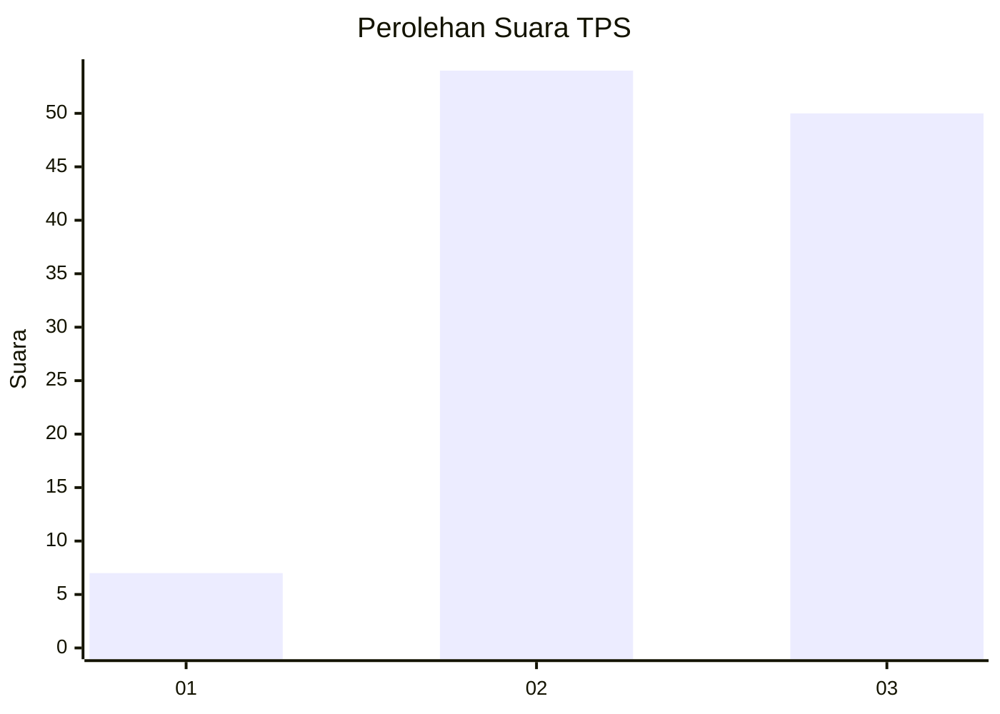
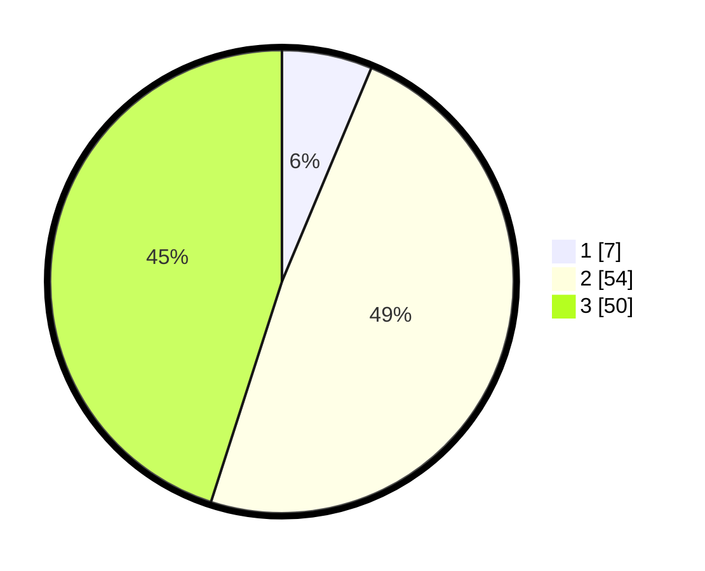

# Hasil

## Grafik

## Tabel

| No. | Nama Paslon    | Suara | Suara (raw) | Persentase |
|:--- |:-------------- | -----:| -----------:| ----------:|
| 1   | ANIES MUHAIMIN | 7     | [7][p-1]    | 6,31       |
| 2   | PRABOWO GIBRAN | 54    | [54][p-2]   | 48,65      |
| 3   | GANJAR MAHFUD  | 50    | [50][p-3]   | 45,05      |

[p-1]: https://github.com/gigit-pemilu/pemilu-2024-33-jawa-tengah/blob/main/pilpres/hitung-suara/sub/33-jawa-tengah/sub/12-wonogiri/sub/01-pracimantoro/sub/2008-pracimantoro/sub/012-tps/sub/paslon-1.txt
[p-2]: https://github.com/gigit-pemilu/pemilu-2024-33-jawa-tengah/blob/main/pilpres/hitung-suara/sub/33-jawa-tengah/sub/12-wonogiri/sub/01-pracimantoro/sub/2008-pracimantoro/sub/012-tps/sub/paslon-2.txt
[p-3]: https://github.com/gigit-pemilu/pemilu-2024-33-jawa-tengah/blob/main/pilpres/hitung-suara/sub/33-jawa-tengah/sub/12-wonogiri/sub/01-pracimantoro/sub/2008-pracimantoro/sub/012-tps/sub/paslon-3.txt

## Foto C Plano

https://sirekap-obj-formc.kpu.go.id/5cc0/pemilu/ppwp/33/12/01/20/08/3312012008012-20240215-000032--619c9750-9e5f-400d-9f64-915ad6d2f3dc.jpg

https://sirekap-obj-formc.kpu.go.id/5cc0/pemilu/ppwp/33/12/01/20/08/3312012008012-20240215-000125--67d8d110-c1f3-49e6-97e9-f409ecc22b64.jpg

https://sirekap-obj-formc.kpu.go.id/5cc0/pemilu/ppwp/33/12/01/20/08/3312012008012-20240215-104537--2e6eb9b7-432c-4bf1-a22f-c36ad7f5638d.jpg

## Metadata

| Key        | Value               |
| ---------- | ------------------- |
| Time Stamp | 2024-02-15 12:00:28 |

