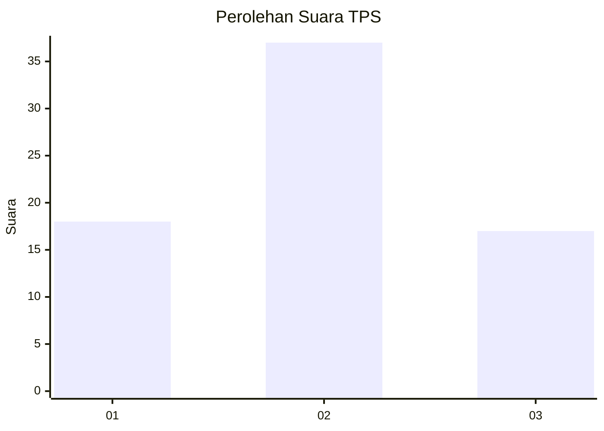
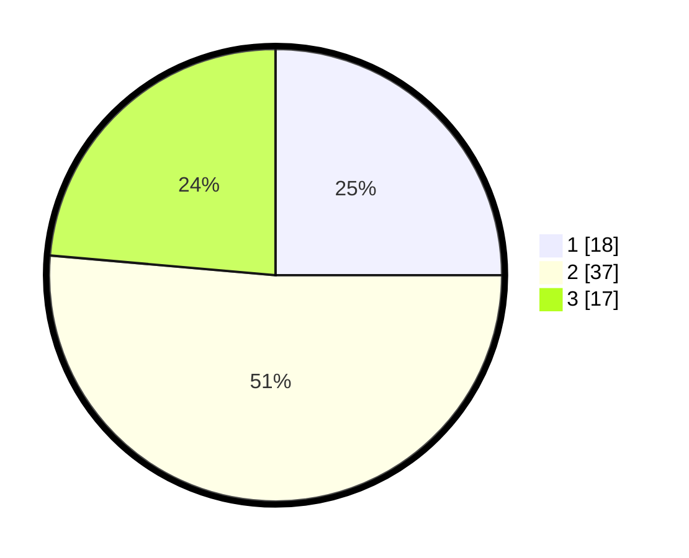

# Hasil

## Grafik

## Tabel

| No. | Nama Paslon    | Suara | Suara (raw) | Persentase |
|:--- |:-------------- | -----:| -----------:| ----------:|
| 1   | ANIES MUHAIMIN | 18    | [18][p-1]   | 25,00      |
| 2   | PRABOWO GIBRAN | 37    | [37][p-2]   | 51,39      |
| 3   | GANJAR MAHFUD  | 17    | [17][p-3]   | 23,61      |

[p-1]: https://github.com/gigit-pemilu/pemilu-2024/blob/main/pilpres/hitung-suara/sub/33-jawa-tengah/sub/12-wonogiri/sub/01-pracimantoro/sub/2011-jimbar/sub/012-tps/sub/paslon-1.txt
[p-2]: https://github.com/gigit-pemilu/pemilu-2024/blob/main/pilpres/hitung-suara/sub/33-jawa-tengah/sub/12-wonogiri/sub/01-pracimantoro/sub/2011-jimbar/sub/012-tps/sub/paslon-2.txt
[p-3]: https://github.com/gigit-pemilu/pemilu-2024/blob/main/pilpres/hitung-suara/sub/33-jawa-tengah/sub/12-wonogiri/sub/01-pracimantoro/sub/2011-jimbar/sub/012-tps/sub/paslon-3.txt

## Foto C Plano

https://sirekap-obj-formc.kpu.go.id/056f/pemilu/ppwp/33/12/01/20/11/3312012011012-20240214-141004--3da15e5a-8ef9-498b-9490-2937e4274558.jpg

https://sirekap-obj-formc.kpu.go.id/056f/pemilu/ppwp/33/12/01/20/11/3312012011012-20240214-141105--304d17e1-e668-4961-b162-ebd43f022bbe.jpg

https://sirekap-obj-formc.kpu.go.id/056f/pemilu/ppwp/33/12/01/20/11/3312012011012-20240214-141430--fdc1c701-0f36-49dc-ba4b-071ec0148fb7.jpg

## Metadata

| Key        | Value               |
| ---------- | ------------------- |
| Time Stamp | 2024-02-14 21:46:01 |

