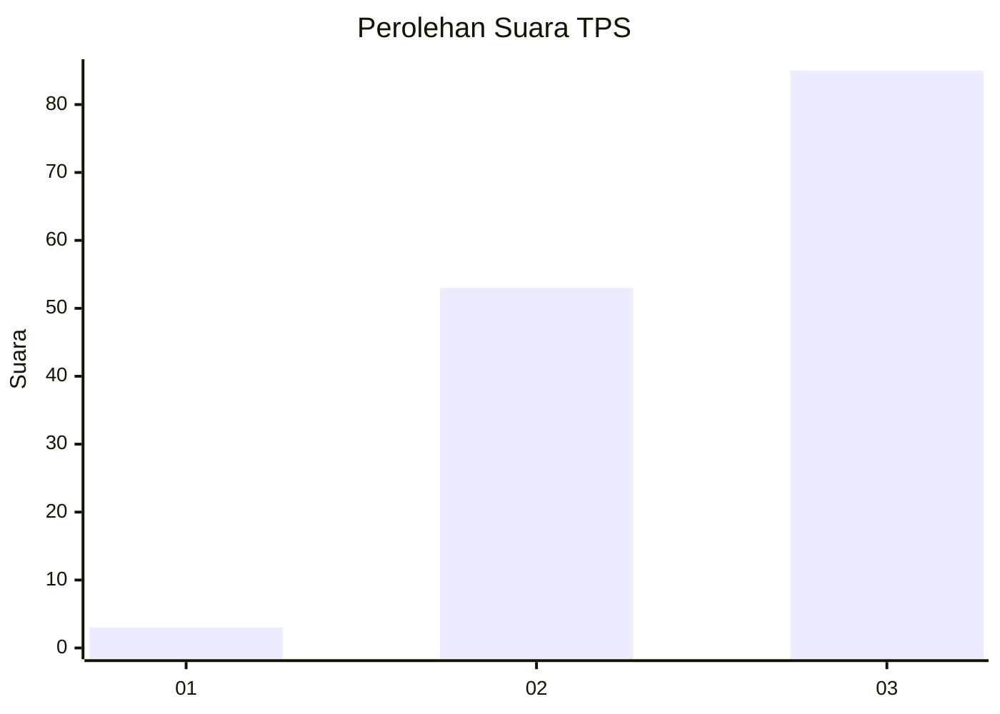
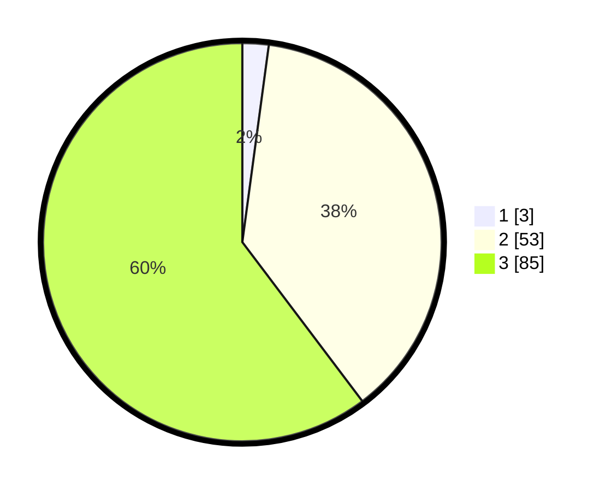

# Hasil

## Grafik

## Tabel

| No. | Nama Paslon    | Suara | Suara (raw) | Persentase |
|:--- |:-------------- | -----:| -----------:| ----------:|
| 1   | ANIES MUHAIMIN | 3     | [3][p-1]    | 2,13       |
| 2   | PRABOWO GIBRAN | 53    | [53][p-2]   | 37,59      |
| 3   | GANJAR MAHFUD  | 85    | [85][p-3]   | 60,28      |

[p-1]: https://github.com/gigit-pemilu/pemilu-2024-33-jawa-tengah/blob/main/pilpres/hitung-suara/sub/33-jawa-tengah/sub/12-wonogiri/sub/01-pracimantoro/sub/2012-banaran/sub/004-tps/sub/paslon-1.txt
[p-2]: https://github.com/gigit-pemilu/pemilu-2024-33-jawa-tengah/blob/main/pilpres/hitung-suara/sub/33-jawa-tengah/sub/12-wonogiri/sub/01-pracimantoro/sub/2012-banaran/sub/004-tps/sub/paslon-2.txt
[p-3]: https://github.com/gigit-pemilu/pemilu-2024-33-jawa-tengah/blob/main/pilpres/hitung-suara/sub/33-jawa-tengah/sub/12-wonogiri/sub/01-pracimantoro/sub/2012-banaran/sub/004-tps/sub/paslon-3.txt

## Foto C Plano

https://sirekap-obj-formc.kpu.go.id/dafe/pemilu/ppwp/33/12/01/20/12/3312012012004-20240215-080714--9c0613f5-a372-49ea-b232-7f3fa4b6fc04.jpg

https://sirekap-obj-formc.kpu.go.id/dafe/pemilu/ppwp/33/12/01/20/12/3312012012004-20240215-081522--dc6bfcfd-9590-4d09-a0d5-2ff2486864f9.jpg

https://sirekap-obj-formc.kpu.go.id/dafe/pemilu/ppwp/33/12/01/20/12/3312012012004-20240215-081701--4802cd61-8a53-4c5a-b49f-600ee104e9f0.jpg

## Metadata

| Key        | Value               |
| ---------- | ------------------- |
| Time Stamp | 2024-02-15 23:29:50 |

