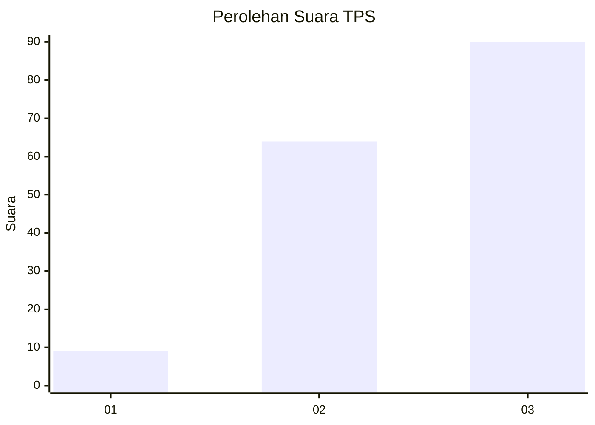
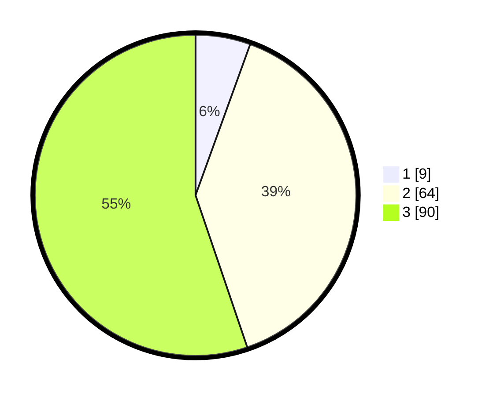

# Hasil

## Grafik

## Tabel

| No. | Nama Paslon    | Suara | Suara (raw) | Persentase |
|:--- |:-------------- | -----:| -----------:| ----------:|
| 1   | ANIES MUHAIMIN | 9     | [9][p-1]    | 5,52       |
| 2   | PRABOWO GIBRAN | 64    | [64][p-2]   | 39,26      |
| 3   | GANJAR MAHFUD  | 90    | [90][p-3]   | 55,21      |

[p-1]: https://github.com/gigit-pemilu/pemilu-2024-33-jawa-tengah/blob/main/pilpres/hitung-suara/sub/33-jawa-tengah/sub/12-wonogiri/sub/01-pracimantoro/sub/2013-trukan/sub/005-tps/sub/paslon-1.txt
[p-2]: https://github.com/gigit-pemilu/pemilu-2024-33-jawa-tengah/blob/main/pilpres/hitung-suara/sub/33-jawa-tengah/sub/12-wonogiri/sub/01-pracimantoro/sub/2013-trukan/sub/005-tps/sub/paslon-2.txt
[p-3]: https://github.com/gigit-pemilu/pemilu-2024-33-jawa-tengah/blob/main/pilpres/hitung-suara/sub/33-jawa-tengah/sub/12-wonogiri/sub/01-pracimantoro/sub/2013-trukan/sub/005-tps/sub/paslon-3.txt

## Foto C Plano

https://sirekap-obj-formc.kpu.go.id/b909/pemilu/ppwp/33/12/01/20/13/3312012013005-20240214-222149--a6b862fd-43bf-4cf9-be10-632f6f02ff7c.jpg

https://sirekap-obj-formc.kpu.go.id/b909/pemilu/ppwp/33/12/01/20/13/3312012013005-20240214-222203--439d535e-c9e4-4826-93ff-5ea4d6cdfab2.jpg

https://sirekap-obj-formc.kpu.go.id/b909/pemilu/ppwp/33/12/01/20/13/3312012013005-20240214-220659--aa15f7a6-9289-46e1-aadd-4276e471a83c.jpg

## Metadata

| Key        | Value               |
| ---------- | ------------------- |
| Time Stamp | 2024-02-19 06:16:00 |

