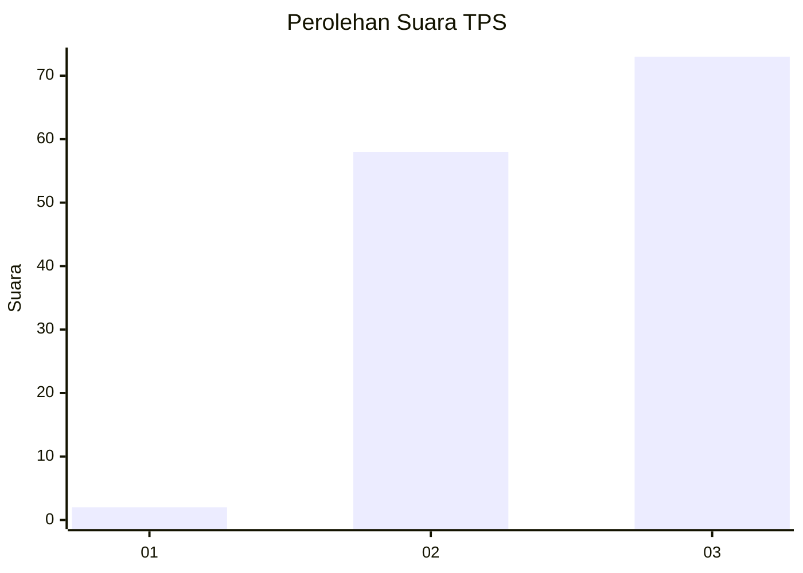
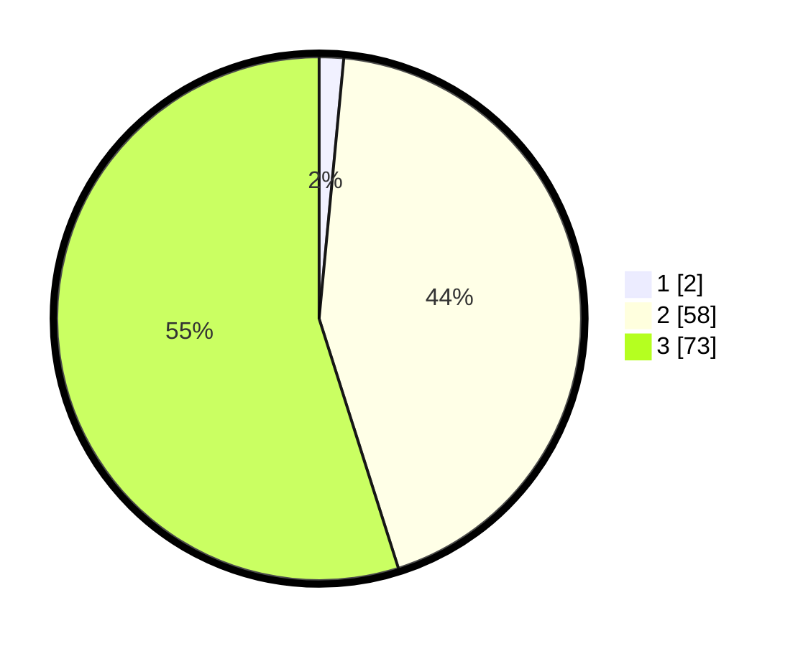

# Hasil

## Grafik

## Tabel

| No. | Nama Paslon    | Suara | Suara (raw) | Persentase |
|:--- |:-------------- | -----:| -----------:| ----------:|
| 1   | ANIES MUHAIMIN | 2     | [2][p-1]    | 1,50       |
| 2   | PRABOWO GIBRAN | 58    | [58][p-2]   | 43,61      |
| 3   | GANJAR MAHFUD  | 73    | [73][p-3]   | 54,89      |

[p-1]: https://github.com/gigit-pemilu/pemilu-2024-33-jawa-tengah/blob/main/pilpres/hitung-suara/sub/33-jawa-tengah/sub/12-wonogiri/sub/01-pracimantoro/sub/2016-gebangharjo/sub/006-tps/sub/paslon-1.txt
[p-2]: https://github.com/gigit-pemilu/pemilu-2024-33-jawa-tengah/blob/main/pilpres/hitung-suara/sub/33-jawa-tengah/sub/12-wonogiri/sub/01-pracimantoro/sub/2016-gebangharjo/sub/006-tps/sub/paslon-2.txt
[p-3]: https://github.com/gigit-pemilu/pemilu-2024-33-jawa-tengah/blob/main/pilpres/hitung-suara/sub/33-jawa-tengah/sub/12-wonogiri/sub/01-pracimantoro/sub/2016-gebangharjo/sub/006-tps/sub/paslon-3.txt

## Foto C Plano

https://sirekap-obj-formc.kpu.go.id/3245/pemilu/ppwp/33/12/01/20/16/3312012016006-20240214-141103--872b03d1-d463-48df-9b35-de5b1cbab0ec.jpg

https://sirekap-obj-formc.kpu.go.id/3245/pemilu/ppwp/33/12/01/20/16/3312012016006-20240214-141314--c1f10857-5388-4ce1-9d9f-1da34f1599bc.jpg

https://sirekap-obj-formc.kpu.go.id/3245/pemilu/ppwp/33/12/01/20/16/3312012016006-20240214-141448--f2a51e2e-bb8e-479c-8db8-99863ddb8760.jpg

## Metadata

| Key        | Value               |
| ---------- | ------------------- |
| Time Stamp | 2024-02-14 21:46:01 |

