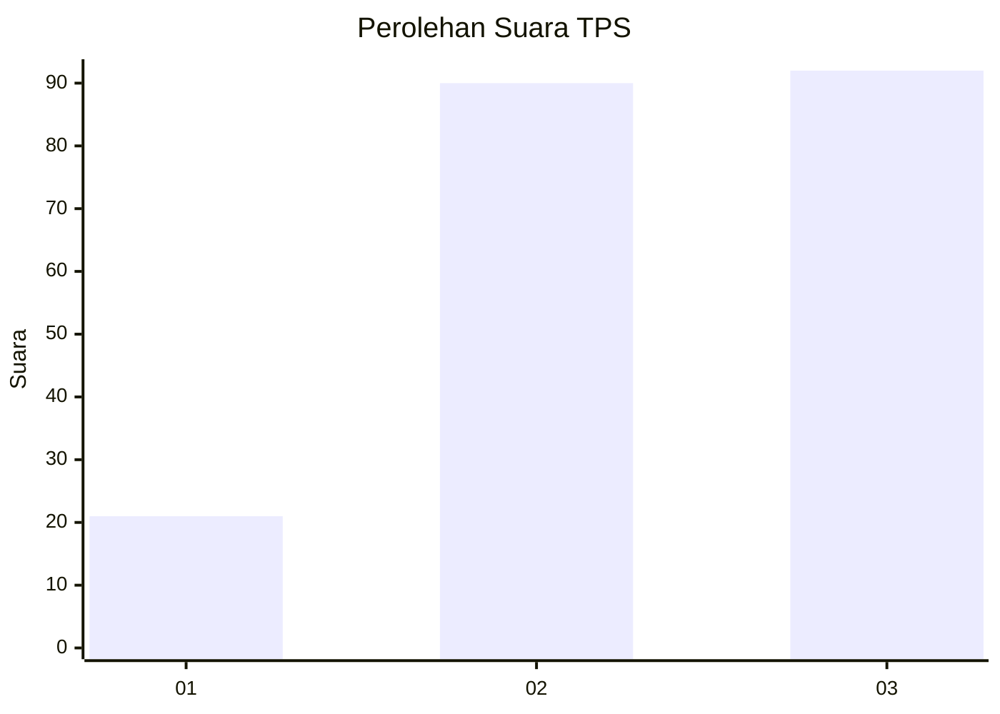
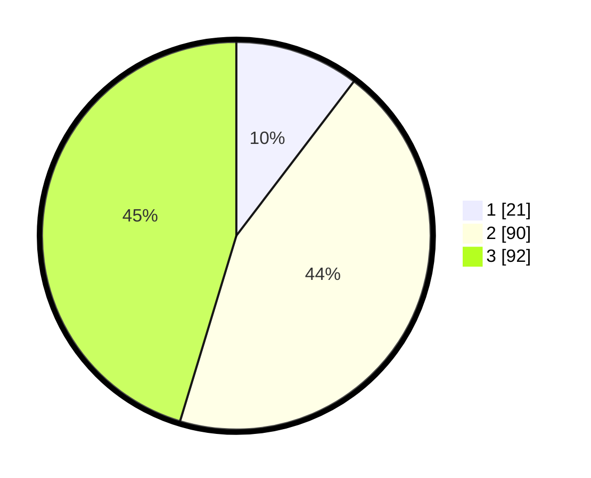

# Hasil

## Grafik

## Tabel

| No. | Nama Paslon    | Suara | Suara (raw) | Persentase |
|:--- |:-------------- | -----:| -----------:| ----------:|
| 1   | ANIES MUHAIMIN | 21    | [21][p-1]   | 10,34      |
| 2   | PRABOWO GIBRAN | 90    | [90][p-2]   | 44,33      |
| 3   | GANJAR MAHFUD  | 92    | [92][p-3]   | 45,32      |

[p-1]: https://github.com/gigit-pemilu/pemilu-2024/blob/main/pilpres/hitung-suara/sub/33-jawa-tengah/sub/12-wonogiri/sub/02-giritontro/sub/1004-bayemharjo/sub/001-tps/sub/paslon-1.txt
[p-2]: https://github.com/gigit-pemilu/pemilu-2024/blob/main/pilpres/hitung-suara/sub/33-jawa-tengah/sub/12-wonogiri/sub/02-giritontro/sub/1004-bayemharjo/sub/001-tps/sub/paslon-2.txt
[p-3]: https://github.com/gigit-pemilu/pemilu-2024/blob/main/pilpres/hitung-suara/sub/33-jawa-tengah/sub/12-wonogiri/sub/02-giritontro/sub/1004-bayemharjo/sub/001-tps/sub/paslon-3.txt

## Foto C Plano

https://sirekap-obj-formc.kpu.go.id/efe4/pemilu/ppwp/33/12/02/10/04/3312021004001-20240216-095654--bea38361-3336-4c9d-bfcf-c68e42c3464e.jpg

https://sirekap-obj-formc.kpu.go.id/efe4/pemilu/ppwp/33/12/02/10/04/3312021004001-20240214-195542--c5b89606-fdef-45df-8cf3-142abf9f2dc2.jpg

https://sirekap-obj-formc.kpu.go.id/efe4/pemilu/ppwp/33/12/02/10/04/3312021004001-20240214-195549--f66a413d-c56a-4089-a2da-14203f275abe.jpg

## Metadata

| Key        | Value               |
| ---------- | ------------------- |
| Time Stamp | 2024-02-16 10:00:28 |

