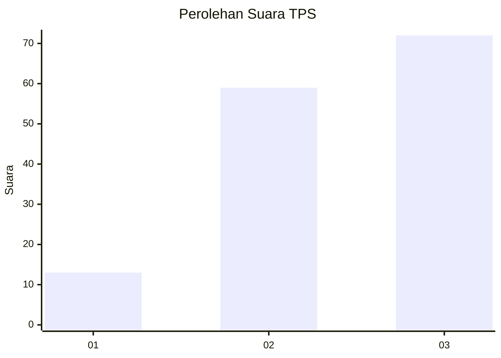
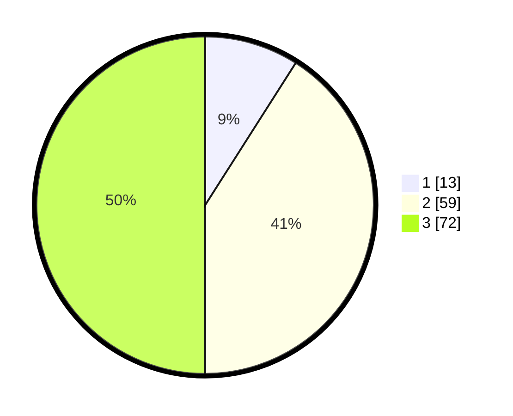

# Hasil

## Grafik

## Tabel

| No. | Nama Paslon    | Suara | Suara (raw) | Persentase |
|:--- |:-------------- | -----:| -----------:| ----------:|
| 1   | ANIES MUHAIMIN | 13    | [13][p-1]   | 9,03       |
| 2   | PRABOWO GIBRAN | 59    | [59][p-2]   | 40,97      |
| 3   | GANJAR MAHFUD  | 72    | [72][p-3]   | 50,00      |

[p-1]: https://github.com/gigit-pemilu/pemilu-2024/blob/main/pilpres/hitung-suara/sub/33-jawa-tengah/sub/12-wonogiri/sub/02-giritontro/sub/1006-giritontro/sub/013-tps/sub/paslon-1.txt
[p-2]: https://github.com/gigit-pemilu/pemilu-2024/blob/main/pilpres/hitung-suara/sub/33-jawa-tengah/sub/12-wonogiri/sub/02-giritontro/sub/1006-giritontro/sub/013-tps/sub/paslon-2.txt
[p-3]: https://github.com/gigit-pemilu/pemilu-2024/blob/main/pilpres/hitung-suara/sub/33-jawa-tengah/sub/12-wonogiri/sub/02-giritontro/sub/1006-giritontro/sub/013-tps/sub/paslon-3.txt

## Foto C Plano

https://sirekap-obj-formc.kpu.go.id/0245/pemilu/ppwp/33/12/02/10/06/3312021006013-20240217-073118--27d098e0-647f-44d6-a38c-1f8e0074e498.jpg

https://sirekap-obj-formc.kpu.go.id/0245/pemilu/ppwp/33/12/02/10/06/3312021006013-20240215-221857--6e17ffb4-43d4-4d02-9f39-1acee58b2a8a.jpg

https://sirekap-obj-formc.kpu.go.id/0245/pemilu/ppwp/33/12/02/10/06/3312021006013-20240216-202952--1d6aadcf-7543-465c-b8fb-e122c9c8369d.jpg

## Metadata

| Key        | Value               |
| ---------- | ------------------- |
| Time Stamp | 2024-02-25 12:00:00 |

