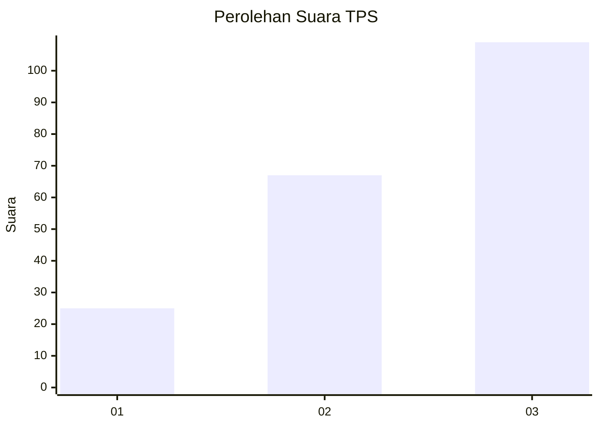
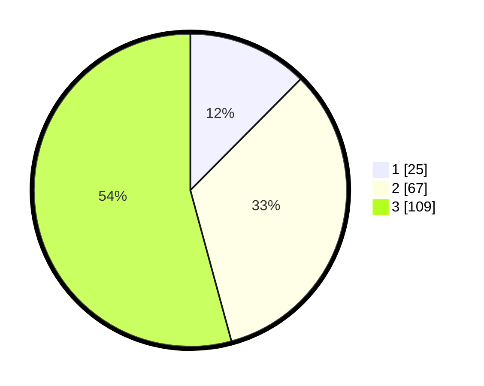

# Hasil

## Grafik

## Tabel

| No. | Nama Paslon    | Suara | Suara (raw) | Persentase |
|:--- |:-------------- | -----:| -----------:| ----------:|
| 1   | ANIES MUHAIMIN | 25    | [25][p-1]   | 12,44      |
| 2   | PRABOWO GIBRAN | 67    | [67][p-2]   | 33,33      |
| 3   | GANJAR MAHFUD  | 109   | [109][p-3]  | 54,23      |

[p-1]: https://github.com/gigit-pemilu/pemilu-2024-33-jawa-tengah/blob/main/pilpres/hitung-suara/sub/33-jawa-tengah/sub/12-wonogiri/sub/02-giritontro/sub/2007-pucanganom/sub/012-tps/sub/paslon-1.txt
[p-2]: https://github.com/gigit-pemilu/pemilu-2024-33-jawa-tengah/blob/main/pilpres/hitung-suara/sub/33-jawa-tengah/sub/12-wonogiri/sub/02-giritontro/sub/2007-pucanganom/sub/012-tps/sub/paslon-2.txt
[p-3]: https://github.com/gigit-pemilu/pemilu-2024-33-jawa-tengah/blob/main/pilpres/hitung-suara/sub/33-jawa-tengah/sub/12-wonogiri/sub/02-giritontro/sub/2007-pucanganom/sub/012-tps/sub/paslon-3.txt

## Foto C Plano

https://sirekap-obj-formc.kpu.go.id/8f5a/pemilu/ppwp/33/12/02/20/07/3312022007012-20240214-230639--84952806-8865-4d66-a206-a7711fe35f3b.jpg

https://sirekap-obj-formc.kpu.go.id/8f5a/pemilu/ppwp/33/12/02/20/07/3312022007012-20240214-230809--3adb95b4-c4cb-4c72-8dc6-a4779b9c8473.jpg

https://sirekap-obj-formc.kpu.go.id/8f5a/pemilu/ppwp/33/12/02/20/07/3312022007012-20240214-230915--2ab2327a-d955-40ca-82d4-6fc419782c90.jpg

## Metadata

| Key        | Value               |
| ---------- | ------------------- |
| Time Stamp | 2024-02-25 21:00:00 |

