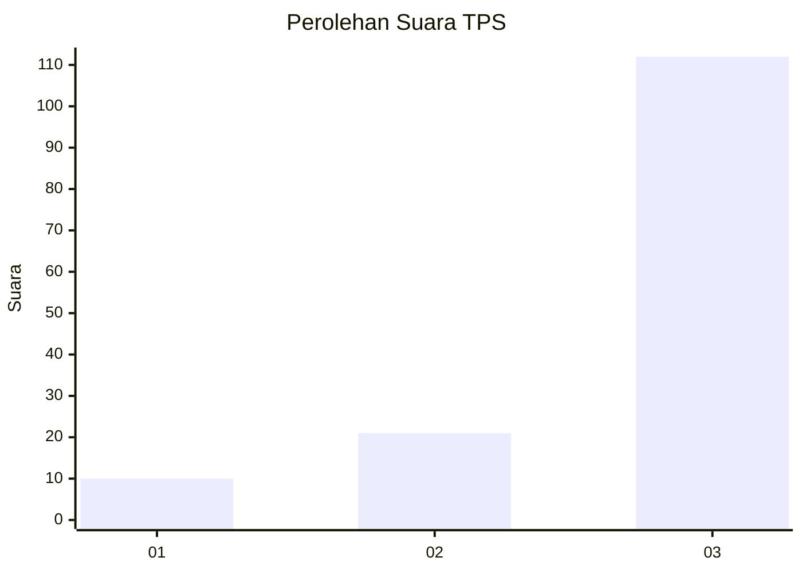
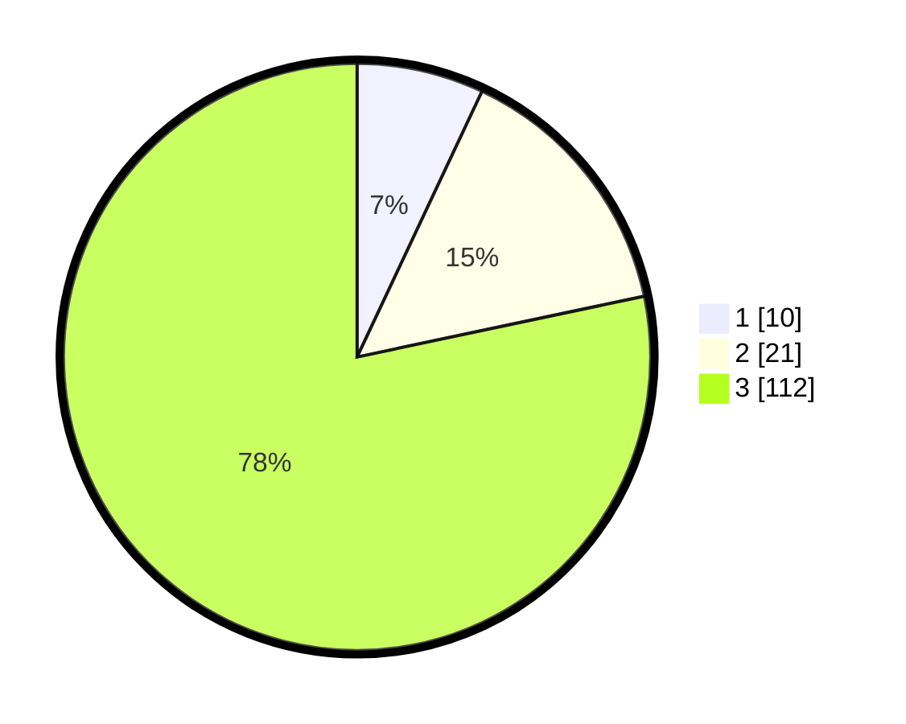

# Hasil

## Grafik

## Tabel

| No. | Nama Paslon    | Suara | Suara (raw) | Persentase |
|:--- |:-------------- | -----:| -----------:| ----------:|
| 1   | ANIES MUHAIMIN | 10    | [10][p-1]   | 6,99       |
| 2   | PRABOWO GIBRAN | 21    | [21][p-2]   | 14,69      |
| 3   | GANJAR MAHFUD  | 112   | [112][p-3]  | 78,32      |

[p-1]: https://github.com/gigit-pemilu/pemilu-2024-33-jawa-tengah/blob/main/pilpres/hitung-suara/sub/33-jawa-tengah/sub/12-wonogiri/sub/03-giriwoyo/sub/1002-girikikis/sub/009-tps/sub/paslon-1.txt
[p-2]: https://github.com/gigit-pemilu/pemilu-2024-33-jawa-tengah/blob/main/pilpres/hitung-suara/sub/33-jawa-tengah/sub/12-wonogiri/sub/03-giriwoyo/sub/1002-girikikis/sub/009-tps/sub/paslon-2.txt
[p-3]: https://github.com/gigit-pemilu/pemilu-2024-33-jawa-tengah/blob/main/pilpres/hitung-suara/sub/33-jawa-tengah/sub/12-wonogiri/sub/03-giriwoyo/sub/1002-girikikis/sub/009-tps/sub/paslon-3.txt

## Foto C Plano

https://sirekap-obj-formc.kpu.go.id/bb1f/pemilu/ppwp/33/12/03/10/02/3312031002009-20240214-215427--cb962640-5d40-4d12-bcb4-0170870e6308.jpg

https://sirekap-obj-formc.kpu.go.id/bb1f/pemilu/ppwp/33/12/03/10/02/3312031002009-20240214-215813--da5f0498-7d89-43e1-8ee7-ec7eaa2bb011.jpg

https://sirekap-obj-formc.kpu.go.id/bb1f/pemilu/ppwp/33/12/03/10/02/3312031002009-20240214-215958--815ccdd6-9019-4e21-abf5-4070b9866599.jpg

## Metadata

| Key        | Value               |
| ---------- | ------------------- |
| Time Stamp | 2024-02-15 09:00:24 |

