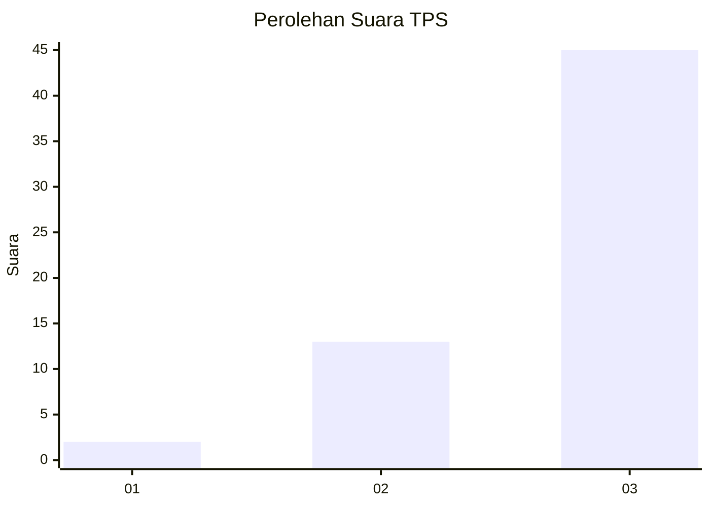
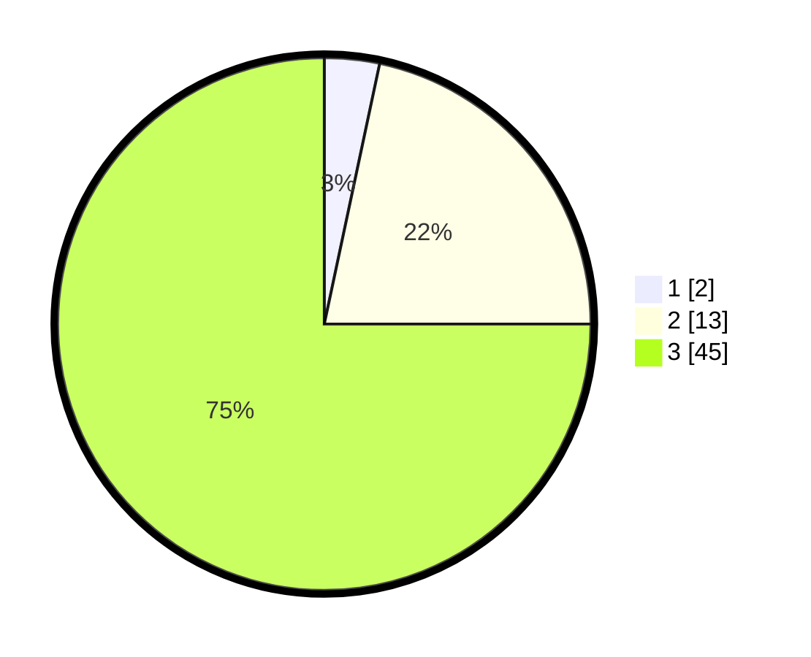

# Hasil

## Grafik

## Tabel

| No. | Nama Paslon    | Suara | Suara (raw) | Persentase |
|:--- |:-------------- | -----:| -----------:| ----------:|
| 1   | ANIES MUHAIMIN | 2     | [2][p-1]    | 3,33       |
| 2   | PRABOWO GIBRAN | 13    | [13][p-2]   | 21,67      |
| 3   | GANJAR MAHFUD  | 45    | [45][p-3]   | 75,00      |

[p-1]: https://github.com/gigit-pemilu/pemilu-2024-33-jawa-tengah/blob/main/pilpres/hitung-suara/sub/33-jawa-tengah/sub/12-wonogiri/sub/03-giriwoyo/sub/1002-girikikis/sub/011-tps/sub/paslon-1.txt
[p-2]: https://github.com/gigit-pemilu/pemilu-2024-33-jawa-tengah/blob/main/pilpres/hitung-suara/sub/33-jawa-tengah/sub/12-wonogiri/sub/03-giriwoyo/sub/1002-girikikis/sub/011-tps/sub/paslon-2.txt
[p-3]: https://github.com/gigit-pemilu/pemilu-2024-33-jawa-tengah/blob/main/pilpres/hitung-suara/sub/33-jawa-tengah/sub/12-wonogiri/sub/03-giriwoyo/sub/1002-girikikis/sub/011-tps/sub/paslon-3.txt

## Foto C Plano

https://sirekap-obj-formc.kpu.go.id/547e/pemilu/ppwp/33/12/03/10/02/3312031002011-20240216-122552--5c974b9e-4cf5-445a-8206-f0a2ff690a6d.jpg

https://sirekap-obj-formc.kpu.go.id/547e/pemilu/ppwp/33/12/03/10/02/3312031002011-20240214-141037--64e17717-99e6-4a86-8916-21e8f62b5de7.jpg

https://sirekap-obj-formc.kpu.go.id/547e/pemilu/ppwp/33/12/03/10/02/3312031002011-20240214-155342--4c5ab65d-2ac8-4a25-9e2a-9e87a10ed356.jpg

## Metadata

| Key        | Value               |
| ---------- | ------------------- |
| Time Stamp | 2024-02-16 12:51:22 |

