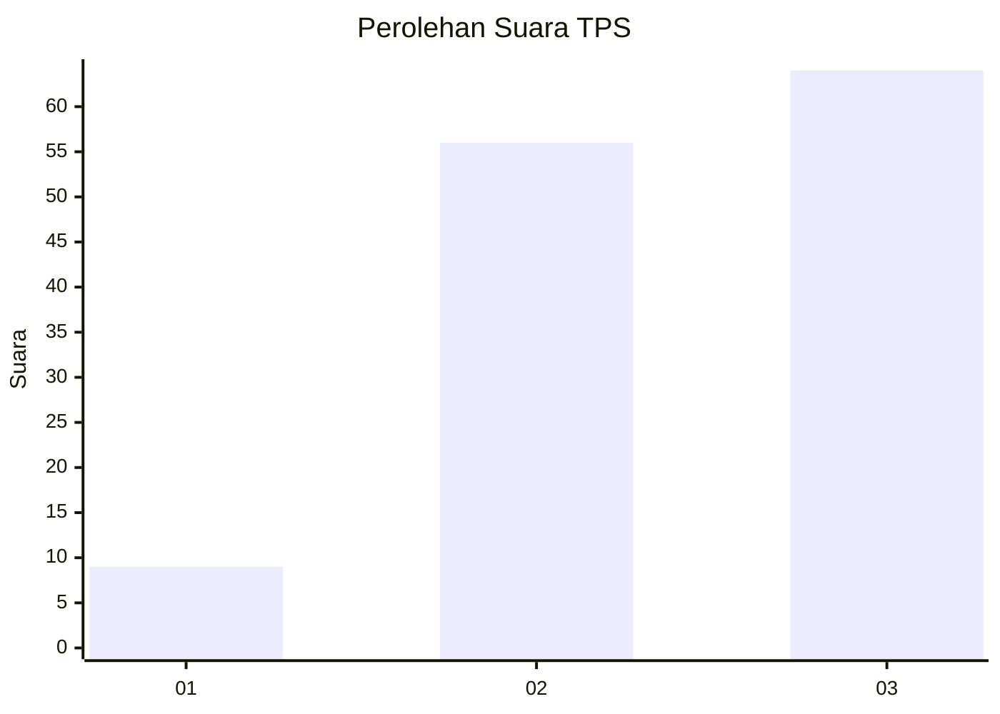
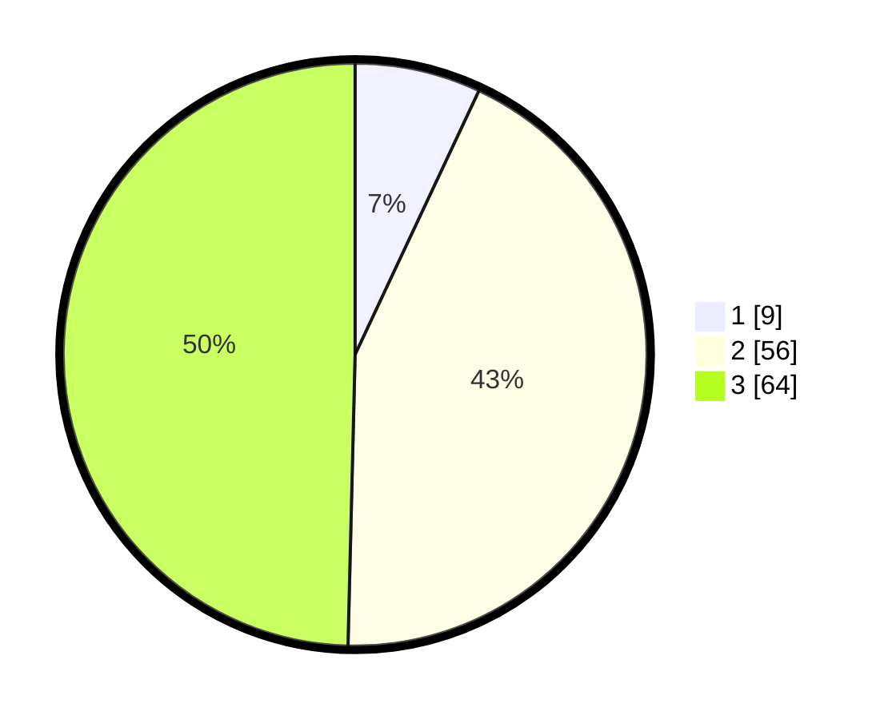

# Hasil

## Grafik

## Tabel

| No. | Nama Paslon    | Suara | Suara (raw) | Persentase |
|:--- |:-------------- | -----:| -----------:| ----------:|
| 1   | ANIES MUHAIMIN | 9     | [9][p-1]    | 6,98       |
| 2   | PRABOWO GIBRAN | 56    | [56][p-2]   | 43,41      |
| 3   | GANJAR MAHFUD  | 64    | [64][p-3]   | 49,61      |

[p-1]: https://github.com/gigit-pemilu/pemilu-2024/blob/main/pilpres/hitung-suara/sub/33-jawa-tengah/sub/12-wonogiri/sub/03-giriwoyo/sub/1011-giriwoyo/sub/009-tps/sub/paslon-1.txt
[p-2]: https://github.com/gigit-pemilu/pemilu-2024/blob/main/pilpres/hitung-suara/sub/33-jawa-tengah/sub/12-wonogiri/sub/03-giriwoyo/sub/1011-giriwoyo/sub/009-tps/sub/paslon-2.txt
[p-3]: https://github.com/gigit-pemilu/pemilu-2024/blob/main/pilpres/hitung-suara/sub/33-jawa-tengah/sub/12-wonogiri/sub/03-giriwoyo/sub/1011-giriwoyo/sub/009-tps/sub/paslon-3.txt

## Foto C Plano

https://sirekap-obj-formc.kpu.go.id/5743/pemilu/ppwp/33/12/03/10/11/3312031011009-20240215-163157--008109b1-457a-44ba-aea3-6210e9dcc9a8.jpg

https://sirekap-obj-formc.kpu.go.id/5743/pemilu/ppwp/33/12/03/10/11/3312031011009-20240215-163308--a057f909-4344-418c-87e8-b411d1f7b4b1.jpg

https://sirekap-obj-formc.kpu.go.id/5743/pemilu/ppwp/33/12/03/10/11/3312031011009-20240215-034552--03bf7b27-4a7e-45db-8c2d-09e2c1221b46.jpg

## Metadata

| Key        | Value               |
| ---------- | ------------------- |
| Time Stamp | 2024-02-25 16:00:00 |

