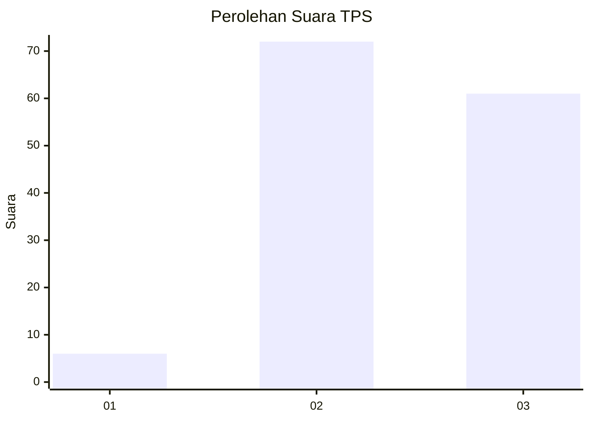
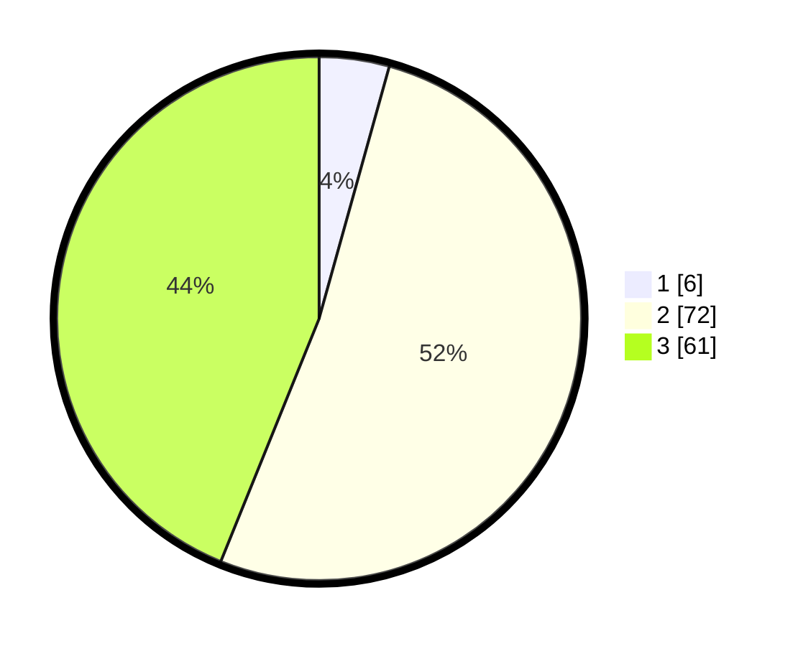

# Hasil

## Grafik

## Tabel

| No. | Nama Paslon    | Suara | Suara (raw) | Persentase |
|:--- |:-------------- | -----:| -----------:| ----------:|
| 1   | ANIES MUHAIMIN | 6     | [6][p-1]    | 4,32       |
| 2   | PRABOWO GIBRAN | 72    | [72][p-2]   | 51,80      |
| 3   | GANJAR MAHFUD  | 61    | [61][p-3]   | 43,88      |

[p-1]: https://github.com/gigit-pemilu/pemilu-2024/blob/main/pilpres/hitung-suara/sub/33-jawa-tengah/sub/12-wonogiri/sub/03-giriwoyo/sub/2003-guwotirto/sub/003-tps/sub/paslon-1.txt
[p-2]: https://github.com/gigit-pemilu/pemilu-2024/blob/main/pilpres/hitung-suara/sub/33-jawa-tengah/sub/12-wonogiri/sub/03-giriwoyo/sub/2003-guwotirto/sub/003-tps/sub/paslon-2.txt
[p-3]: https://github.com/gigit-pemilu/pemilu-2024/blob/main/pilpres/hitung-suara/sub/33-jawa-tengah/sub/12-wonogiri/sub/03-giriwoyo/sub/2003-guwotirto/sub/003-tps/sub/paslon-3.txt

## Foto C Plano

https://sirekap-obj-formc.kpu.go.id/66c9/pemilu/ppwp/33/12/03/20/03/3312032003003-20240216-183920--9f4c2f01-281b-453f-b520-00812ceb24c0.jpg

https://sirekap-obj-formc.kpu.go.id/66c9/pemilu/ppwp/33/12/03/20/03/3312032003003-20240216-185034--92d63308-d0ea-4769-a195-a1fcd69b6dfc.jpg

https://sirekap-obj-formc.kpu.go.id/66c9/pemilu/ppwp/33/12/03/20/03/3312032003003-20240216-185121--ae4b3889-febc-4cda-a587-488ed9b0ed92.jpg

## Metadata

| Key        | Value               |
| ---------- | ------------------- |
| Time Stamp | 2024-02-24 22:31:28 |

