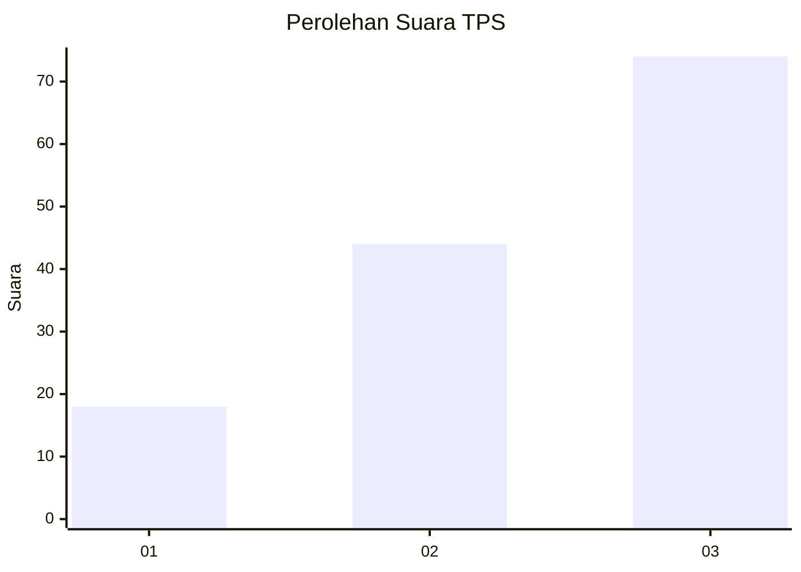
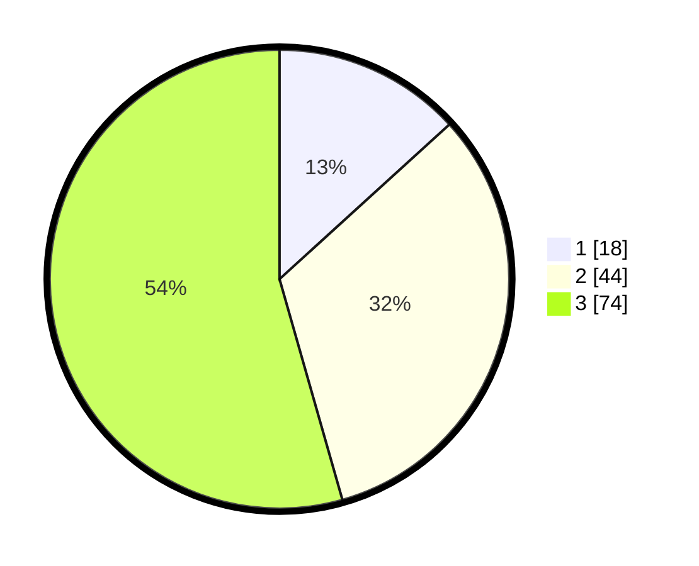

# Hasil

## Grafik

## Tabel

| No. | Nama Paslon    | Suara | Suara (raw) | Persentase |
|:--- |:-------------- | -----:| -----------:| ----------:|
| 1   | ANIES MUHAIMIN | 18    | [18][p-1]   | 13,24      |
| 2   | PRABOWO GIBRAN | 44    | [44][p-2]   | 32,35      |
| 3   | GANJAR MAHFUD  | 74    | [74][p-3]   | 54,41      |

[p-1]: https://github.com/gigit-pemilu/pemilu-2024-33-jawa-tengah/blob/main/pilpres/hitung-suara/sub/33-jawa-tengah/sub/12-wonogiri/sub/03-giriwoyo/sub/2006-gedongrejo/sub/002-tps/sub/paslon-1.txt
[p-2]: https://github.com/gigit-pemilu/pemilu-2024-33-jawa-tengah/blob/main/pilpres/hitung-suara/sub/33-jawa-tengah/sub/12-wonogiri/sub/03-giriwoyo/sub/2006-gedongrejo/sub/002-tps/sub/paslon-2.txt
[p-3]: https://github.com/gigit-pemilu/pemilu-2024-33-jawa-tengah/blob/main/pilpres/hitung-suara/sub/33-jawa-tengah/sub/12-wonogiri/sub/03-giriwoyo/sub/2006-gedongrejo/sub/002-tps/sub/paslon-3.txt

## Foto C Plano

https://sirekap-obj-formc.kpu.go.id/393c/pemilu/ppwp/33/12/03/20/06/3312032006002-20240216-161018--f794e858-b463-45ab-8cac-b0b8ae0542b9.jpg

https://sirekap-obj-formc.kpu.go.id/393c/pemilu/ppwp/33/12/03/20/06/3312032006002-20240214-233536--25bc01ed-9673-49a8-9020-8842103823d5.jpg

https://sirekap-obj-formc.kpu.go.id/393c/pemilu/ppwp/33/12/03/20/06/3312032006002-20240214-233658--03e384b2-d8e7-4389-89a3-0218b4429f01.jpg

## Metadata

| Key        | Value               |
| ---------- | ------------------- |
| Time Stamp | 2024-02-16 16:25:10 |

