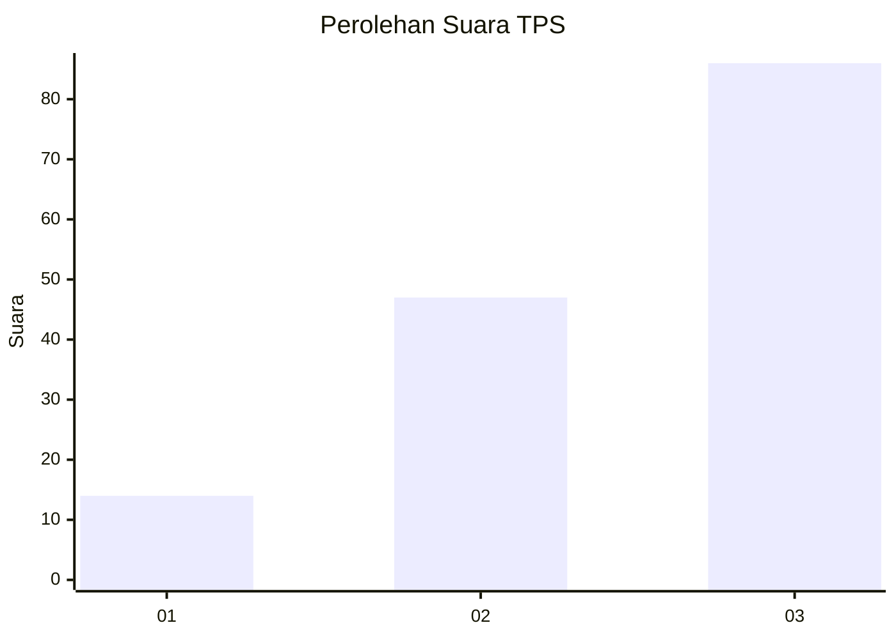
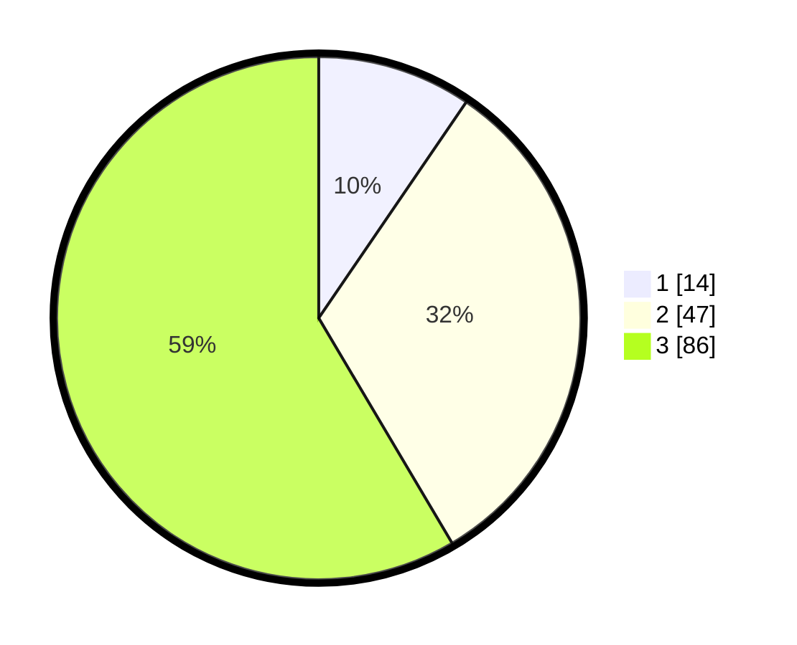

# Hasil

## Grafik

## Tabel

| No. | Nama Paslon    | Suara | Suara (raw) | Persentase |
|:--- |:-------------- | -----:| -----------:| ----------:|
| 1   | ANIES MUHAIMIN | 14    | [14][p-1]   | 9,52       |
| 2   | PRABOWO GIBRAN | 47    | [47][p-2]   | 31,97      |
| 3   | GANJAR MAHFUD  | 86    | [86][p-3]   | 58,50      |

[p-1]: https://github.com/gigit-pemilu/pemilu-2024/blob/main/pilpres/hitung-suara/sub/33-jawa-tengah/sub/12-wonogiri/sub/03-giriwoyo/sub/2010-selomarto/sub/005-tps/sub/paslon-1.txt
[p-2]: https://github.com/gigit-pemilu/pemilu-2024/blob/main/pilpres/hitung-suara/sub/33-jawa-tengah/sub/12-wonogiri/sub/03-giriwoyo/sub/2010-selomarto/sub/005-tps/sub/paslon-2.txt
[p-3]: https://github.com/gigit-pemilu/pemilu-2024/blob/main/pilpres/hitung-suara/sub/33-jawa-tengah/sub/12-wonogiri/sub/03-giriwoyo/sub/2010-selomarto/sub/005-tps/sub/paslon-3.txt

## Foto C Plano

https://sirekap-obj-formc.kpu.go.id/0d4a/pemilu/ppwp/33/12/03/20/10/3312032010005-20240214-222716--5c1e5ae0-a733-4767-aa0d-ab20d2dba570.jpg

https://sirekap-obj-formc.kpu.go.id/0d4a/pemilu/ppwp/33/12/03/20/10/3312032010005-20240214-222752--b842c4d1-317d-4f2f-8b30-5c741c73a54e.jpg

https://sirekap-obj-formc.kpu.go.id/0d4a/pemilu/ppwp/33/12/03/20/10/3312032010005-20240214-222830--15b1bede-b1be-430b-a11e-11b1058c9a46.jpg

## Metadata

| Key        | Value               |
| ---------- | ------------------- |
| Time Stamp | 2024-02-15 09:00:24 |

