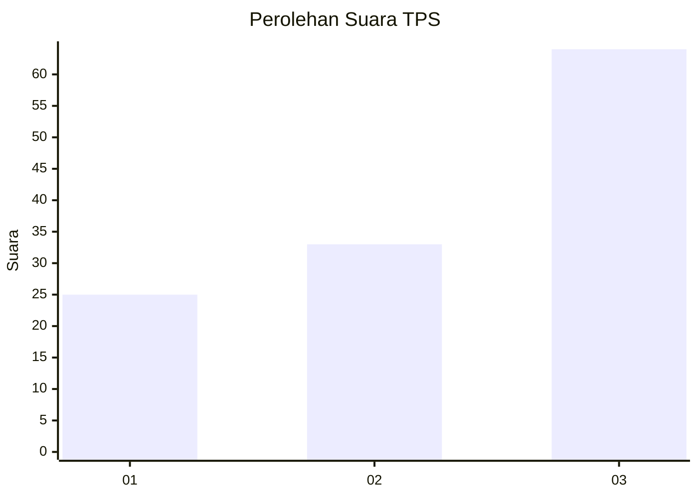
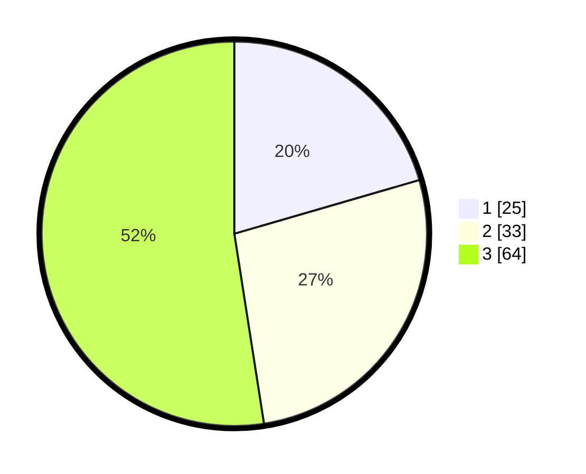

# Hasil

## Grafik

## Tabel

| No. | Nama Paslon    | Suara | Suara (raw) | Persentase |
|:--- |:-------------- | -----:| -----------:| ----------:|
| 1   | ANIES MUHAIMIN | 25    | [25][p-1]   | 20,49      |
| 2   | PRABOWO GIBRAN | 33    | [33][p-2]   | 27,05      |
| 3   | GANJAR MAHFUD  | 64    | [64][p-3]   | 52,46      |

[p-1]: https://github.com/gigit-pemilu/pemilu-2024/blob/main/pilpres/hitung-suara/sub/33-jawa-tengah/sub/12-wonogiri/sub/04-batuwarno/sub/2003-batuwarno/sub/008-tps/sub/paslon-1.txt
[p-2]: https://github.com/gigit-pemilu/pemilu-2024/blob/main/pilpres/hitung-suara/sub/33-jawa-tengah/sub/12-wonogiri/sub/04-batuwarno/sub/2003-batuwarno/sub/008-tps/sub/paslon-2.txt
[p-3]: https://github.com/gigit-pemilu/pemilu-2024/blob/main/pilpres/hitung-suara/sub/33-jawa-tengah/sub/12-wonogiri/sub/04-batuwarno/sub/2003-batuwarno/sub/008-tps/sub/paslon-3.txt

## Foto C Plano

https://sirekap-obj-formc.kpu.go.id/a159/pemilu/ppwp/33/12/04/20/03/3312042003008-20240216-202636--4921ca14-158d-4cc5-8c5d-f11ce2b0bf3f.jpg

https://sirekap-obj-formc.kpu.go.id/a159/pemilu/ppwp/33/12/04/20/03/3312042003008-20240216-201335--8ae0fac2-51cc-4213-9201-77eb46f0afd6.jpg

https://sirekap-obj-formc.kpu.go.id/a159/pemilu/ppwp/33/12/04/20/03/3312042003008-20240216-201721--f216b58c-d576-497e-b21d-419de5480240.jpg

## Metadata

| Key        | Value               |
| ---------- | ------------------- |
| Time Stamp | 2024-02-16 21:01:00 |

