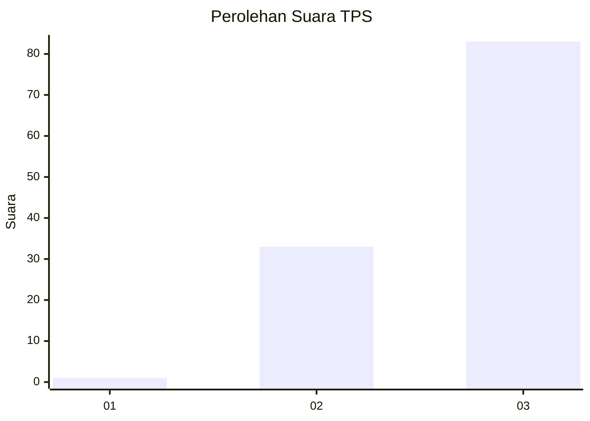
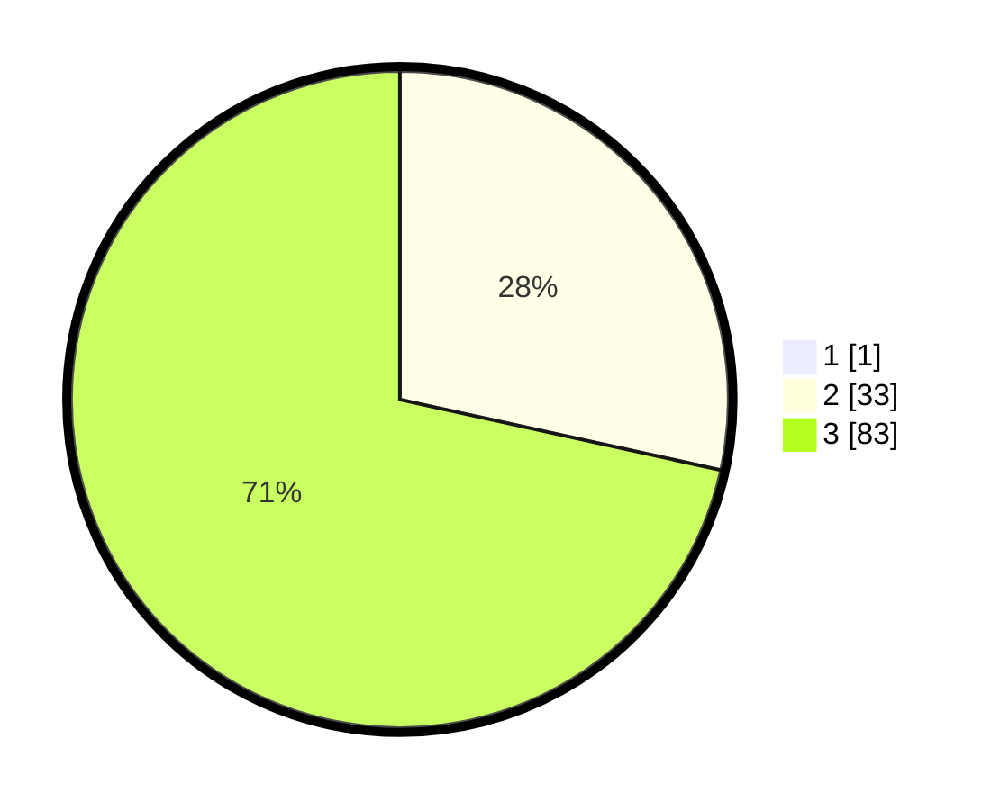

# Hasil

## Grafik

## Tabel

| No. | Nama Paslon    | Suara | Suara (raw) | Persentase |
|:--- |:-------------- | -----:| -----------:| ----------:|
| 1   | ANIES MUHAIMIN | 1     | [1][p-1]    | 0,85       |
| 2   | PRABOWO GIBRAN | 33    | [33][p-2]   | 28,21      |
| 3   | GANJAR MAHFUD  | 83    | [83][p-3]   | 70,94      |

[p-1]: https://github.com/gigit-pemilu/pemilu-2024/blob/main/pilpres/hitung-suara/sub/33-jawa-tengah/sub/12-wonogiri/sub/04-batuwarno/sub/2005-ronggojati/sub/009-tps/sub/paslon-1.txt
[p-2]: https://github.com/gigit-pemilu/pemilu-2024/blob/main/pilpres/hitung-suara/sub/33-jawa-tengah/sub/12-wonogiri/sub/04-batuwarno/sub/2005-ronggojati/sub/009-tps/sub/paslon-2.txt
[p-3]: https://github.com/gigit-pemilu/pemilu-2024/blob/main/pilpres/hitung-suara/sub/33-jawa-tengah/sub/12-wonogiri/sub/04-batuwarno/sub/2005-ronggojati/sub/009-tps/sub/paslon-3.txt

## Foto C Plano

https://sirekap-obj-formc.kpu.go.id/b89c/pemilu/ppwp/33/12/04/20/05/3312042005009-20240215-195738--2bd8bc92-1158-4ac3-9bf9-05f44794e0b2.jpg

https://sirekap-obj-formc.kpu.go.id/b89c/pemilu/ppwp/33/12/04/20/05/3312042005009-20240215-202927--dd7cda0c-7fb7-4bb1-b1a4-ec4e96dafe79.jpg

https://sirekap-obj-formc.kpu.go.id/b89c/pemilu/ppwp/33/12/04/20/05/3312042005009-20240215-203940--84e17b01-ccdb-4f06-88e7-9016628d23e5.jpg

## Metadata

| Key        | Value               |
| ---------- | ------------------- |
| Time Stamp | 2024-02-15 22:30:27 |

