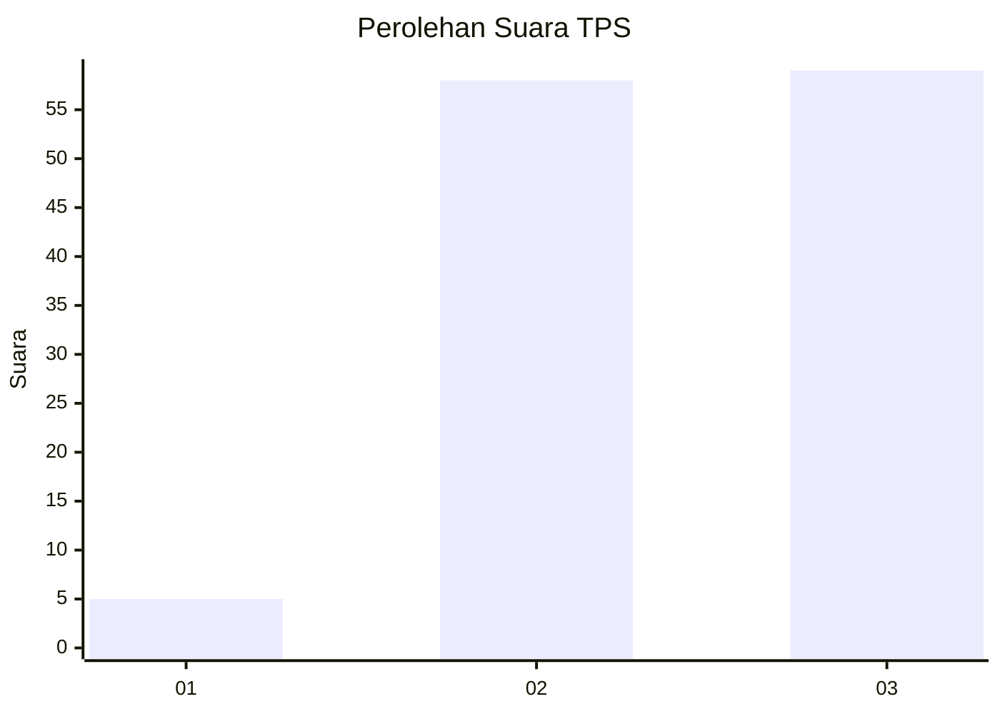
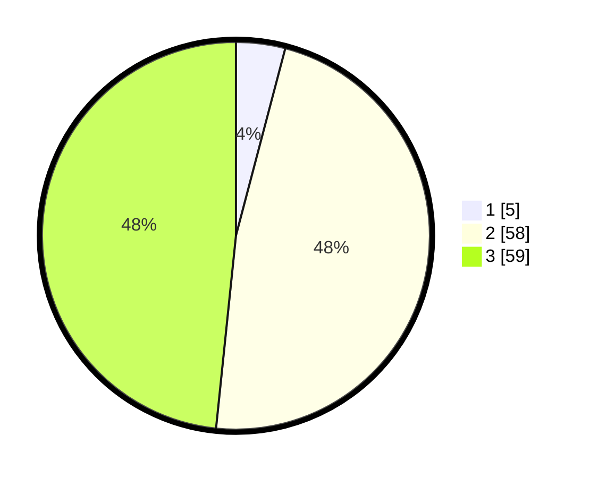

# Hasil

## Grafik

## Tabel

| No. | Nama Paslon    | Suara | Suara (raw) | Persentase |
|:--- |:-------------- | -----:| -----------:| ----------:|
| 1   | ANIES MUHAIMIN | 5     | [5][p-1]    | 4,10       |
| 2   | PRABOWO GIBRAN | 58    | [58][p-2]   | 47,54      |
| 3   | GANJAR MAHFUD  | 59    | [59][p-3]   | 48,36      |

[p-1]: https://github.com/gigit-pemilu/pemilu-2024/blob/main/pilpres/hitung-suara/sub/33-jawa-tengah/sub/12-wonogiri/sub/04-batuwarno/sub/2006-sumberagung/sub/002-tps/sub/paslon-1.txt
[p-2]: https://github.com/gigit-pemilu/pemilu-2024/blob/main/pilpres/hitung-suara/sub/33-jawa-tengah/sub/12-wonogiri/sub/04-batuwarno/sub/2006-sumberagung/sub/002-tps/sub/paslon-2.txt
[p-3]: https://github.com/gigit-pemilu/pemilu-2024/blob/main/pilpres/hitung-suara/sub/33-jawa-tengah/sub/12-wonogiri/sub/04-batuwarno/sub/2006-sumberagung/sub/002-tps/sub/paslon-3.txt

## Foto C Plano

https://sirekap-obj-formc.kpu.go.id/87ce/pemilu/ppwp/33/12/04/20/06/3312042006002-20240215-003843--69f9b40c-b202-4e2a-b7c7-91d7a0f5cefd.jpg

https://sirekap-obj-formc.kpu.go.id/87ce/pemilu/ppwp/33/12/04/20/06/3312042006002-20240215-003900--3d260df2-96f8-4b4b-92a5-cca8854dcac4.jpg

https://sirekap-obj-formc.kpu.go.id/87ce/pemilu/ppwp/33/12/04/20/06/3312042006002-20240215-003949--0bc17c18-6024-4db9-b5b7-972e80cd92c3.jpg

## Metadata

| Key        | Value               |
| ---------- | ------------------- |
| Time Stamp | 2024-02-15 20:00:44 |

