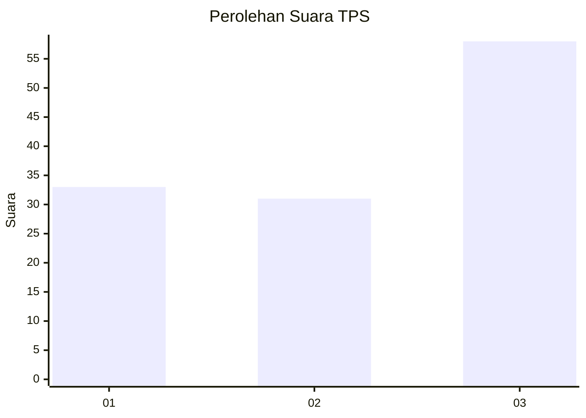
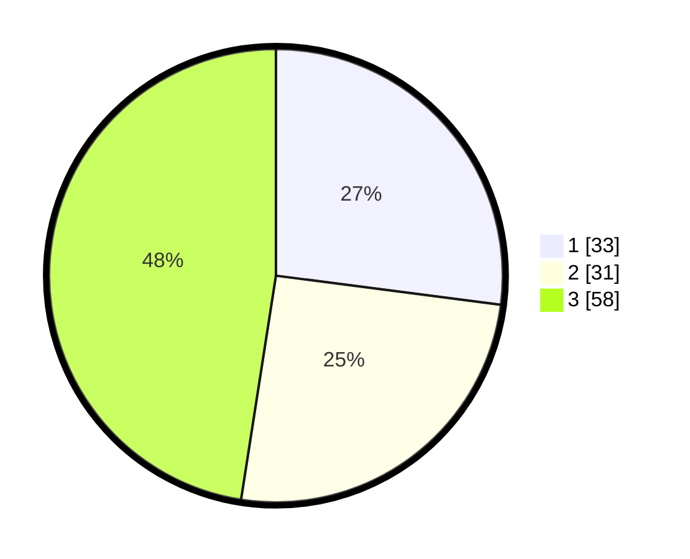

# Hasil

## Grafik

## Tabel

| No. | Nama Paslon    | Suara | Suara (raw) | Persentase |
|:--- |:-------------- | -----:| -----------:| ----------:|
| 1   | ANIES MUHAIMIN | 33    | [33][p-1]   | 27,05      |
| 2   | PRABOWO GIBRAN | 31    | [31][p-2]   | 25,41      |
| 3   | GANJAR MAHFUD  | 58    | [58][p-3]   | 47,54      |

[p-1]: https://github.com/gigit-pemilu/pemilu-2024/blob/main/pilpres/hitung-suara/sub/33-jawa-tengah/sub/12-wonogiri/sub/04-batuwarno/sub/2006-sumberagung/sub/006-tps/sub/paslon-1.txt
[p-2]: https://github.com/gigit-pemilu/pemilu-2024/blob/main/pilpres/hitung-suara/sub/33-jawa-tengah/sub/12-wonogiri/sub/04-batuwarno/sub/2006-sumberagung/sub/006-tps/sub/paslon-2.txt
[p-3]: https://github.com/gigit-pemilu/pemilu-2024/blob/main/pilpres/hitung-suara/sub/33-jawa-tengah/sub/12-wonogiri/sub/04-batuwarno/sub/2006-sumberagung/sub/006-tps/sub/paslon-3.txt

## Foto C Plano

https://sirekap-obj-formc.kpu.go.id/0e1a/pemilu/ppwp/33/12/04/20/06/3312042006006-20240214-141729--57c0f7c9-baa7-44d8-869b-f7c96e5228c0.jpg

https://sirekap-obj-formc.kpu.go.id/0e1a/pemilu/ppwp/33/12/04/20/06/3312042006006-20240214-141105--70f814c3-7ea7-4537-8417-8eb9e175dae0.jpg

https://sirekap-obj-formc.kpu.go.id/0e1a/pemilu/ppwp/33/12/04/20/06/3312042006006-20240214-141146--b9a4fc59-c795-4e41-a091-2e29794abc44.jpg

## Metadata

| Key        | Value               |
| ---------- | ------------------- |
| Time Stamp | 2024-02-14 21:46:01 |

