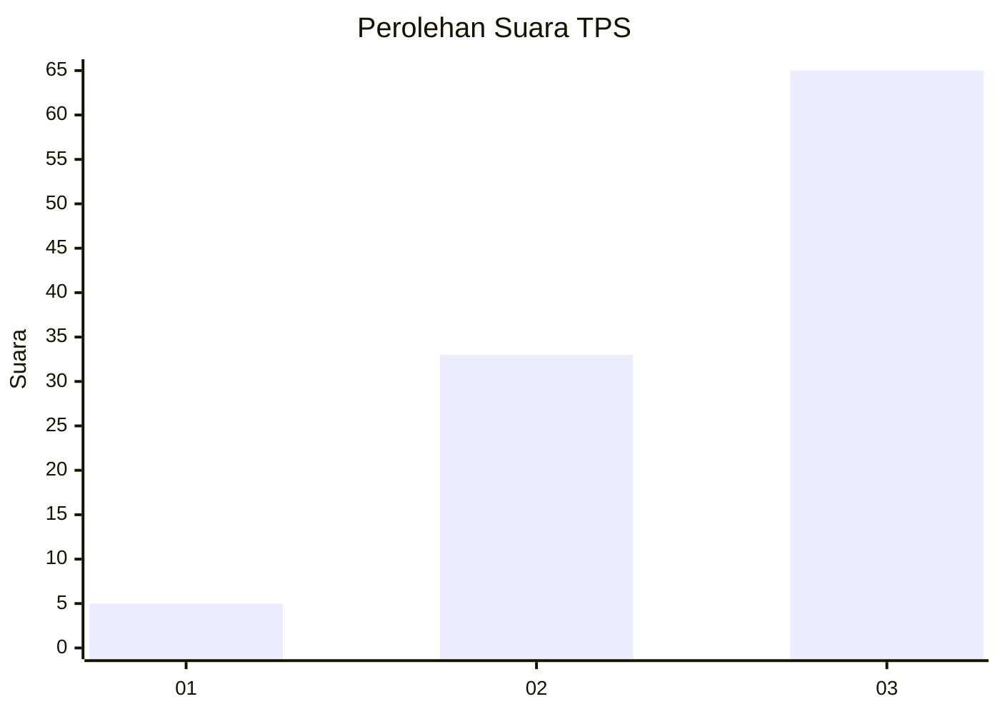
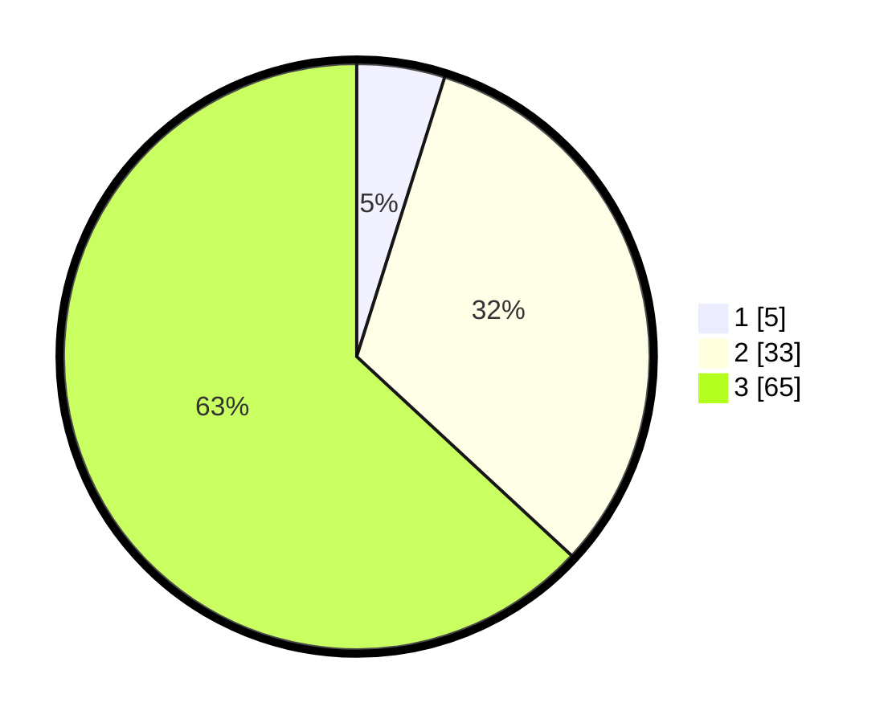

# Hasil

## Grafik

## Tabel

| No. | Nama Paslon    | Suara | Suara (raw) | Persentase |
|:--- |:-------------- | -----:| -----------:| ----------:|
| 1   | ANIES MUHAIMIN | 5     | [5][p-1]    | 4,85       |
| 2   | PRABOWO GIBRAN | 33    | [33][p-2]   | 32,04      |
| 3   | GANJAR MAHFUD  | 65    | [65][p-3]   | 63,11      |

[p-1]: https://github.com/gigit-pemilu/pemilu-2024/blob/main/pilpres/hitung-suara/sub/33-jawa-tengah/sub/12-wonogiri/sub/04-batuwarno/sub/2007-kudi/sub/004-tps/sub/paslon-1.txt
[p-2]: https://github.com/gigit-pemilu/pemilu-2024/blob/main/pilpres/hitung-suara/sub/33-jawa-tengah/sub/12-wonogiri/sub/04-batuwarno/sub/2007-kudi/sub/004-tps/sub/paslon-2.txt
[p-3]: https://github.com/gigit-pemilu/pemilu-2024/blob/main/pilpres/hitung-suara/sub/33-jawa-tengah/sub/12-wonogiri/sub/04-batuwarno/sub/2007-kudi/sub/004-tps/sub/paslon-3.txt

## Foto C Plano

https://sirekap-obj-formc.kpu.go.id/7104/pemilu/ppwp/33/12/04/20/07/3312042007004-20240215-000146--77c718b5-2411-49e8-87e8-fb8c51b6ab9a.jpg

https://sirekap-obj-formc.kpu.go.id/7104/pemilu/ppwp/33/12/04/20/07/3312042007004-20240215-000658--ce9b61ad-9e0c-4189-91e5-be148a458976.jpg

https://sirekap-obj-formc.kpu.go.id/7104/pemilu/ppwp/33/12/04/20/07/3312042007004-20240215-000940--0762c643-0b96-43ea-b7b4-f031de5b7b78.jpg

## Metadata

| Key        | Value               |
| ---------- | ------------------- |
| Time Stamp | 2024-02-15 09:00:24 |

