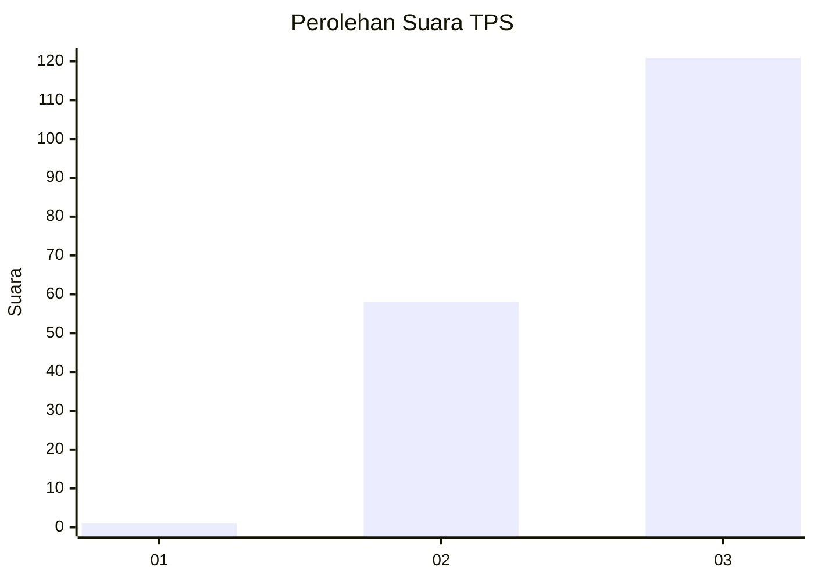
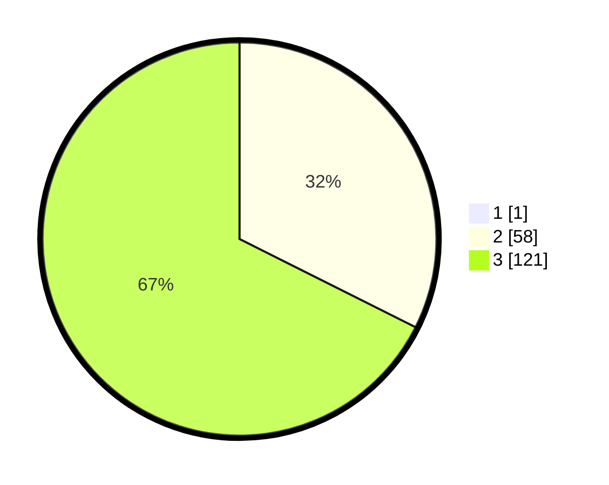

# Hasil

## Grafik

## Tabel

| No. | Nama Paslon    | Suara | Suara (raw) | Persentase |
|:--- |:-------------- | -----:| -----------:| ----------:|
| 1   | ANIES MUHAIMIN | 1     | [1][p-1]    | 0,56       |
| 2   | PRABOWO GIBRAN | 58    | [58][p-2]   | 32,22      |
| 3   | GANJAR MAHFUD  | 121   | [121][p-3]  | 67,22      |

[p-1]: https://github.com/gigit-pemilu/pemilu-2024/blob/main/pilpres/hitung-suara/sub/33-jawa-tengah/sub/12-wonogiri/sub/04-batuwarno/sub/2007-kudi/sub/005-tps/sub/paslon-1.txt
[p-2]: https://github.com/gigit-pemilu/pemilu-2024/blob/main/pilpres/hitung-suara/sub/33-jawa-tengah/sub/12-wonogiri/sub/04-batuwarno/sub/2007-kudi/sub/005-tps/sub/paslon-2.txt
[p-3]: https://github.com/gigit-pemilu/pemilu-2024/blob/main/pilpres/hitung-suara/sub/33-jawa-tengah/sub/12-wonogiri/sub/04-batuwarno/sub/2007-kudi/sub/005-tps/sub/paslon-3.txt

## Foto C Plano

https://sirekap-obj-formc.kpu.go.id/ccfd/pemilu/ppwp/33/12/04/20/07/3312042007005-20240215-005538--b61b1653-8996-4bc6-a6e4-779b4e708a75.jpg

https://sirekap-obj-formc.kpu.go.id/ccfd/pemilu/ppwp/33/12/04/20/07/3312042007005-20240215-005656--13980cdc-fdc6-4861-b1eb-1b3be60ee4c7.jpg

https://sirekap-obj-formc.kpu.go.id/ccfd/pemilu/ppwp/33/12/04/20/07/3312042007005-20240215-003542--b6ac02fc-21fb-40a5-97a8-341dd13b6464.jpg

## Metadata

| Key        | Value               |
| ---------- | ------------------- |
| Time Stamp | 2024-02-15 20:00:44 |

