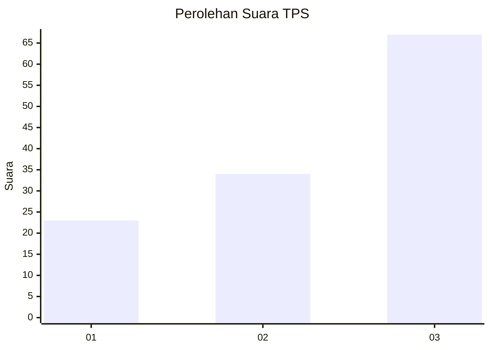
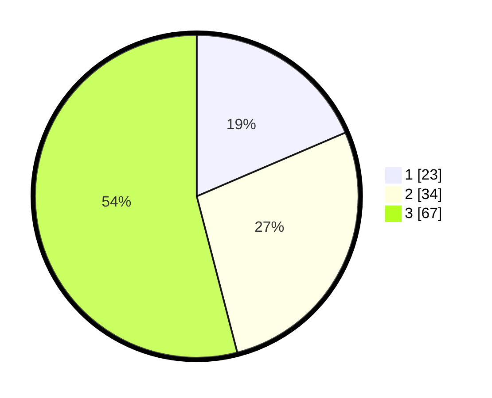

# Hasil

## Grafik

## Tabel

| No. | Nama Paslon    | Suara | Suara (raw) | Persentase |
|:--- |:-------------- | -----:| -----------:| ----------:|
| 1   | ANIES MUHAIMIN | 23    | [23][p-1]   | 18,55      |
| 2   | PRABOWO GIBRAN | 34    | [34][p-2]   | 27,42      |
| 3   | GANJAR MAHFUD  | 67    | [67][p-3]   | 54,03      |

[p-1]: https://github.com/gigit-pemilu/pemilu-2024/blob/main/pilpres/hitung-suara/sub/33-jawa-tengah/sub/12-wonogiri/sub/05-tirtomoyo/sub/1010-tirtomoyo/sub/002-tps/sub/paslon-1.txt
[p-2]: https://github.com/gigit-pemilu/pemilu-2024/blob/main/pilpres/hitung-suara/sub/33-jawa-tengah/sub/12-wonogiri/sub/05-tirtomoyo/sub/1010-tirtomoyo/sub/002-tps/sub/paslon-2.txt
[p-3]: https://github.com/gigit-pemilu/pemilu-2024/blob/main/pilpres/hitung-suara/sub/33-jawa-tengah/sub/12-wonogiri/sub/05-tirtomoyo/sub/1010-tirtomoyo/sub/002-tps/sub/paslon-3.txt

## Foto C Plano

https://sirekap-obj-formc.kpu.go.id/4225/pemilu/ppwp/33/12/05/10/10/3312051010002-20240217-182742--f4fd5d2f-cf11-40f9-9b63-34cefd7dff6e.jpg

https://sirekap-obj-formc.kpu.go.id/4225/pemilu/ppwp/33/12/05/10/10/3312051010002-20240217-182743--459df3ac-1db6-4ae6-9294-537885eb5e8c.jpg

https://sirekap-obj-formc.kpu.go.id/4225/pemilu/ppwp/33/12/05/10/10/3312051010002-20240217-182742--5d6ace09-0f07-4a5f-a4c6-b6827af3e6a8.jpg

## Metadata

| Key        | Value               |
| ---------- | ------------------- |
| Time Stamp | 2024-02-24 22:31:28 |

## DATA PEMILIH TETAP

Jumlah pemilih dalam DPT: **180**.
 * L: **95**.
 * P: **85**.

## DATA PENGGUNA HAK PILIH

Jumlah pengguna hak pilih dalam DPT: **126**.
 * L: **60**.
 * P: **66**.

Jumlah pengguna hak pilih dalam DPTb: **0**.
 * L: **0**.
 * P: **0**.

Jumlah pengguna hak pilih dalam DPK: **0**.
 * L: **0**.
 * P: **0**.

Jumlah pengguna hak pilih: **126**.
 * L: **60**.
 * P: **66**.

## JUMLAH SUARA SAH DAN TIDAK SAH

JUMLAH SELURUH SUARA SAH: **0**.

JUMLAH SUARA TIDAK SAH: **0**.

JUMLAH SELURUH SUARA SAH DAN SUARA TIDAK SAH: **0**.

