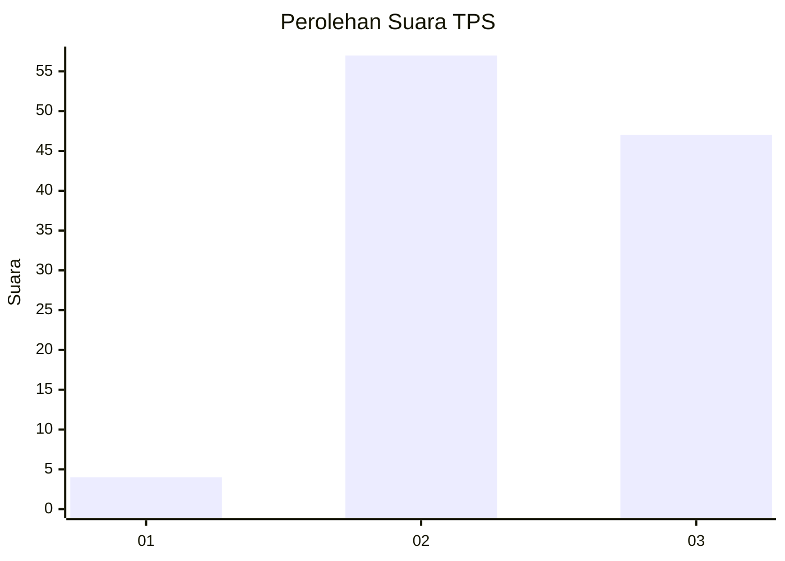
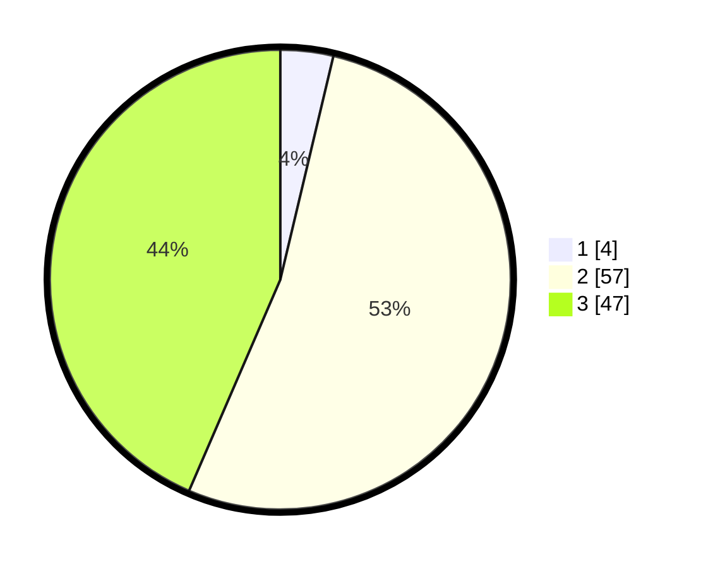

# Hasil

## Grafik

## Tabel

| No. | Nama Paslon    | Suara | Suara (raw) | Persentase |
|:--- |:-------------- | -----:| -----------:| ----------:|
| 1   | ANIES MUHAIMIN | 4     | [4][p-1]    | 3,70       |
| 2   | PRABOWO GIBRAN | 57    | [57][p-2]   | 52,78      |
| 3   | GANJAR MAHFUD  | 47    | [47][p-3]   | 43,52      |

[p-1]: https://github.com/gigit-pemilu/pemilu-2024/blob/main/pilpres/hitung-suara/sub/33-jawa-tengah/sub/12-wonogiri/sub/05-tirtomoyo/sub/1010-tirtomoyo/sub/020-tps/sub/paslon-1.txt
[p-2]: https://github.com/gigit-pemilu/pemilu-2024/blob/main/pilpres/hitung-suara/sub/33-jawa-tengah/sub/12-wonogiri/sub/05-tirtomoyo/sub/1010-tirtomoyo/sub/020-tps/sub/paslon-2.txt
[p-3]: https://github.com/gigit-pemilu/pemilu-2024/blob/main/pilpres/hitung-suara/sub/33-jawa-tengah/sub/12-wonogiri/sub/05-tirtomoyo/sub/1010-tirtomoyo/sub/020-tps/sub/paslon-3.txt

## Foto C Plano

https://sirekap-obj-formc.kpu.go.id/a3db/pemilu/ppwp/33/12/05/10/10/3312051010020-20240214-141925--541d0eb5-d828-46e2-94eb-d1705a6dd035.jpg

https://sirekap-obj-formc.kpu.go.id/a3db/pemilu/ppwp/33/12/05/10/10/3312051010020-20240214-141311--1af0ef9a-3f4d-4c06-8cc6-e7100ceb82f6.jpg

https://sirekap-obj-formc.kpu.go.id/a3db/pemilu/ppwp/33/12/05/10/10/3312051010020-20240214-141837--ed51c681-91d3-4b88-9c3d-630cf116f6ab.jpg

## Metadata

| Key        | Value               |
| ---------- | ------------------- |
| Time Stamp | 2024-02-15 20:00:44 |

