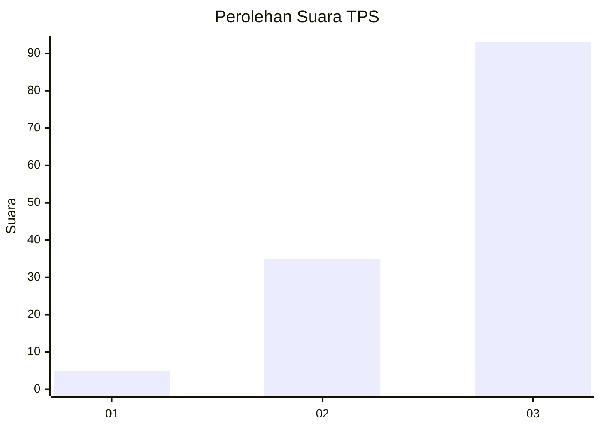
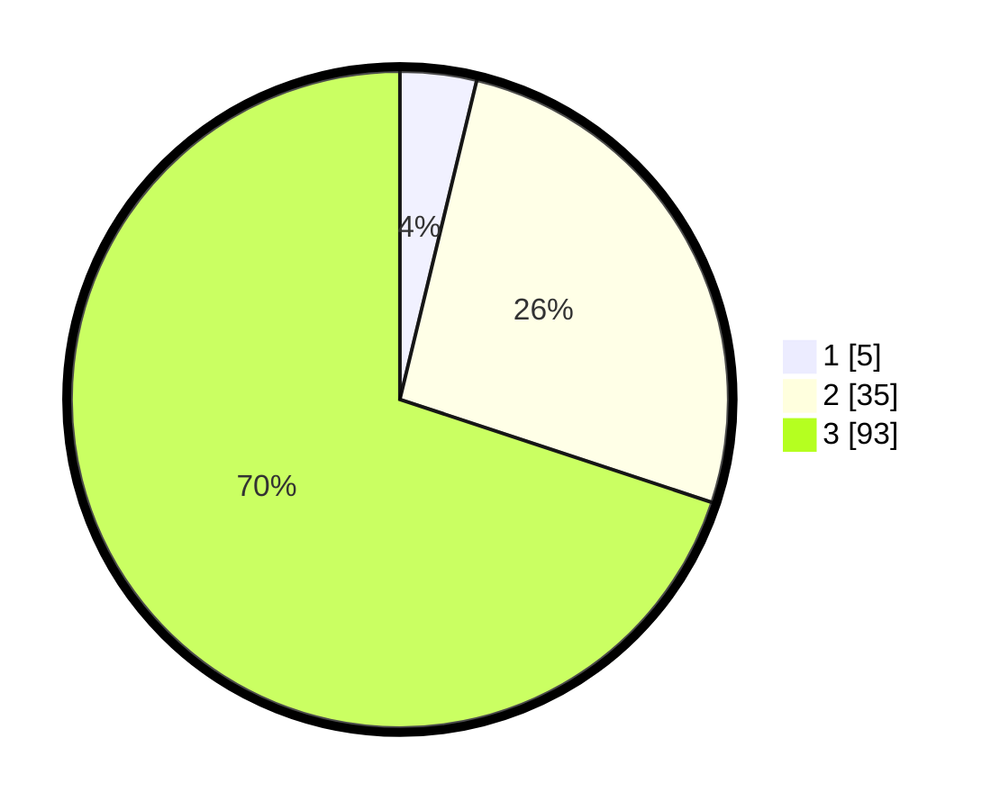

# Hasil

## Grafik

## Tabel

| No. | Nama Paslon    | Suara | Suara (raw) | Persentase |
|:--- |:-------------- | -----:| -----------:| ----------:|
| 1   | ANIES MUHAIMIN | 5     | [5][p-1]    | 3,76       |
| 2   | PRABOWO GIBRAN | 35    | [35][p-2]   | 26,32      |
| 3   | GANJAR MAHFUD  | 93    | [93][p-3]   | 69,92      |

[p-1]: https://github.com/gigit-pemilu/pemilu-2024/blob/main/pilpres/hitung-suara/sub/33-jawa-tengah/sub/12-wonogiri/sub/05-tirtomoyo/sub/2001-hargosari/sub/019-tps/sub/paslon-1.txt
[p-2]: https://github.com/gigit-pemilu/pemilu-2024/blob/main/pilpres/hitung-suara/sub/33-jawa-tengah/sub/12-wonogiri/sub/05-tirtomoyo/sub/2001-hargosari/sub/019-tps/sub/paslon-2.txt
[p-3]: https://github.com/gigit-pemilu/pemilu-2024/blob/main/pilpres/hitung-suara/sub/33-jawa-tengah/sub/12-wonogiri/sub/05-tirtomoyo/sub/2001-hargosari/sub/019-tps/sub/paslon-3.txt

## Foto C Plano

https://sirekap-obj-formc.kpu.go.id/d918/pemilu/ppwp/33/12/05/20/01/3312052001019-20240214-141452--4f2bcb1e-9257-46e2-ba36-4bab15dcff6a.jpg

https://sirekap-obj-formc.kpu.go.id/d918/pemilu/ppwp/33/12/05/20/01/3312052001019-20240214-141555--f9278718-a4e9-4f4a-af36-c4f2ed67aecb.jpg

https://sirekap-obj-formc.kpu.go.id/d918/pemilu/ppwp/33/12/05/20/01/3312052001019-20240214-141132--00168031-49fd-4718-8f84-a33792d2e54f.jpg

## Metadata

| Key        | Value               |
| ---------- | ------------------- |
| Time Stamp | 2024-02-14 21:46:01 |

