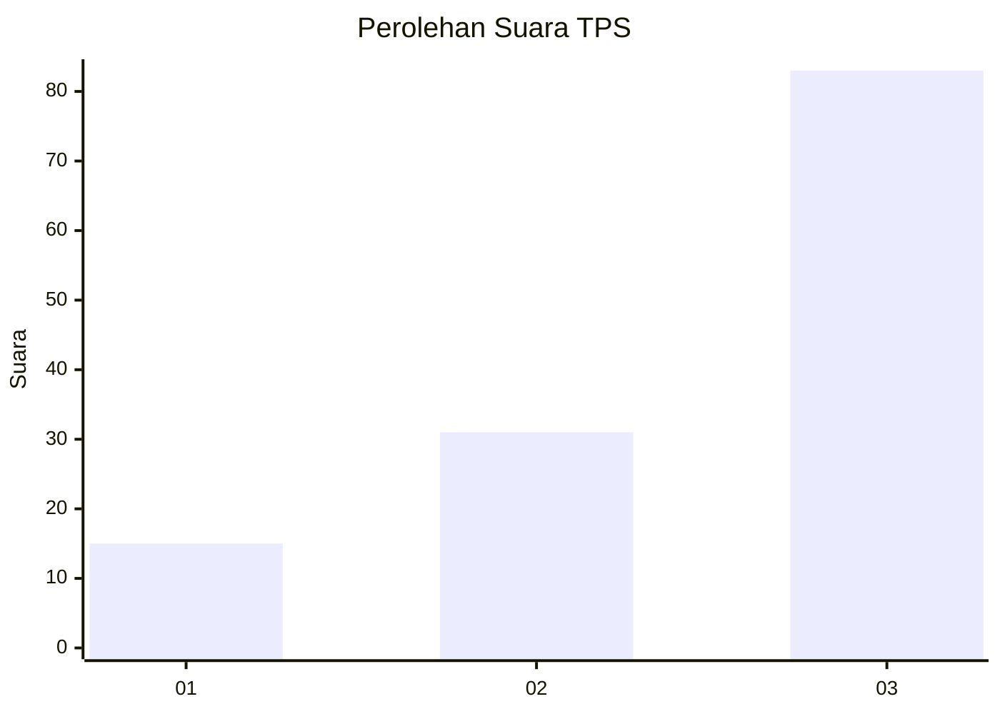
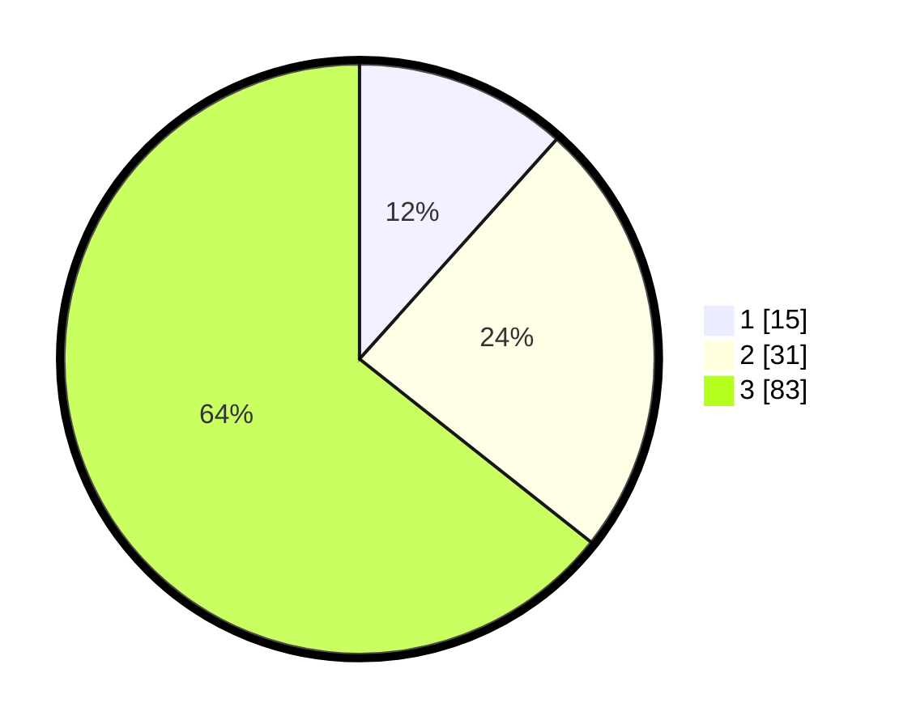

# Hasil

## Grafik

## Tabel

| No. | Nama Paslon    | Suara | Suara (raw) | Persentase |
|:--- |:-------------- | -----:| -----------:| ----------:|
| 1   | ANIES MUHAIMIN | 15    | [15][p-1]   | 11,63      |
| 2   | PRABOWO GIBRAN | 31    | [31][p-2]   | 24,03      |
| 3   | GANJAR MAHFUD  | 83    | [83][p-3]   | 64,34      |

[p-1]: https://github.com/gigit-pemilu/pemilu-2024/blob/main/pilpres/hitung-suara/sub/33-jawa-tengah/sub/12-wonogiri/sub/05-tirtomoyo/sub/2005-hargorejo/sub/008-tps/sub/paslon-1.txt
[p-2]: https://github.com/gigit-pemilu/pemilu-2024/blob/main/pilpres/hitung-suara/sub/33-jawa-tengah/sub/12-wonogiri/sub/05-tirtomoyo/sub/2005-hargorejo/sub/008-tps/sub/paslon-2.txt
[p-3]: https://github.com/gigit-pemilu/pemilu-2024/blob/main/pilpres/hitung-suara/sub/33-jawa-tengah/sub/12-wonogiri/sub/05-tirtomoyo/sub/2005-hargorejo/sub/008-tps/sub/paslon-3.txt

## Foto C Plano

https://sirekap-obj-formc.kpu.go.id/af06/pemilu/ppwp/33/12/05/20/05/3312052005008-20240215-003502--86868728-d86d-4d80-99ea-230b89e1c79c.jpg

https://sirekap-obj-formc.kpu.go.id/af06/pemilu/ppwp/33/12/05/20/05/3312052005008-20240215-003817--346862c9-eaed-493f-ad45-922ca25a208a.jpg

https://sirekap-obj-formc.kpu.go.id/af06/pemilu/ppwp/33/12/05/20/05/3312052005008-20240214-195621--14ecd77c-3b1b-46cb-957e-fd9c624dc882.jpg

## Metadata

| Key        | Value               |
| ---------- | ------------------- |
| Time Stamp | 2024-02-15 20:00:44 |

