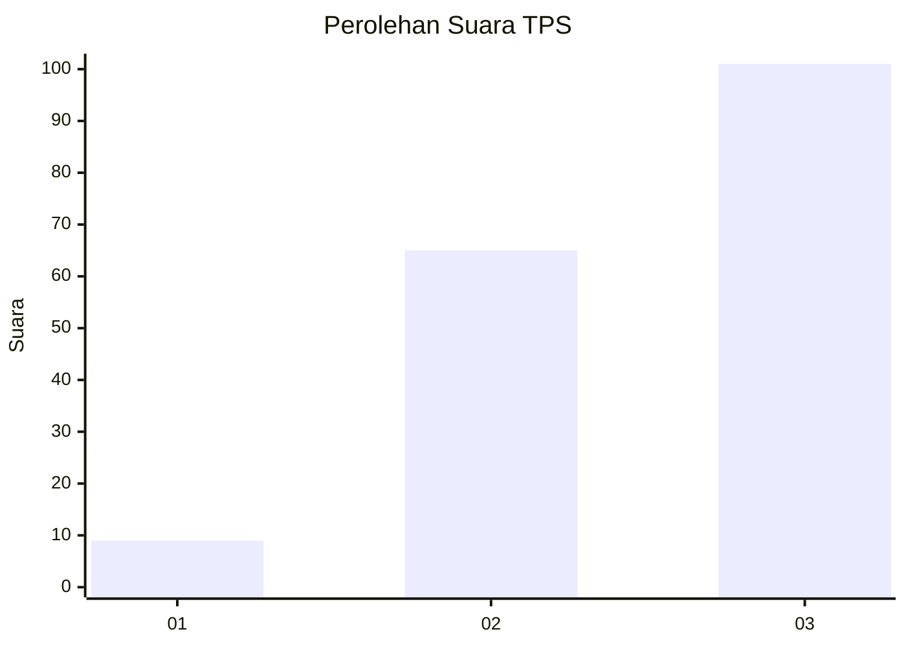
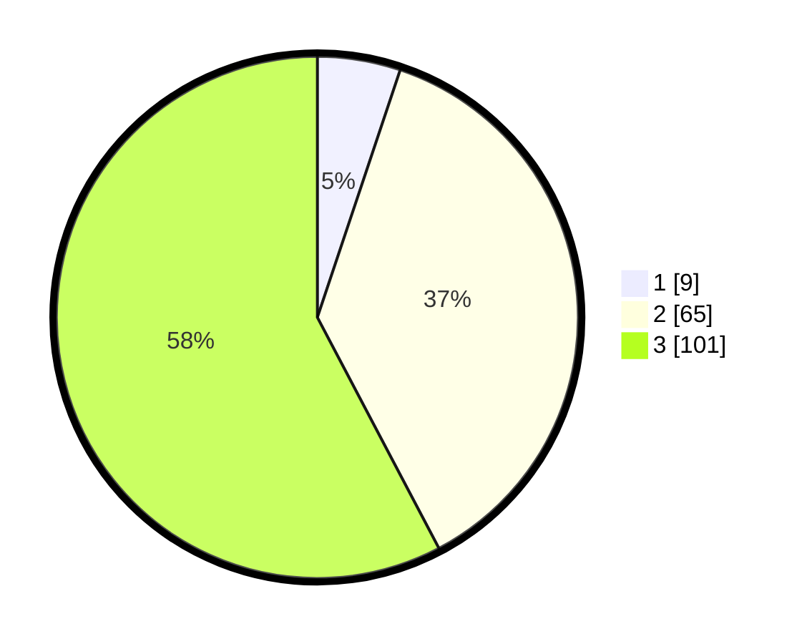

# Hasil

## Grafik

## Tabel

| No. | Nama Paslon    | Suara | Suara (raw) | Persentase |
|:--- |:-------------- | -----:| -----------:| ----------:|
| 1   | ANIES MUHAIMIN | 9     | [9][p-1]    | 5,14       |
| 2   | PRABOWO GIBRAN | 65    | [65][p-2]   | 37,14      |
| 3   | GANJAR MAHFUD  | 101   | [101][p-3]  | 57,71      |

[p-1]: https://github.com/gigit-pemilu/pemilu-2024/blob/main/pilpres/hitung-suara/sub/33-jawa-tengah/sub/12-wonogiri/sub/05-tirtomoyo/sub/2006-sidorejo/sub/018-tps/sub/paslon-1.txt
[p-2]: https://github.com/gigit-pemilu/pemilu-2024/blob/main/pilpres/hitung-suara/sub/33-jawa-tengah/sub/12-wonogiri/sub/05-tirtomoyo/sub/2006-sidorejo/sub/018-tps/sub/paslon-2.txt
[p-3]: https://github.com/gigit-pemilu/pemilu-2024/blob/main/pilpres/hitung-suara/sub/33-jawa-tengah/sub/12-wonogiri/sub/05-tirtomoyo/sub/2006-sidorejo/sub/018-tps/sub/paslon-3.txt

## Foto C Plano

https://sirekap-obj-formc.kpu.go.id/452e/pemilu/ppwp/33/12/05/20/06/3312052006018-20240215-235426--33b85a6c-abc9-4ba1-be8e-ad496d8f6ef3.jpg

https://sirekap-obj-formc.kpu.go.id/452e/pemilu/ppwp/33/12/05/20/06/3312052006018-20240218-114247--8354c73e-12e8-42ed-944d-d5bc785aeea4.jpg

https://sirekap-obj-formc.kpu.go.id/452e/pemilu/ppwp/33/12/05/20/06/3312052006018-20240215-143546--87a595d3-5e92-4182-90b8-d9a3d5d2efb7.jpg

## Metadata

| Key        | Value               |
| ---------- | ------------------- |
| Time Stamp | 2024-02-25 12:00:00 |

