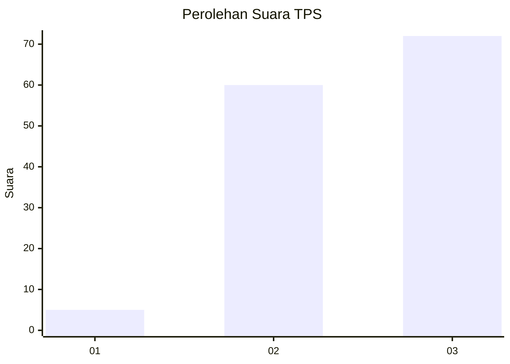
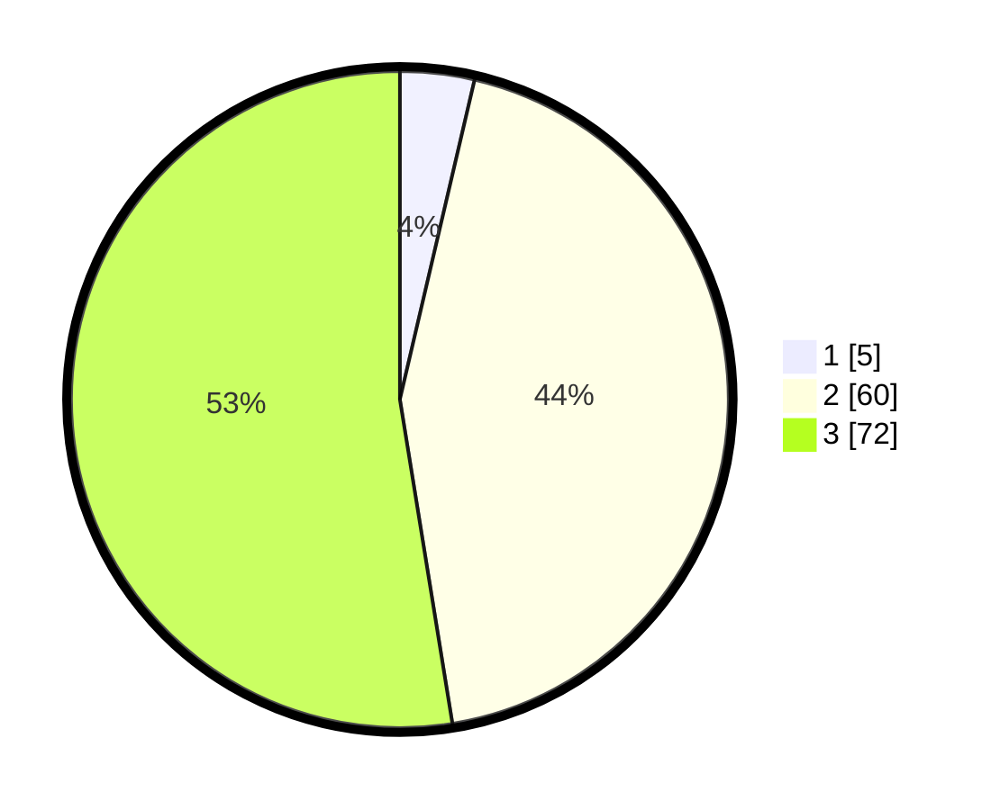

# Hasil

## Grafik

## Tabel

| No. | Nama Paslon    | Suara | Suara (raw) | Persentase |
|:--- |:-------------- | -----:| -----------:| ----------:|
| 1   | ANIES MUHAIMIN | 5     | [5][p-1]    | 3,65       |
| 2   | PRABOWO GIBRAN | 60    | [60][p-2]   | 43,80      |
| 3   | GANJAR MAHFUD  | 72    | [72][p-3]   | 52,55      |

[p-1]: https://github.com/gigit-pemilu/pemilu-2024-33-jawa-tengah/blob/main/pilpres/hitung-suara/sub/33-jawa-tengah/sub/12-wonogiri/sub/05-tirtomoyo/sub/2009-hargantoro/sub/002-tps/sub/paslon-1.txt
[p-2]: https://github.com/gigit-pemilu/pemilu-2024-33-jawa-tengah/blob/main/pilpres/hitung-suara/sub/33-jawa-tengah/sub/12-wonogiri/sub/05-tirtomoyo/sub/2009-hargantoro/sub/002-tps/sub/paslon-2.txt
[p-3]: https://github.com/gigit-pemilu/pemilu-2024-33-jawa-tengah/blob/main/pilpres/hitung-suara/sub/33-jawa-tengah/sub/12-wonogiri/sub/05-tirtomoyo/sub/2009-hargantoro/sub/002-tps/sub/paslon-3.txt

## Foto C Plano

https://sirekap-obj-formc.kpu.go.id/ad30/pemilu/ppwp/33/12/05/20/09/3312052009002-20240218-080310--3e755f01-4311-44a0-a233-ef25b6d58507.jpg

https://sirekap-obj-formc.kpu.go.id/ad30/pemilu/ppwp/33/12/05/20/09/3312052009002-20240218-110140--a75ea425-f3b5-42f7-90bf-8211cfc6b784.jpg

https://sirekap-obj-formc.kpu.go.id/ad30/pemilu/ppwp/33/12/05/20/09/3312052009002-20240215-131516--3a0a0df5-e4db-4c80-9f24-c0a3e0ccd24b.jpg

## Metadata

| Key        | Value               |
| ---------- | ------------------- |
| Time Stamp | 2024-02-19 23:00:00 |

