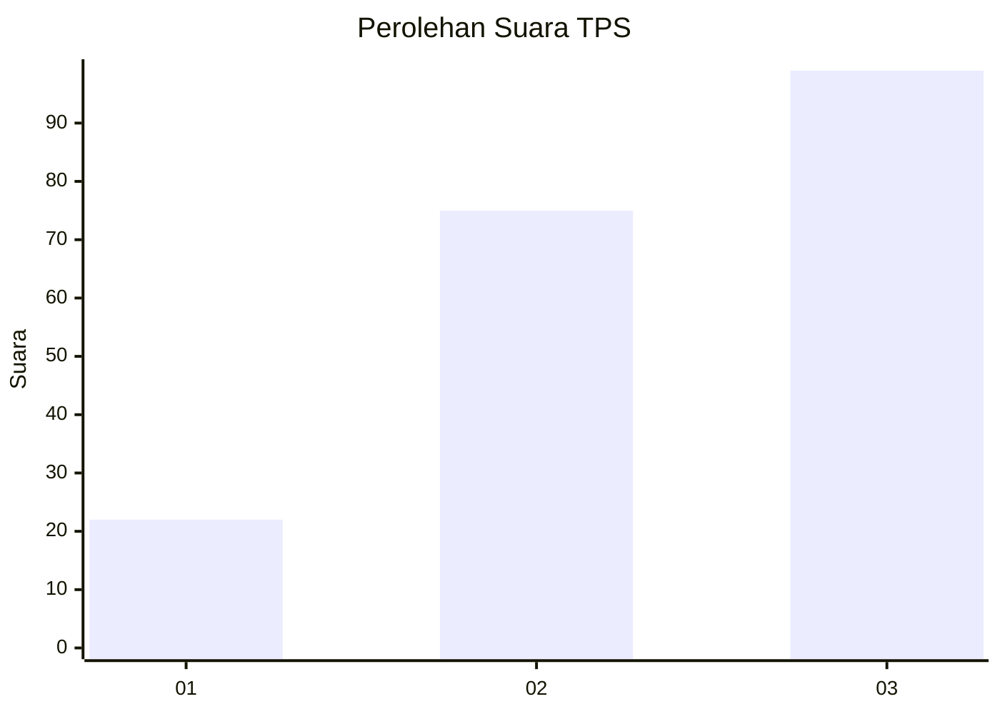
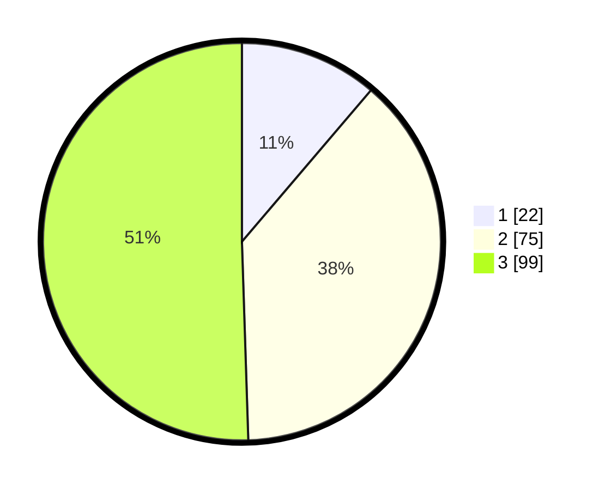

# Hasil

## Grafik

## Tabel

| No. | Nama Paslon    | Suara | Suara (raw) | Persentase |
|:--- |:-------------- | -----:| -----------:| ----------:|
| 1   | ANIES MUHAIMIN | 22    | [22][p-1]   | 11,22      |
| 2   | PRABOWO GIBRAN | 75    | [75][p-2]   | 38,27      |
| 3   | GANJAR MAHFUD  | 99    | [99][p-3]   | 50,51      |

[p-1]: https://github.com/gigit-pemilu/pemilu-2024/blob/main/pilpres/hitung-suara/sub/33-jawa-tengah/sub/12-wonogiri/sub/05-tirtomoyo/sub/2009-hargantoro/sub/007-tps/sub/paslon-1.txt
[p-2]: https://github.com/gigit-pemilu/pemilu-2024/blob/main/pilpres/hitung-suara/sub/33-jawa-tengah/sub/12-wonogiri/sub/05-tirtomoyo/sub/2009-hargantoro/sub/007-tps/sub/paslon-2.txt
[p-3]: https://github.com/gigit-pemilu/pemilu-2024/blob/main/pilpres/hitung-suara/sub/33-jawa-tengah/sub/12-wonogiri/sub/05-tirtomoyo/sub/2009-hargantoro/sub/007-tps/sub/paslon-3.txt

## Foto C Plano

https://sirekap-obj-formc.kpu.go.id/0b74/pemilu/ppwp/33/12/05/20/09/3312052009007-20240215-001716--63928e81-30d4-41a1-b9f9-8f3ff08a66f0.jpg

https://sirekap-obj-formc.kpu.go.id/0b74/pemilu/ppwp/33/12/05/20/09/3312052009007-20240215-001820--90977c33-e8c1-49f2-b040-e52bea4a4e86.jpg

https://sirekap-obj-formc.kpu.go.id/0b74/pemilu/ppwp/33/12/05/20/09/3312052009007-20240219-105439--5e3c1ac8-c68b-439b-91d9-dd8219cf089c.jpg

## Metadata

| Key        | Value               |
| ---------- | ------------------- |
| Time Stamp | 2024-02-19 11:00:00 |

