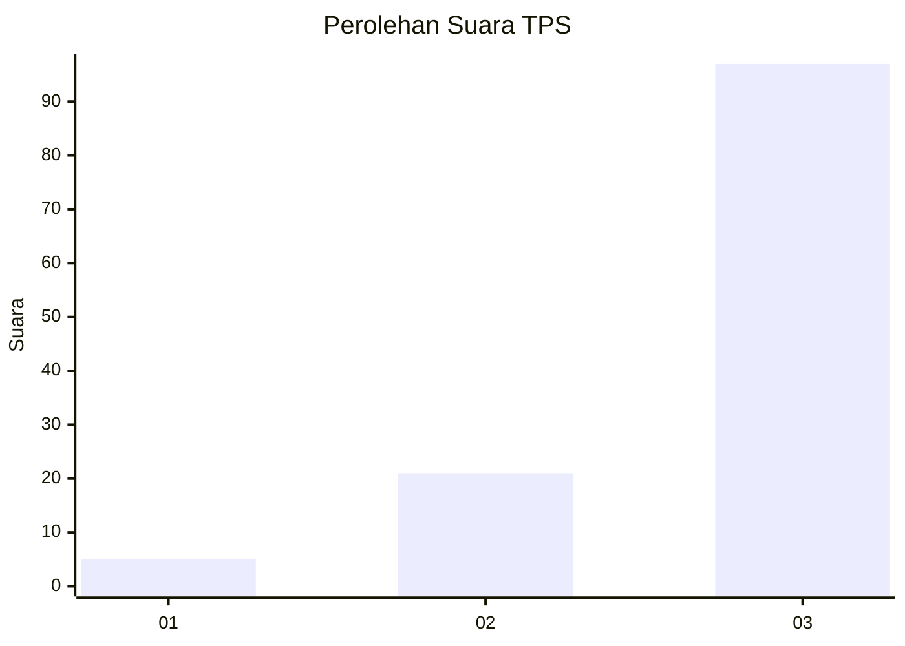
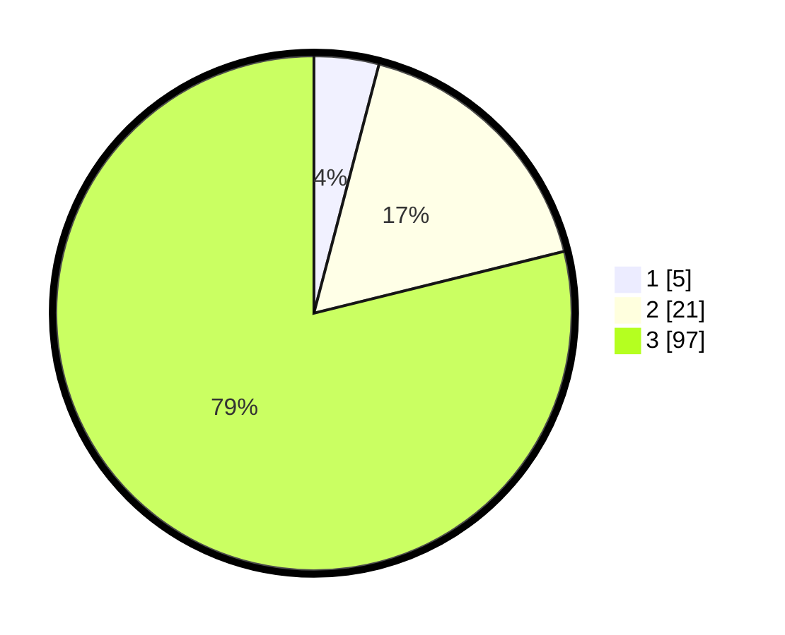

# Hasil

## Grafik

## Tabel

| No. | Nama Paslon    | Suara | Suara (raw) | Persentase |
|:--- |:-------------- | -----:| -----------:| ----------:|
| 1   | ANIES MUHAIMIN | 5     | [5][p-1]    | 4,07       |
| 2   | PRABOWO GIBRAN | 21    | [21][p-2]   | 17,07      |
| 3   | GANJAR MAHFUD  | 97    | [97][p-3]   | 78,86      |

[p-1]: https://github.com/gigit-pemilu/pemilu-2024/blob/main/pilpres/hitung-suara/sub/33-jawa-tengah/sub/12-wonogiri/sub/05-tirtomoyo/sub/2014-tanjungsari/sub/006-tps/sub/paslon-1.txt
[p-2]: https://github.com/gigit-pemilu/pemilu-2024/blob/main/pilpres/hitung-suara/sub/33-jawa-tengah/sub/12-wonogiri/sub/05-tirtomoyo/sub/2014-tanjungsari/sub/006-tps/sub/paslon-2.txt
[p-3]: https://github.com/gigit-pemilu/pemilu-2024/blob/main/pilpres/hitung-suara/sub/33-jawa-tengah/sub/12-wonogiri/sub/05-tirtomoyo/sub/2014-tanjungsari/sub/006-tps/sub/paslon-3.txt

## Foto C Plano

https://sirekap-obj-formc.kpu.go.id/959f/pemilu/ppwp/33/12/05/20/14/3312052014006-20240217-144828--fa32e637-c441-4317-9288-a289288838bf.jpg

https://sirekap-obj-formc.kpu.go.id/959f/pemilu/ppwp/33/12/05/20/14/3312052014006-20240217-144959--f9f3c4e4-814e-4933-b5c2-3e5f4c8ce095.jpg

https://sirekap-obj-formc.kpu.go.id/959f/pemilu/ppwp/33/12/05/20/14/3312052014006-20240217-145409--2553ced5-5f70-4551-b15b-796eeb7dfa27.jpg

## Metadata

| Key        | Value               |
| ---------- | ------------------- |
| Time Stamp | 2024-02-19 06:16:00 |

