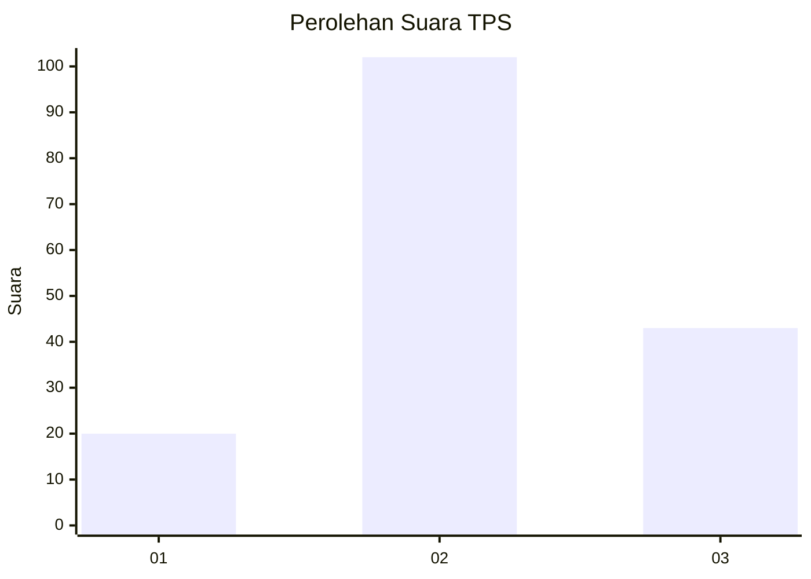
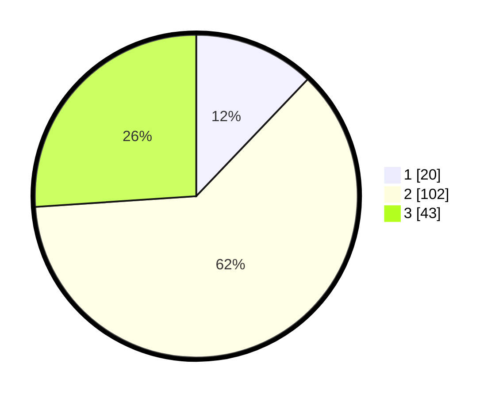

# Hasil

## Grafik

## Tabel

| No. | Nama Paslon    | Suara | Suara (raw) | Persentase |
|:--- |:-------------- | -----:| -----------:| ----------:|
| 1   | ANIES MUHAIMIN | 20    | [20][p-1]   | 12,12      |
| 2   | PRABOWO GIBRAN | 102   | [102][p-2]  | 61,82      |
| 3   | GANJAR MAHFUD  | 43    | [43][p-3]   | 26,06      |

[p-1]: https://github.com/gigit-pemilu/pemilu-2024/blob/main/pilpres/hitung-suara/sub/33-jawa-tengah/sub/12-wonogiri/sub/06-nguntoronadi/sub/1004-kedungrejo/sub/002-tps/sub/paslon-1.txt
[p-2]: https://github.com/gigit-pemilu/pemilu-2024/blob/main/pilpres/hitung-suara/sub/33-jawa-tengah/sub/12-wonogiri/sub/06-nguntoronadi/sub/1004-kedungrejo/sub/002-tps/sub/paslon-2.txt
[p-3]: https://github.com/gigit-pemilu/pemilu-2024/blob/main/pilpres/hitung-suara/sub/33-jawa-tengah/sub/12-wonogiri/sub/06-nguntoronadi/sub/1004-kedungrejo/sub/002-tps/sub/paslon-3.txt

## Foto C Plano

https://sirekap-obj-formc.kpu.go.id/15c0/pemilu/ppwp/33/12/06/10/04/3312061004002-20240217-015428--f6d72316-5b0f-4abd-96fc-904b2322ca01.jpg

https://sirekap-obj-formc.kpu.go.id/15c0/pemilu/ppwp/33/12/06/10/04/3312061004002-20240217-015721--0f5afa7b-8e58-449c-8a2b-6d8de3196747.jpg

https://sirekap-obj-formc.kpu.go.id/15c0/pemilu/ppwp/33/12/06/10/04/3312061004002-20240217-015803--7b4cb26b-abeb-44c4-8229-a6e736e77654.jpg

## Metadata

| Key        | Value               |
| ---------- | ------------------- |
| Time Stamp | 2024-02-19 06:16:00 |

