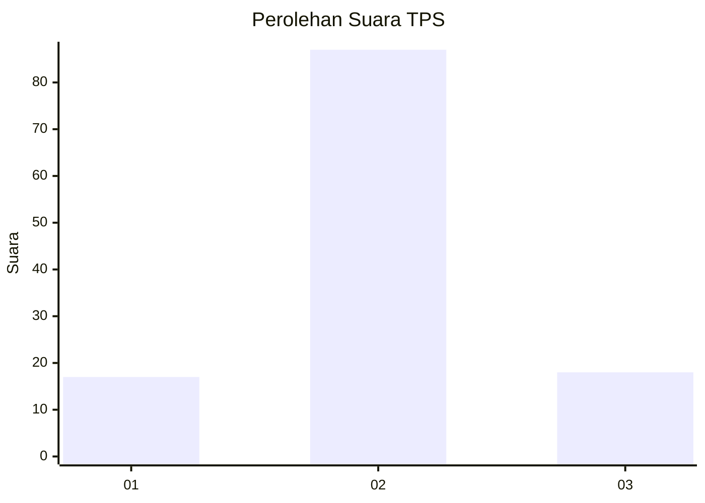
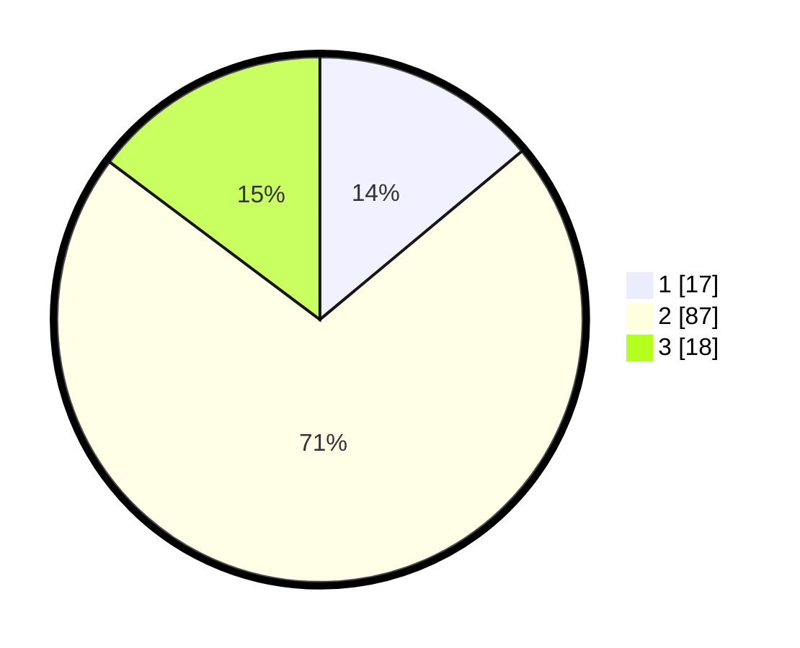

# Hasil

## Grafik

## Tabel

| No. | Nama Paslon    | Suara | Suara (raw) | Persentase |
|:--- |:-------------- | -----:| -----------:| ----------:|
| 1   | ANIES MUHAIMIN | 17    | [17][p-1]   | 13,93      |
| 2   | PRABOWO GIBRAN | 87    | [87][p-2]   | 71,31      |
| 3   | GANJAR MAHFUD  | 18    | [18][p-3]   | 14,75      |

[p-1]: https://github.com/gigit-pemilu/pemilu-2024-33-jawa-tengah/blob/main/pilpres/hitung-suara/sub/33-jawa-tengah/sub/12-wonogiri/sub/06-nguntoronadi/sub/1004-kedungrejo/sub/007-tps/sub/paslon-1.txt
[p-2]: https://github.com/gigit-pemilu/pemilu-2024-33-jawa-tengah/blob/main/pilpres/hitung-suara/sub/33-jawa-tengah/sub/12-wonogiri/sub/06-nguntoronadi/sub/1004-kedungrejo/sub/007-tps/sub/paslon-2.txt
[p-3]: https://github.com/gigit-pemilu/pemilu-2024-33-jawa-tengah/blob/main/pilpres/hitung-suara/sub/33-jawa-tengah/sub/12-wonogiri/sub/06-nguntoronadi/sub/1004-kedungrejo/sub/007-tps/sub/paslon-3.txt

## Foto C Plano

https://sirekap-obj-formc.kpu.go.id/e88c/pemilu/ppwp/33/12/06/10/04/3312061004007-20240214-210300--66a50989-e131-4fb7-888d-06106479f460.jpg

https://sirekap-obj-formc.kpu.go.id/e88c/pemilu/ppwp/33/12/06/10/04/3312061004007-20240215-142435--9a68e476-6b05-4411-a530-a251e538e79e.jpg

https://sirekap-obj-formc.kpu.go.id/e88c/pemilu/ppwp/33/12/06/10/04/3312061004007-20240215-160048--63475b65-e4a3-4a04-a383-17753e08ad19.jpg

## Metadata

| Key        | Value               |
| ---------- | ------------------- |
| Time Stamp | 2024-02-15 21:01:18 |

