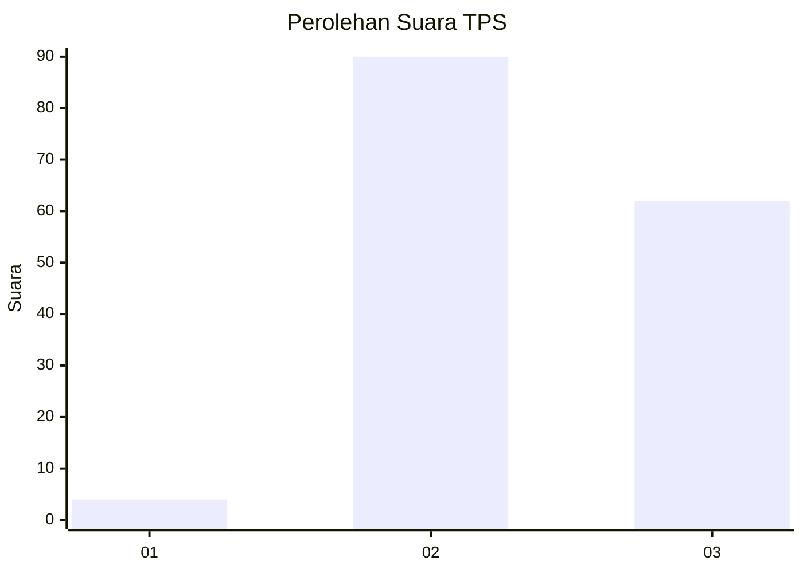
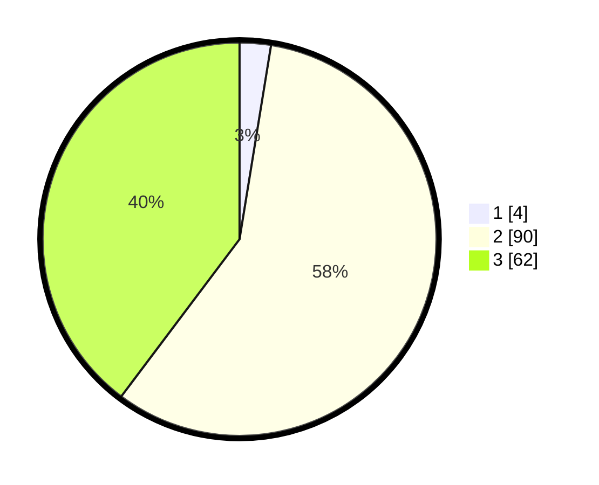

# Hasil

## Grafik

## Tabel

| No. | Nama Paslon    | Suara | Suara (raw) | Persentase |
|:--- |:-------------- | -----:| -----------:| ----------:|
| 1   | ANIES MUHAIMIN | 4     | [4][p-1]    | 2,56       |
| 2   | PRABOWO GIBRAN | 90    | [90][p-2]   | 57,69      |
| 3   | GANJAR MAHFUD  | 62    | [62][p-3]   | 39,74      |

[p-1]: https://github.com/gigit-pemilu/pemilu-2024/blob/main/pilpres/hitung-suara/sub/33-jawa-tengah/sub/12-wonogiri/sub/06-nguntoronadi/sub/1004-kedungrejo/sub/008-tps/sub/paslon-1.txt
[p-2]: https://github.com/gigit-pemilu/pemilu-2024/blob/main/pilpres/hitung-suara/sub/33-jawa-tengah/sub/12-wonogiri/sub/06-nguntoronadi/sub/1004-kedungrejo/sub/008-tps/sub/paslon-2.txt
[p-3]: https://github.com/gigit-pemilu/pemilu-2024/blob/main/pilpres/hitung-suara/sub/33-jawa-tengah/sub/12-wonogiri/sub/06-nguntoronadi/sub/1004-kedungrejo/sub/008-tps/sub/paslon-3.txt

## Foto C Plano

https://sirekap-obj-formc.kpu.go.id/80e1/pemilu/ppwp/33/12/06/10/04/3312061004008-20240214-235004--e65095f1-e3df-42e9-8831-b9f6ead2d701.jpg

https://sirekap-obj-formc.kpu.go.id/80e1/pemilu/ppwp/33/12/06/10/04/3312061004008-20240214-234718--f23d9d25-804b-4e21-9474-56c401015e05.jpg

https://sirekap-obj-formc.kpu.go.id/80e1/pemilu/ppwp/33/12/06/10/04/3312061004008-20240214-234514--d6fe1a38-98f5-45a9-8ac2-5b985b860e1e.jpg

## Metadata

| Key        | Value               |
| ---------- | ------------------- |
| Time Stamp | 2024-02-15 20:30:46 |

