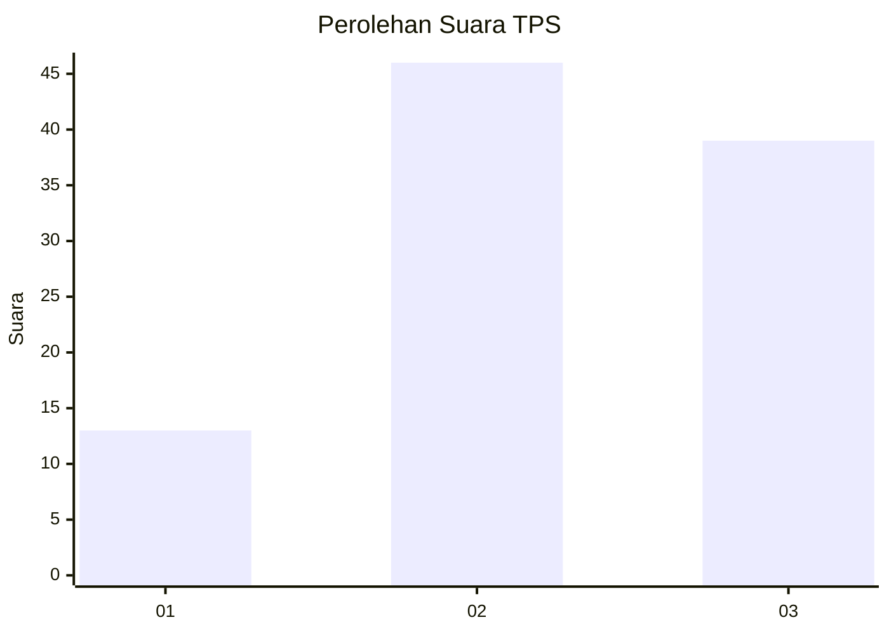
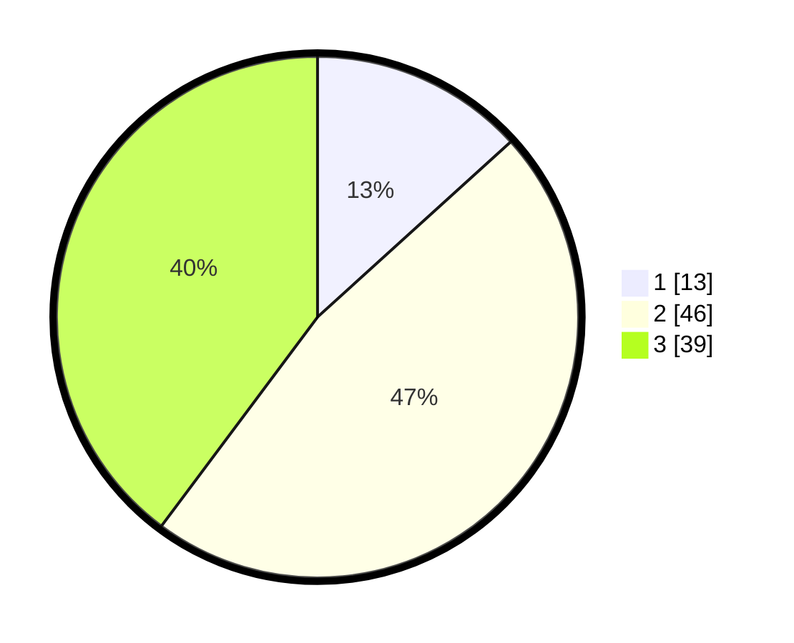

# Hasil

## Grafik

## Tabel

| No. | Nama Paslon    | Suara | Suara (raw) | Persentase |
|:--- |:-------------- | -----:| -----------:| ----------:|
| 1   | ANIES MUHAIMIN | 13    | [13][p-1]   | 13,27      |
| 2   | PRABOWO GIBRAN | 46    | [46][p-2]   | 46,94      |
| 3   | GANJAR MAHFUD  | 39    | [39][p-3]   | 39,80      |

[p-1]: https://github.com/gigit-pemilu/pemilu-2024/blob/main/pilpres/hitung-suara/sub/33-jawa-tengah/sub/12-wonogiri/sub/06-nguntoronadi/sub/1004-kedungrejo/sub/009-tps/sub/paslon-1.txt
[p-2]: https://github.com/gigit-pemilu/pemilu-2024/blob/main/pilpres/hitung-suara/sub/33-jawa-tengah/sub/12-wonogiri/sub/06-nguntoronadi/sub/1004-kedungrejo/sub/009-tps/sub/paslon-2.txt
[p-3]: https://github.com/gigit-pemilu/pemilu-2024/blob/main/pilpres/hitung-suara/sub/33-jawa-tengah/sub/12-wonogiri/sub/06-nguntoronadi/sub/1004-kedungrejo/sub/009-tps/sub/paslon-3.txt

## Foto C Plano

https://sirekap-obj-formc.kpu.go.id/22f0/pemilu/ppwp/33/12/06/10/04/3312061004009-20240214-234802--0f983e48-d8c7-45ec-9568-49cff0e86943.jpg

https://sirekap-obj-formc.kpu.go.id/22f0/pemilu/ppwp/33/12/06/10/04/3312061004009-20240214-235517--4150545d-37bc-43a3-ad71-e4e0cb77b38f.jpg

https://sirekap-obj-formc.kpu.go.id/22f0/pemilu/ppwp/33/12/06/10/04/3312061004009-20240214-235354--12c1662e-4c83-4fe1-accc-59643a741341.jpg

## Metadata

| Key        | Value               |
| ---------- | ------------------- |
| Time Stamp | 2024-02-15 20:30:46 |

