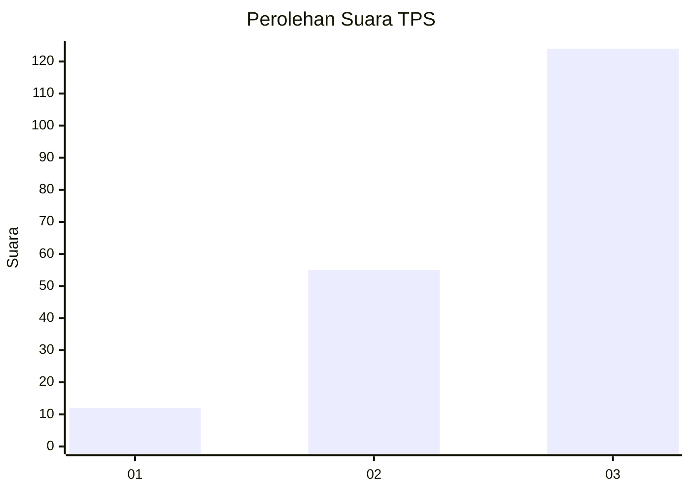
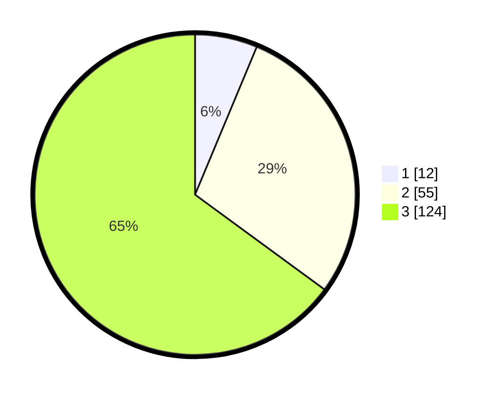

# Hasil

## Grafik

## Tabel

| No. | Nama Paslon    | Suara | Suara (raw) | Persentase |
|:--- |:-------------- | -----:| -----------:| ----------:|
| 1   | ANIES MUHAIMIN | 12    | [12][p-1]   | 6,28       |
| 2   | PRABOWO GIBRAN | 55    | [55][p-2]   | 28,80      |
| 3   | GANJAR MAHFUD  | 124   | [124][p-3]  | 64,92      |

[p-1]: https://github.com/gigit-pemilu/pemilu-2024-33-jawa-tengah/blob/main/pilpres/hitung-suara/sub/33-jawa-tengah/sub/12-wonogiri/sub/06-nguntoronadi/sub/2001-wonoharjo/sub/006-tps/sub/paslon-1.txt
[p-2]: https://github.com/gigit-pemilu/pemilu-2024-33-jawa-tengah/blob/main/pilpres/hitung-suara/sub/33-jawa-tengah/sub/12-wonogiri/sub/06-nguntoronadi/sub/2001-wonoharjo/sub/006-tps/sub/paslon-2.txt
[p-3]: https://github.com/gigit-pemilu/pemilu-2024-33-jawa-tengah/blob/main/pilpres/hitung-suara/sub/33-jawa-tengah/sub/12-wonogiri/sub/06-nguntoronadi/sub/2001-wonoharjo/sub/006-tps/sub/paslon-3.txt

## Foto C Plano

https://sirekap-obj-formc.kpu.go.id/88af/pemilu/ppwp/33/12/06/20/01/3312062001006-20240214-200356--18b17e0a-31bc-4afb-8e72-f0b325c7c67a.jpg

https://sirekap-obj-formc.kpu.go.id/88af/pemilu/ppwp/33/12/06/20/01/3312062001006-20240214-203948--5e1f518a-d6a9-40bd-b8b0-fd2d4ae51e21.jpg

https://sirekap-obj-formc.kpu.go.id/88af/pemilu/ppwp/33/12/06/20/01/3312062001006-20240214-204017--b60cb738-fa64-470d-9003-6b5fcc29dc61.jpg

## Metadata

| Key        | Value               |
| ---------- | ------------------- |
| Time Stamp | 2024-02-15 20:30:46 |

