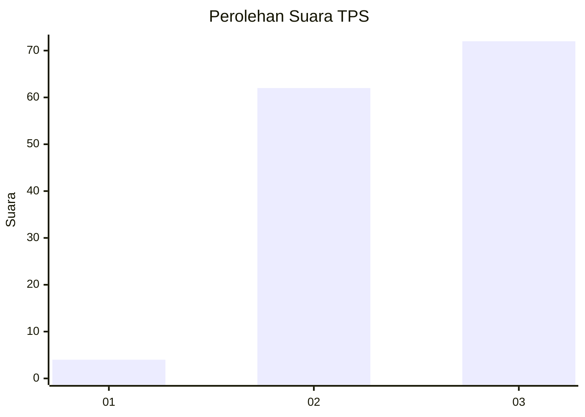
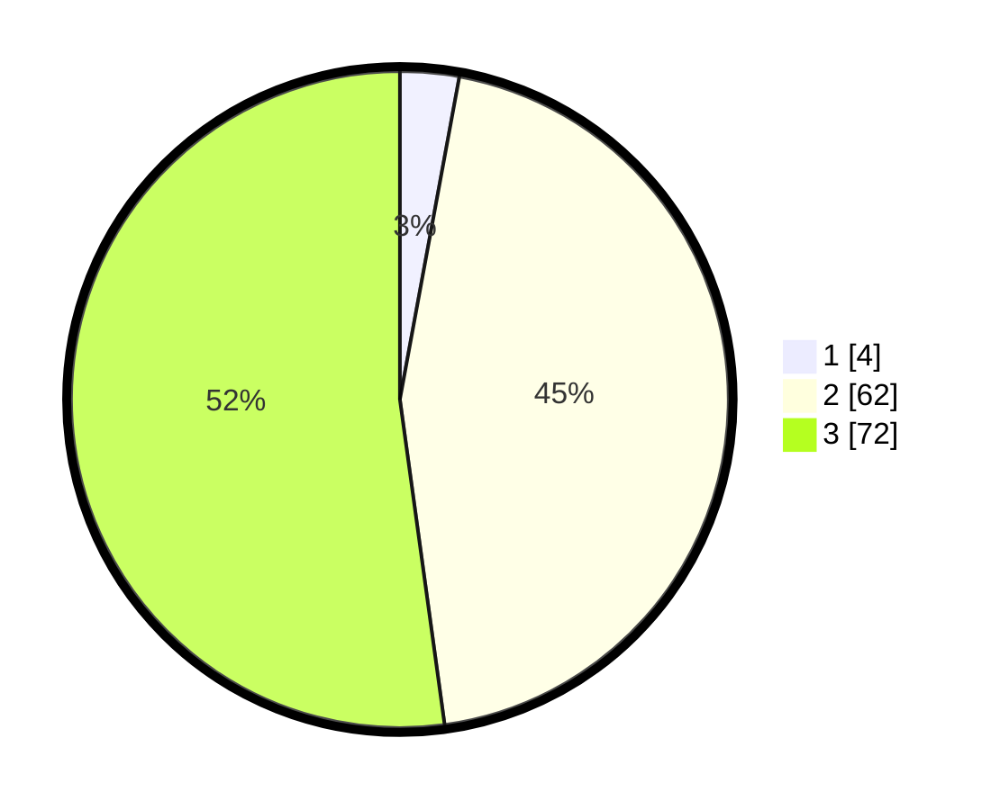

# Hasil

## Grafik

## Tabel

| No. | Nama Paslon    | Suara | Suara (raw) | Persentase |
|:--- |:-------------- | -----:| -----------:| ----------:|
| 1   | ANIES MUHAIMIN | 4     | [4][p-1]    | 2,90       |
| 2   | PRABOWO GIBRAN | 62    | [62][p-2]   | 44,93      |
| 3   | GANJAR MAHFUD  | 72    | [72][p-3]   | 52,17      |

[p-1]: https://github.com/gigit-pemilu/pemilu-2024-33-jawa-tengah/blob/main/pilpres/hitung-suara/sub/33-jawa-tengah/sub/12-wonogiri/sub/06-nguntoronadi/sub/2001-wonoharjo/sub/009-tps/sub/paslon-1.txt
[p-2]: https://github.com/gigit-pemilu/pemilu-2024-33-jawa-tengah/blob/main/pilpres/hitung-suara/sub/33-jawa-tengah/sub/12-wonogiri/sub/06-nguntoronadi/sub/2001-wonoharjo/sub/009-tps/sub/paslon-2.txt
[p-3]: https://github.com/gigit-pemilu/pemilu-2024-33-jawa-tengah/blob/main/pilpres/hitung-suara/sub/33-jawa-tengah/sub/12-wonogiri/sub/06-nguntoronadi/sub/2001-wonoharjo/sub/009-tps/sub/paslon-3.txt

## Foto C Plano

https://sirekap-obj-formc.kpu.go.id/b1bd/pemilu/ppwp/33/12/06/20/01/3312062001009-20240214-141933--9adebb4d-1a52-4f4a-b33e-3d0663fd624c.jpg

https://sirekap-obj-formc.kpu.go.id/b1bd/pemilu/ppwp/33/12/06/20/01/3312062001009-20240214-141559--16c7e5f2-6f44-42ba-96b2-984a5c0372f3.jpg

https://sirekap-obj-formc.kpu.go.id/b1bd/pemilu/ppwp/33/12/06/20/01/3312062001009-20240214-141322--9511a395-7e1f-45a8-b403-d7c634e99b76.jpg

## Metadata

| Key        | Value               |
| ---------- | ------------------- |
| Time Stamp | 2024-02-24 22:31:28 |

