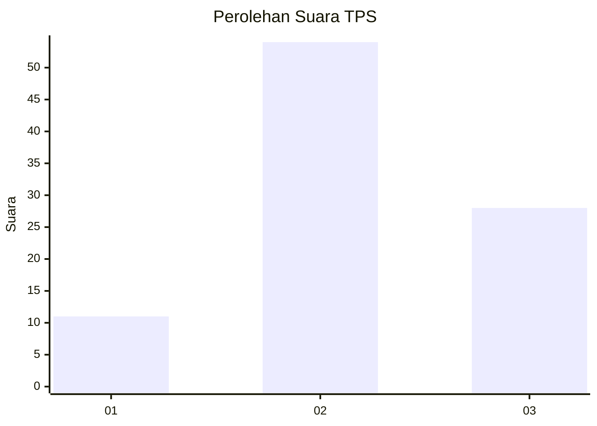
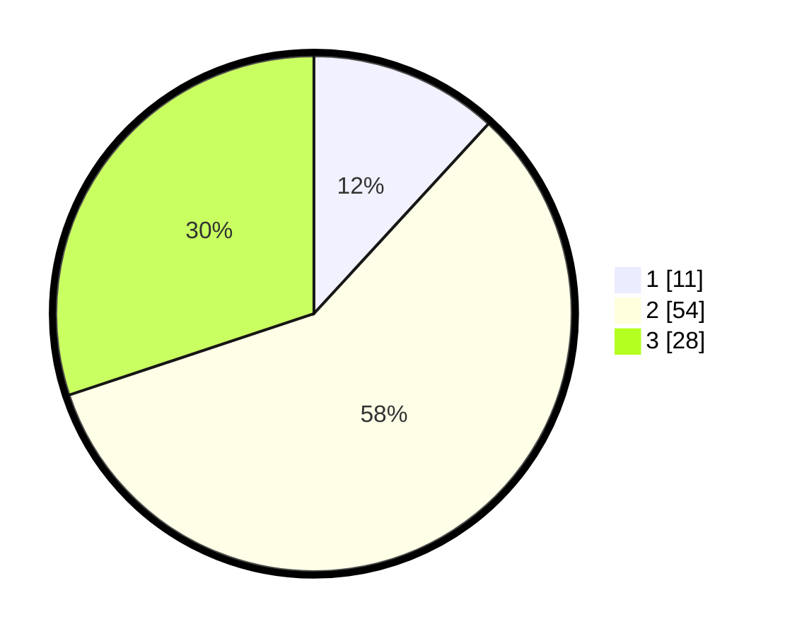

# Hasil

## Grafik

## Tabel

| No. | Nama Paslon    | Suara | Suara (raw) | Persentase |
|:--- |:-------------- | -----:| -----------:| ----------:|
| 1   | ANIES MUHAIMIN | 11    | [11][p-1]   | 11,83      |
| 2   | PRABOWO GIBRAN | 54    | [54][p-2]   | 58,06      |
| 3   | GANJAR MAHFUD  | 28    | [28][p-3]   | 30,11      |

[p-1]: https://github.com/gigit-pemilu/pemilu-2024/blob/main/pilpres/hitung-suara/sub/33-jawa-tengah/sub/12-wonogiri/sub/06-nguntoronadi/sub/2011-ngadipiro/sub/002-tps/sub/paslon-1.txt
[p-2]: https://github.com/gigit-pemilu/pemilu-2024/blob/main/pilpres/hitung-suara/sub/33-jawa-tengah/sub/12-wonogiri/sub/06-nguntoronadi/sub/2011-ngadipiro/sub/002-tps/sub/paslon-2.txt
[p-3]: https://github.com/gigit-pemilu/pemilu-2024/blob/main/pilpres/hitung-suara/sub/33-jawa-tengah/sub/12-wonogiri/sub/06-nguntoronadi/sub/2011-ngadipiro/sub/002-tps/sub/paslon-3.txt

## Foto C Plano

https://sirekap-obj-formc.kpu.go.id/06c5/pemilu/ppwp/33/12/06/20/11/3312062011002-20240214-232516--bad06c2f-85a8-43ba-bad7-4ffaae72b6e5.jpg

https://sirekap-obj-formc.kpu.go.id/06c5/pemilu/ppwp/33/12/06/20/11/3312062011002-20240214-195114--23423381-0853-4dfd-9e84-e79a95730e89.jpg

https://sirekap-obj-formc.kpu.go.id/06c5/pemilu/ppwp/33/12/06/20/11/3312062011002-20240214-232711--a8d6de26-0a16-43f2-a758-2157812eccd8.jpg

## Metadata

| Key        | Value               |
| ---------- | ------------------- |
| Time Stamp | 2024-02-15 22:30:27 |

