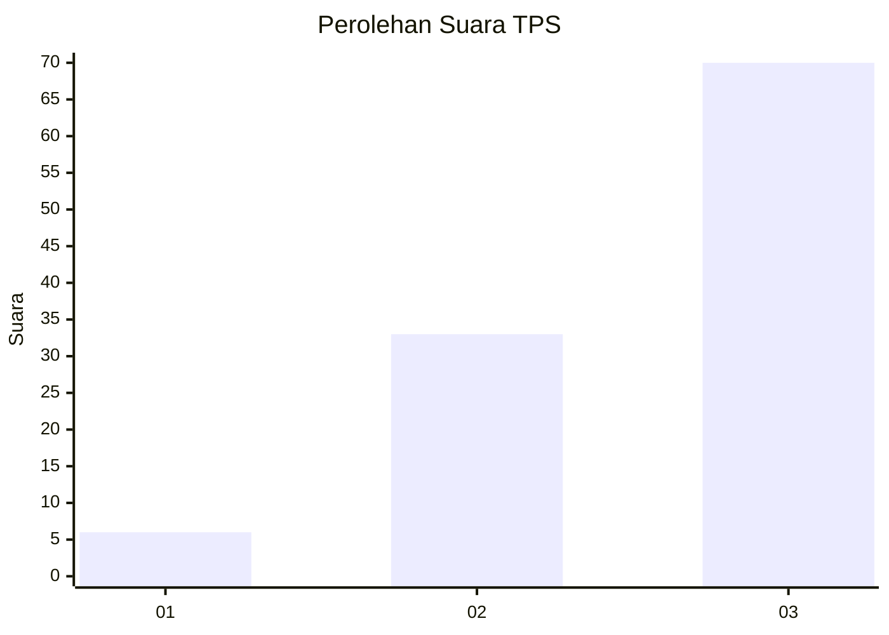
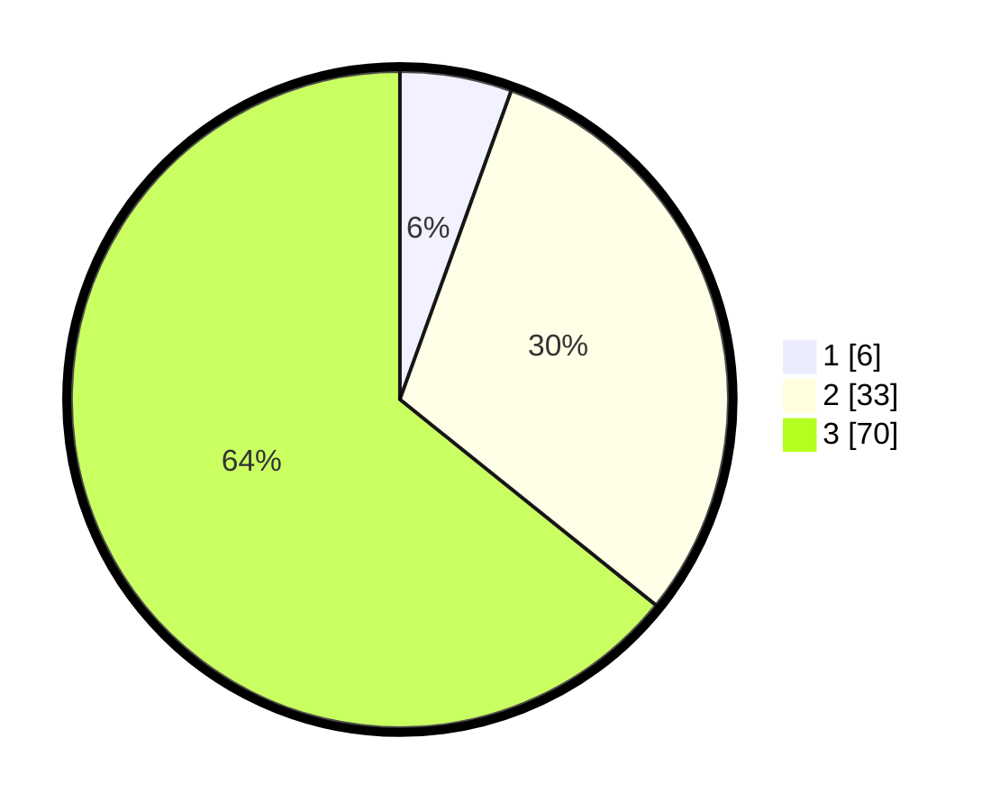

# Hasil

## Grafik

## Tabel

| No. | Nama Paslon    | Suara | Suara (raw) | Persentase |
|:--- |:-------------- | -----:| -----------:| ----------:|
| 1   | ANIES MUHAIMIN | 6     | [6][p-1]    | 5,50       |
| 2   | PRABOWO GIBRAN | 33    | [33][p-2]   | 30,28      |
| 3   | GANJAR MAHFUD  | 70    | [70][p-3]   | 64,22      |

[p-1]: https://github.com/gigit-pemilu/pemilu-2024/blob/main/pilpres/hitung-suara/sub/33-jawa-tengah/sub/12-wonogiri/sub/06-nguntoronadi/sub/2011-ngadipiro/sub/009-tps/sub/paslon-1.txt
[p-2]: https://github.com/gigit-pemilu/pemilu-2024/blob/main/pilpres/hitung-suara/sub/33-jawa-tengah/sub/12-wonogiri/sub/06-nguntoronadi/sub/2011-ngadipiro/sub/009-tps/sub/paslon-2.txt
[p-3]: https://github.com/gigit-pemilu/pemilu-2024/blob/main/pilpres/hitung-suara/sub/33-jawa-tengah/sub/12-wonogiri/sub/06-nguntoronadi/sub/2011-ngadipiro/sub/009-tps/sub/paslon-3.txt

## Foto C Plano

https://sirekap-obj-formc.kpu.go.id/07f9/pemilu/ppwp/33/12/06/20/11/3312062011009-20240214-221632--c8d89388-d785-4804-9f5e-e5f9012f5327.jpg

https://sirekap-obj-formc.kpu.go.id/07f9/pemilu/ppwp/33/12/06/20/11/3312062011009-20240214-232001--c5b61ae5-efa2-478b-ae40-dbac6d198310.jpg

https://sirekap-obj-formc.kpu.go.id/07f9/pemilu/ppwp/33/12/06/20/11/3312062011009-20240214-232152--7db599a0-cb08-4fc4-80e4-92d7aaf4cd75.jpg

## Metadata

| Key        | Value               |
| ---------- | ------------------- |
| Time Stamp | 2024-02-17 13:37:34 |

