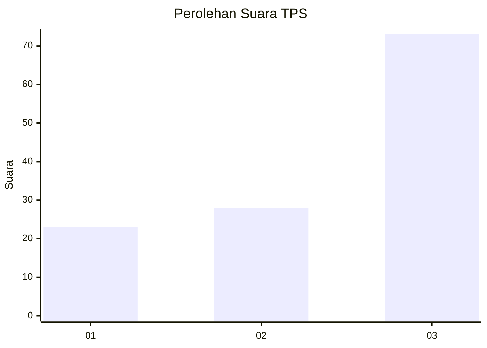
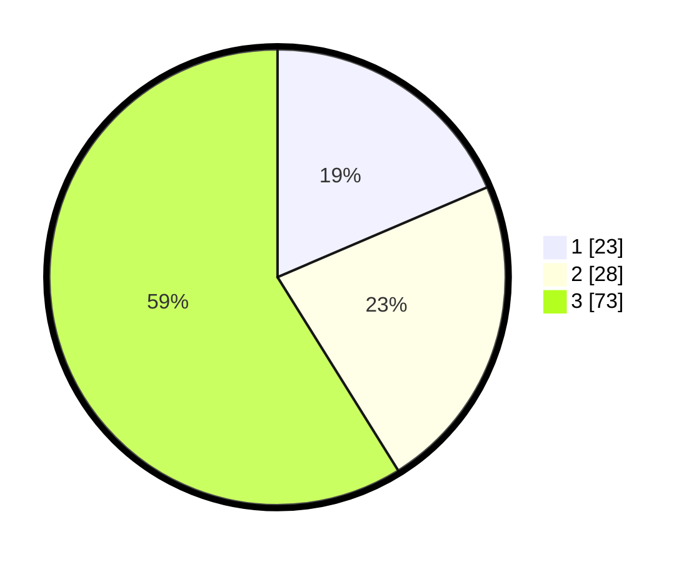

# Hasil

## Grafik

## Tabel

| No. | Nama Paslon    | Suara | Suara (raw) | Persentase |
|:--- |:-------------- | -----:| -----------:| ----------:|
| 1   | ANIES MUHAIMIN | 23    | [23][p-1]   | 18,55      |
| 2   | PRABOWO GIBRAN | 28    | [28][p-2]   | 22,58      |
| 3   | GANJAR MAHFUD  | 73    | [73][p-3]   | 58,87      |

[p-1]: https://github.com/gigit-pemilu/pemilu-2024-33-jawa-tengah/blob/main/pilpres/hitung-suara/sub/33-jawa-tengah/sub/12-wonogiri/sub/08-eromoko/sub/1009-ngadirejo/sub/009-tps/sub/paslon-1.txt
[p-2]: https://github.com/gigit-pemilu/pemilu-2024-33-jawa-tengah/blob/main/pilpres/hitung-suara/sub/33-jawa-tengah/sub/12-wonogiri/sub/08-eromoko/sub/1009-ngadirejo/sub/009-tps/sub/paslon-2.txt
[p-3]: https://github.com/gigit-pemilu/pemilu-2024-33-jawa-tengah/blob/main/pilpres/hitung-suara/sub/33-jawa-tengah/sub/12-wonogiri/sub/08-eromoko/sub/1009-ngadirejo/sub/009-tps/sub/paslon-3.txt

## Foto C Plano

https://sirekap-obj-formc.kpu.go.id/41d6/pemilu/ppwp/33/12/08/10/09/3312081009009-20240215-092805--797c0328-7020-4967-b39e-75af94605270.jpg

https://sirekap-obj-formc.kpu.go.id/41d6/pemilu/ppwp/33/12/08/10/09/3312081009009-20240215-092849--1533857e-4079-47ec-b9ef-e39ce6d9a05c.jpg

https://sirekap-obj-formc.kpu.go.id/41d6/pemilu/ppwp/33/12/08/10/09/3312081009009-20240215-090543--1bb7f24b-c58a-4bfb-baed-218d4dc5b817.jpg

## Metadata

| Key        | Value               |
| ---------- | ------------------- |
| Time Stamp | 2024-02-15 22:30:27 |

