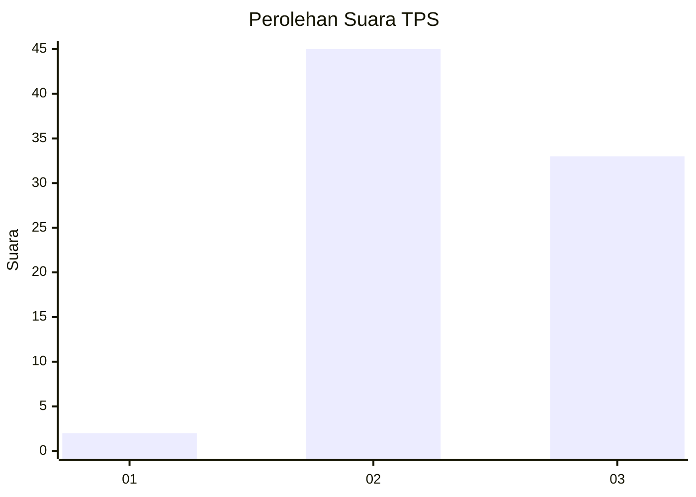
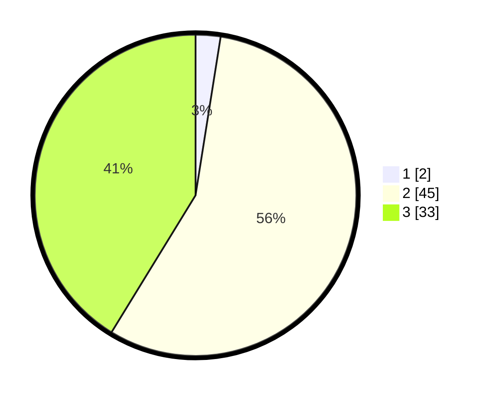

# Hasil

## Grafik

## Tabel

| No. | Nama Paslon    | Suara | Suara (raw) | Persentase |
|:--- |:-------------- | -----:| -----------:| ----------:|
| 1   | ANIES MUHAIMIN | 2     | [2][p-1]    | 2,50       |
| 2   | PRABOWO GIBRAN | 45    | [45][p-2]   | 56,25      |
| 3   | GANJAR MAHFUD  | 33    | [33][p-3]   | 41,25      |

[p-1]: https://github.com/gigit-pemilu/pemilu-2024-33-jawa-tengah/blob/main/pilpres/hitung-suara/sub/33-jawa-tengah/sub/12-wonogiri/sub/08-eromoko/sub/1009-ngadirejo/sub/016-tps/sub/paslon-1.txt
[p-2]: https://github.com/gigit-pemilu/pemilu-2024-33-jawa-tengah/blob/main/pilpres/hitung-suara/sub/33-jawa-tengah/sub/12-wonogiri/sub/08-eromoko/sub/1009-ngadirejo/sub/016-tps/sub/paslon-2.txt
[p-3]: https://github.com/gigit-pemilu/pemilu-2024-33-jawa-tengah/blob/main/pilpres/hitung-suara/sub/33-jawa-tengah/sub/12-wonogiri/sub/08-eromoko/sub/1009-ngadirejo/sub/016-tps/sub/paslon-3.txt

## Foto C Plano

https://sirekap-obj-formc.kpu.go.id/a98a/pemilu/ppwp/33/12/08/10/09/3312081009016-20240215-065357--29305908-d90f-4ee6-be91-b960b590af10.jpg

https://sirekap-obj-formc.kpu.go.id/a98a/pemilu/ppwp/33/12/08/10/09/3312081009016-20240215-070518--c5c24dc1-1f63-4a02-a9c5-91ce774c443a.jpg

https://sirekap-obj-formc.kpu.go.id/a98a/pemilu/ppwp/33/12/08/10/09/3312081009016-20240215-074703--821b77aa-34f5-4a3d-a2c8-bfe9ddf18d8c.jpg

## Metadata

| Key        | Value               |
| ---------- | ------------------- |
| Time Stamp | 2024-02-15 21:30:27 |

