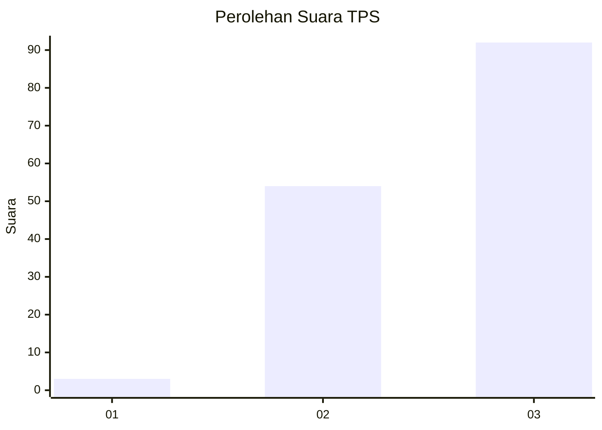
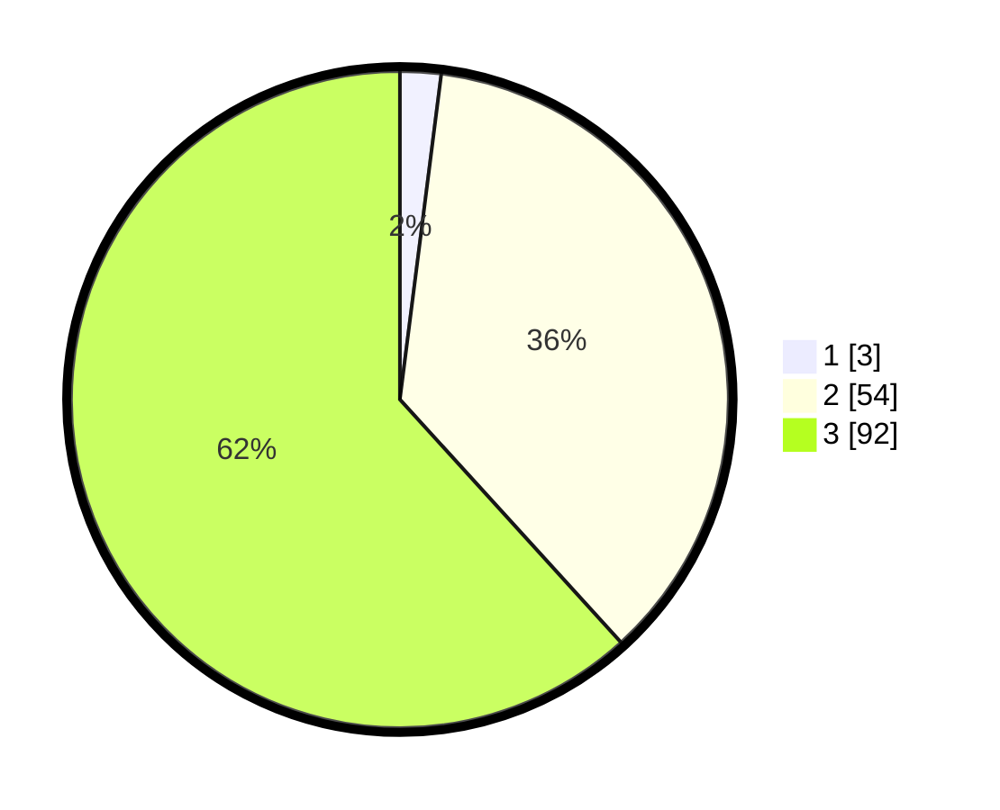

# Hasil

## Grafik

## Tabel

| No. | Nama Paslon    | Suara | Suara (raw) | Persentase |
|:--- |:-------------- | -----:| -----------:| ----------:|
| 1   | ANIES MUHAIMIN | 3     | [3][p-1]    | 2,01       |
| 2   | PRABOWO GIBRAN | 54    | [54][p-2]   | 36,24      |
| 3   | GANJAR MAHFUD  | 92    | [92][p-3]   | 61,74      |

[p-1]: https://github.com/gigit-pemilu/pemilu-2024-33-jawa-tengah/blob/main/pilpres/hitung-suara/sub/33-jawa-tengah/sub/12-wonogiri/sub/08-eromoko/sub/1009-ngadirejo/sub/017-tps/sub/paslon-1.txt
[p-2]: https://github.com/gigit-pemilu/pemilu-2024-33-jawa-tengah/blob/main/pilpres/hitung-suara/sub/33-jawa-tengah/sub/12-wonogiri/sub/08-eromoko/sub/1009-ngadirejo/sub/017-tps/sub/paslon-2.txt
[p-3]: https://github.com/gigit-pemilu/pemilu-2024-33-jawa-tengah/blob/main/pilpres/hitung-suara/sub/33-jawa-tengah/sub/12-wonogiri/sub/08-eromoko/sub/1009-ngadirejo/sub/017-tps/sub/paslon-3.txt

## Foto C Plano

https://sirekap-obj-formc.kpu.go.id/c6c1/pemilu/ppwp/33/12/08/10/09/3312081009017-20240215-060911--94f0dbd1-904d-4d9b-aa52-a61ce57540e7.jpg

https://sirekap-obj-formc.kpu.go.id/c6c1/pemilu/ppwp/33/12/08/10/09/3312081009017-20240215-001755--e1c7b6ca-85b3-4a25-843f-08154409b6ea.jpg

https://sirekap-obj-formc.kpu.go.id/c6c1/pemilu/ppwp/33/12/08/10/09/3312081009017-20240215-060935--76c47d87-effe-4632-b694-1400bb9857a0.jpg

## Metadata

| Key        | Value               |
| ---------- | ------------------- |
| Time Stamp | 2024-02-15 21:30:27 |

