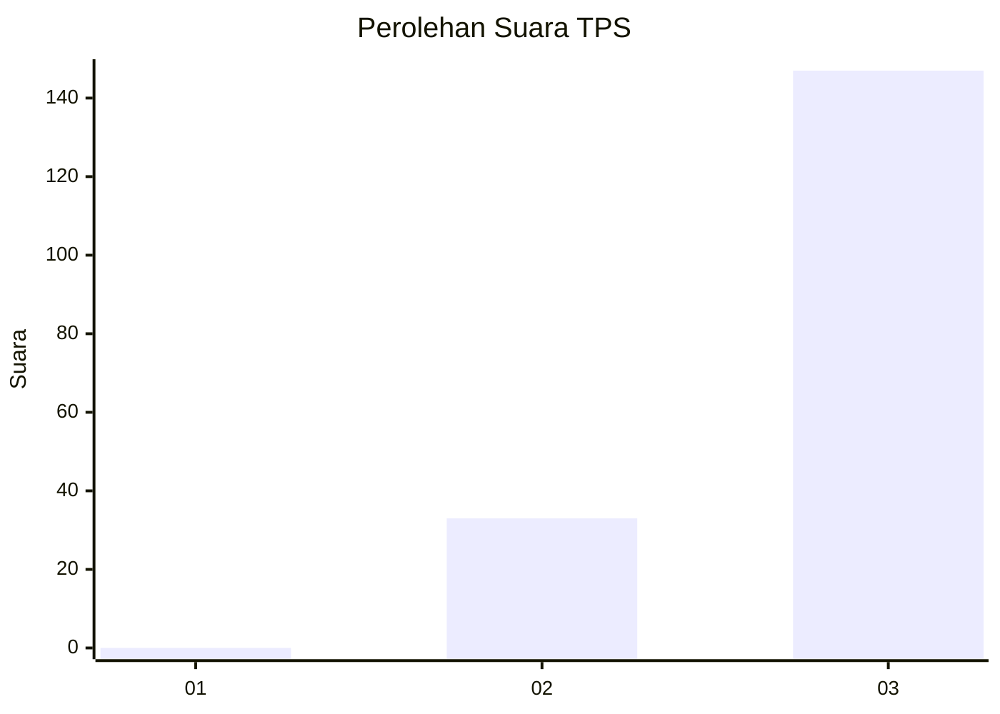
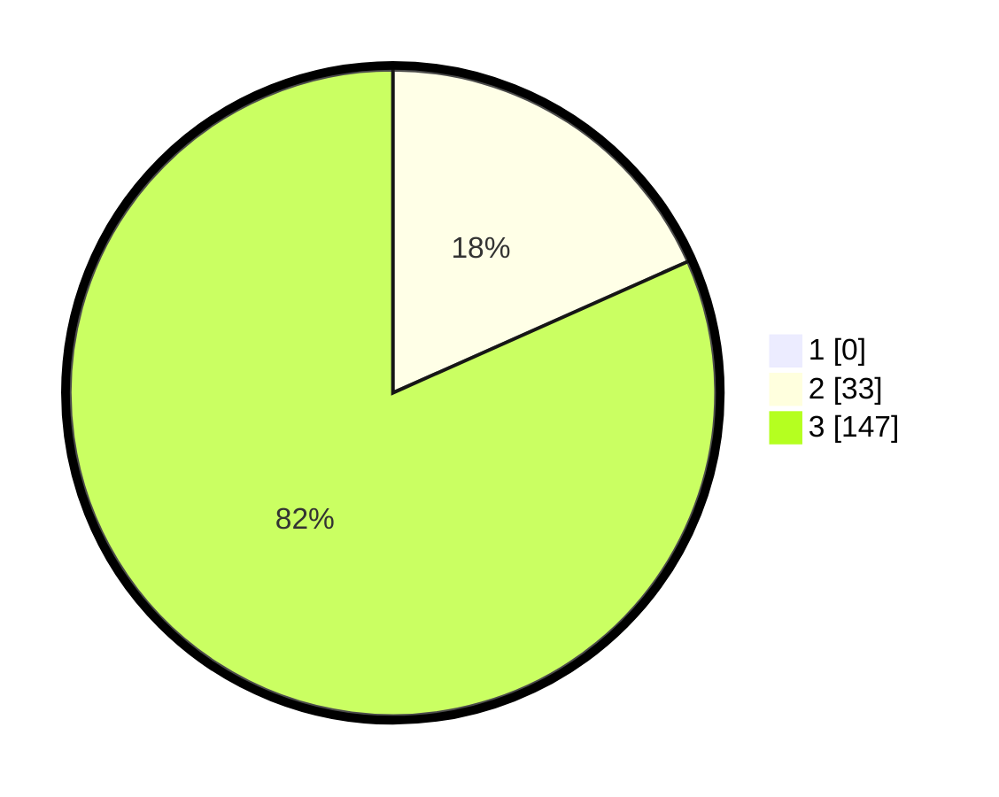

# Hasil

## Grafik

## Tabel

| No. | Nama Paslon    | Suara | Suara (raw) | Persentase |
|:--- |:-------------- | -----:| -----------:| ----------:|
| 1   | ANIES MUHAIMIN | 0     | [0][p-1]    | 0,00       |
| 2   | PRABOWO GIBRAN | 33    | [33][p-2]   | 18,33      |
| 3   | GANJAR MAHFUD  | 147   | [147][p-3]  | 81,67      |

[p-1]: https://github.com/gigit-pemilu/pemilu-2024-33-jawa-tengah/blob/main/pilpres/hitung-suara/sub/33-jawa-tengah/sub/12-wonogiri/sub/08-eromoko/sub/2001-basuhan/sub/007-tps/sub/paslon-1.txt
[p-2]: https://github.com/gigit-pemilu/pemilu-2024-33-jawa-tengah/blob/main/pilpres/hitung-suara/sub/33-jawa-tengah/sub/12-wonogiri/sub/08-eromoko/sub/2001-basuhan/sub/007-tps/sub/paslon-2.txt
[p-3]: https://github.com/gigit-pemilu/pemilu-2024-33-jawa-tengah/blob/main/pilpres/hitung-suara/sub/33-jawa-tengah/sub/12-wonogiri/sub/08-eromoko/sub/2001-basuhan/sub/007-tps/sub/paslon-3.txt

## Foto C Plano

https://sirekap-obj-formc.kpu.go.id/65f0/pemilu/ppwp/33/12/08/20/01/3312082001007-20240214-194510--06422d81-1d0f-4c01-8f3e-3fc3ad3dadc1.jpg

https://sirekap-obj-formc.kpu.go.id/65f0/pemilu/ppwp/33/12/08/20/01/3312082001007-20240214-194620--2345701e-8633-4598-8d84-0731d37241f6.jpg

https://sirekap-obj-formc.kpu.go.id/65f0/pemilu/ppwp/33/12/08/20/01/3312082001007-20240214-194700--25485610-67d9-4f08-afe5-71ca04d41881.jpg

## Metadata

| Key        | Value               |
| ---------- | ------------------- |
| Time Stamp | 2024-02-15 21:30:27 |

