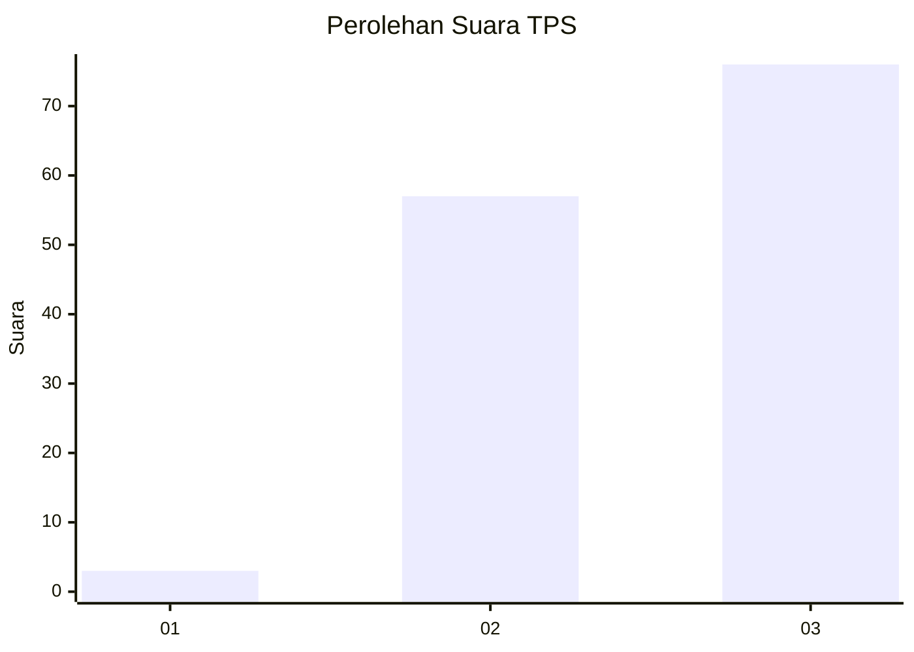
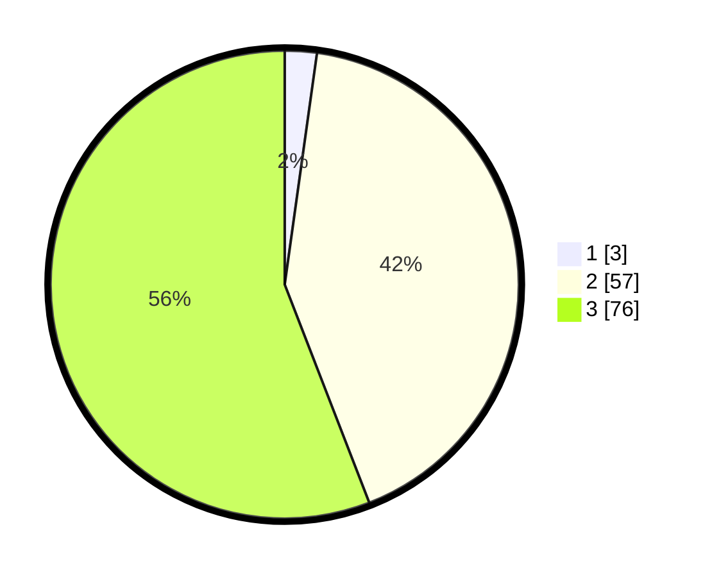

# Hasil

## Grafik

## Tabel

| No. | Nama Paslon    | Suara | Suara (raw) | Persentase |
|:--- |:-------------- | -----:| -----------:| ----------:|
| 1   | ANIES MUHAIMIN | 3     | [3][p-1]    | 2,21       |
| 2   | PRABOWO GIBRAN | 57    | [57][p-2]   | 41,91      |
| 3   | GANJAR MAHFUD  | 76    | [76][p-3]   | 55,88      |

[p-1]: https://github.com/gigit-pemilu/pemilu-2024/blob/main/pilpres/hitung-suara/sub/33-jawa-tengah/sub/12-wonogiri/sub/08-eromoko/sub/2001-basuhan/sub/009-tps/sub/paslon-1.txt
[p-2]: https://github.com/gigit-pemilu/pemilu-2024/blob/main/pilpres/hitung-suara/sub/33-jawa-tengah/sub/12-wonogiri/sub/08-eromoko/sub/2001-basuhan/sub/009-tps/sub/paslon-2.txt
[p-3]: https://github.com/gigit-pemilu/pemilu-2024/blob/main/pilpres/hitung-suara/sub/33-jawa-tengah/sub/12-wonogiri/sub/08-eromoko/sub/2001-basuhan/sub/009-tps/sub/paslon-3.txt

## Foto C Plano

https://sirekap-obj-formc.kpu.go.id/de8e/pemilu/ppwp/33/12/08/20/01/3312082001009-20240218-234350--77006fd5-1aa5-4576-af22-2fb409de4627.jpg

https://sirekap-obj-formc.kpu.go.id/de8e/pemilu/ppwp/33/12/08/20/01/3312082001009-20240217-013938--900a8ad4-66d5-4e76-bc9d-e119069ae60b.jpg

https://sirekap-obj-formc.kpu.go.id/de8e/pemilu/ppwp/33/12/08/20/01/3312082001009-20240217-014230--454f3b57-19e3-4500-bcdc-0e47c649cb67.jpg

## Metadata

| Key        | Value               |
| ---------- | ------------------- |
| Time Stamp | 2024-02-19 06:16:00 |

