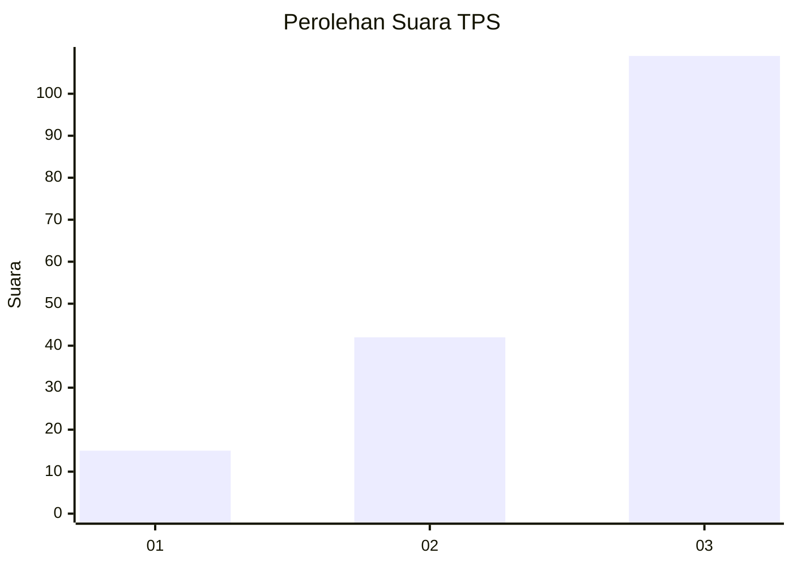
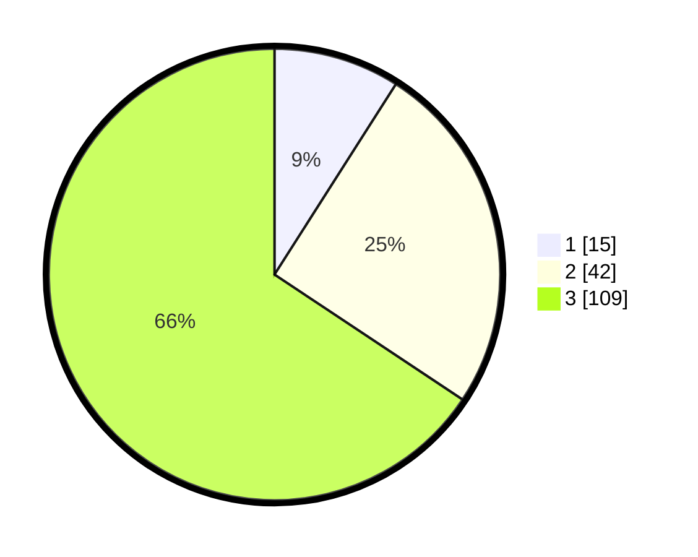

# Hasil

## Grafik

## Tabel

| No. | Nama Paslon    | Suara | Suara (raw) | Persentase |
|:--- |:-------------- | -----:| -----------:| ----------:|
| 1   | ANIES MUHAIMIN | 15    | [15][p-1]   | 9,04       |
| 2   | PRABOWO GIBRAN | 42    | [42][p-2]   | 25,30      |
| 3   | GANJAR MAHFUD  | 109   | [109][p-3]  | 65,66      |

[p-1]: https://github.com/gigit-pemilu/pemilu-2024/blob/main/pilpres/hitung-suara/sub/33-jawa-tengah/sub/12-wonogiri/sub/08-eromoko/sub/2001-basuhan/sub/011-tps/sub/paslon-1.txt
[p-2]: https://github.com/gigit-pemilu/pemilu-2024/blob/main/pilpres/hitung-suara/sub/33-jawa-tengah/sub/12-wonogiri/sub/08-eromoko/sub/2001-basuhan/sub/011-tps/sub/paslon-2.txt
[p-3]: https://github.com/gigit-pemilu/pemilu-2024/blob/main/pilpres/hitung-suara/sub/33-jawa-tengah/sub/12-wonogiri/sub/08-eromoko/sub/2001-basuhan/sub/011-tps/sub/paslon-3.txt

## Foto C Plano

https://sirekap-obj-formc.kpu.go.id/103f/pemilu/ppwp/33/12/08/20/01/3312082001011-20240216-132601--c390fb4e-2ddc-4c14-babe-2a310d713164.jpg

https://sirekap-obj-formc.kpu.go.id/103f/pemilu/ppwp/33/12/08/20/01/3312082001011-20240216-134524--b58d0b8b-87fd-4a7a-ae52-735bb6bb99a9.jpg

https://sirekap-obj-formc.kpu.go.id/103f/pemilu/ppwp/33/12/08/20/01/3312082001011-20240216-134956--b8cddbc2-8b7b-4b4d-8eaa-3ab91eb4de3c.jpg

## Metadata

| Key        | Value               |
| ---------- | ------------------- |
| Time Stamp | 2024-02-19 06:16:00 |

