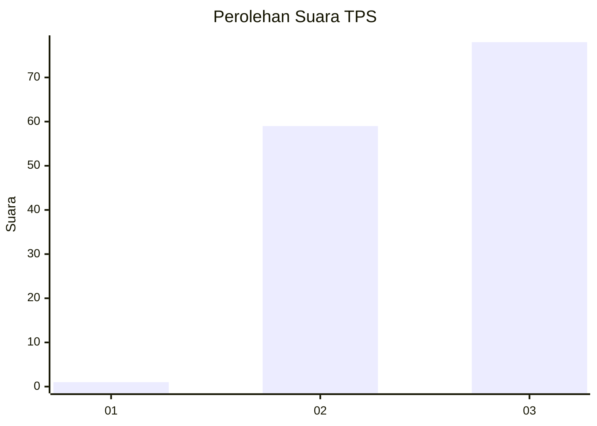
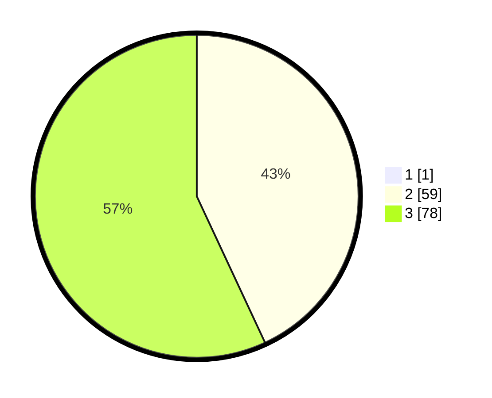

# Hasil

## Grafik

## Tabel

| No. | Nama Paslon    | Suara | Suara (raw) | Persentase |
|:--- |:-------------- | -----:| -----------:| ----------:|
| 1   | ANIES MUHAIMIN | 1     | [1][p-1]    | 0,72       |
| 2   | PRABOWO GIBRAN | 59    | [59][p-2]   | 42,75      |
| 3   | GANJAR MAHFUD  | 78    | [78][p-3]   | 56,52      |

[p-1]: https://github.com/gigit-pemilu/pemilu-2024-33-jawa-tengah/blob/main/pilpres/hitung-suara/sub/33-jawa-tengah/sub/12-wonogiri/sub/08-eromoko/sub/2002-pucung/sub/002-tps/sub/paslon-1.txt
[p-2]: https://github.com/gigit-pemilu/pemilu-2024-33-jawa-tengah/blob/main/pilpres/hitung-suara/sub/33-jawa-tengah/sub/12-wonogiri/sub/08-eromoko/sub/2002-pucung/sub/002-tps/sub/paslon-2.txt
[p-3]: https://github.com/gigit-pemilu/pemilu-2024-33-jawa-tengah/blob/main/pilpres/hitung-suara/sub/33-jawa-tengah/sub/12-wonogiri/sub/08-eromoko/sub/2002-pucung/sub/002-tps/sub/paslon-3.txt

## Foto C Plano

https://sirekap-obj-formc.kpu.go.id/6fc6/pemilu/ppwp/33/12/08/20/02/3312082002002-20240215-062007--0bc47f86-d6c9-49ac-97fd-b59cd936cdc1.jpg

https://sirekap-obj-formc.kpu.go.id/6fc6/pemilu/ppwp/33/12/08/20/02/3312082002002-20240215-064844--015ac22b-fd0b-4c22-80e0-d309ebeb509d.jpg

https://sirekap-obj-formc.kpu.go.id/6fc6/pemilu/ppwp/33/12/08/20/02/3312082002002-20240215-062518--3aae0c43-4d65-4dba-ace9-6abbc9dec0e4.jpg

## Metadata

| Key        | Value               |
| ---------- | ------------------- |
| Time Stamp | 2024-02-16 00:00:26 |

