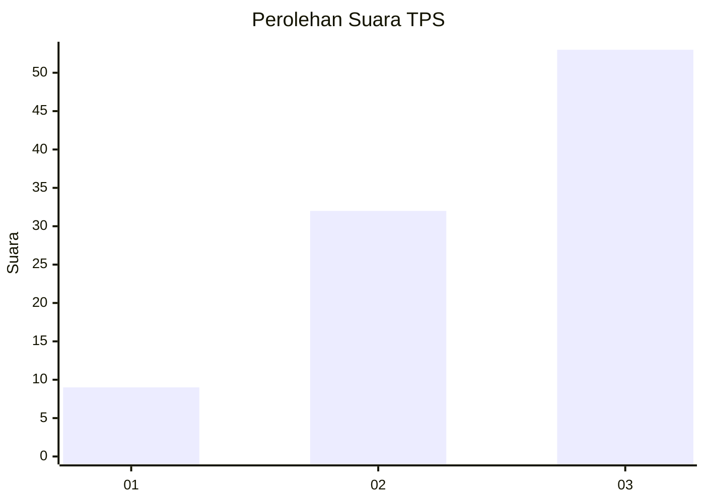
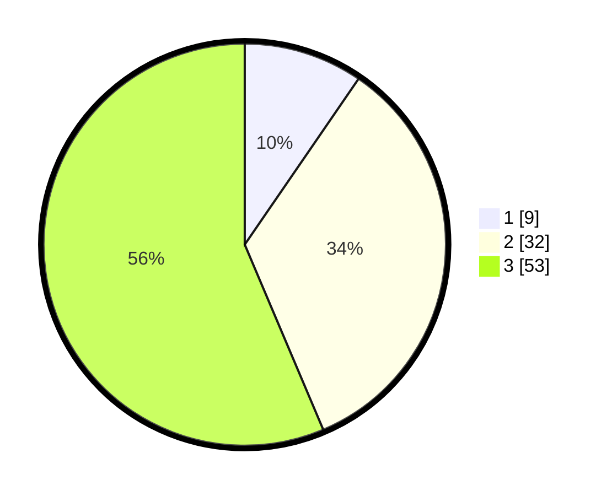

# Hasil

## Grafik

## Tabel

| No. | Nama Paslon    | Suara | Suara (raw) | Persentase |
|:--- |:-------------- | -----:| -----------:| ----------:|
| 1   | ANIES MUHAIMIN | 9     | [9][p-1]    | 9,57       |
| 2   | PRABOWO GIBRAN | 32    | [32][p-2]   | 34,04      |
| 3   | GANJAR MAHFUD  | 53    | [53][p-3]   | 56,38      |

[p-1]: https://github.com/gigit-pemilu/pemilu-2024-33-jawa-tengah/blob/main/pilpres/hitung-suara/sub/33-jawa-tengah/sub/12-wonogiri/sub/08-eromoko/sub/2005-panekan/sub/010-tps/sub/paslon-1.txt
[p-2]: https://github.com/gigit-pemilu/pemilu-2024-33-jawa-tengah/blob/main/pilpres/hitung-suara/sub/33-jawa-tengah/sub/12-wonogiri/sub/08-eromoko/sub/2005-panekan/sub/010-tps/sub/paslon-2.txt
[p-3]: https://github.com/gigit-pemilu/pemilu-2024-33-jawa-tengah/blob/main/pilpres/hitung-suara/sub/33-jawa-tengah/sub/12-wonogiri/sub/08-eromoko/sub/2005-panekan/sub/010-tps/sub/paslon-3.txt

## Foto C Plano

https://sirekap-obj-formc.kpu.go.id/7874/pemilu/ppwp/33/12/08/20/05/3312082005010-20240215-090747--b70f8b65-9f24-4fa1-846e-28a7a7b73870.jpg

https://sirekap-obj-formc.kpu.go.id/7874/pemilu/ppwp/33/12/08/20/05/3312082005010-20240215-090856--7a48b01d-4f2d-4a2a-8c9e-5758d3833009.jpg

https://sirekap-obj-formc.kpu.go.id/7874/pemilu/ppwp/33/12/08/20/05/3312082005010-20240215-090954--87397c10-e561-4faf-afe3-9cf872a91dad.jpg

## Metadata

| Key        | Value               |
| ---------- | ------------------- |
| Time Stamp | 2024-02-15 21:30:27 |

