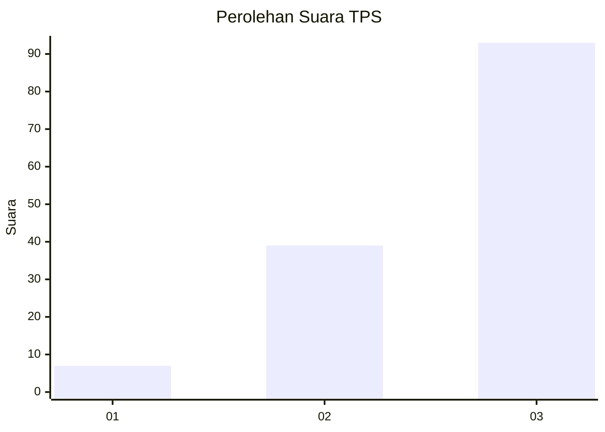
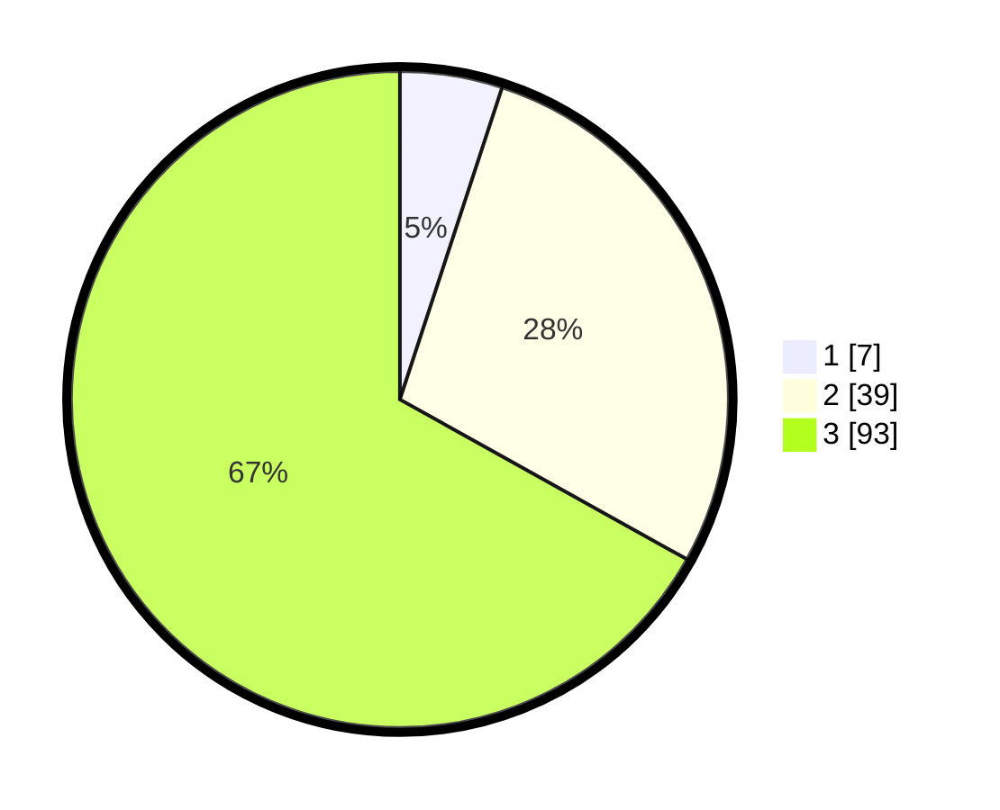

# Hasil

## Grafik

## Tabel

| No. | Nama Paslon    | Suara | Suara (raw) | Persentase |
|:--- |:-------------- | -----:| -----------:| ----------:|
| 1   | ANIES MUHAIMIN | 7     | [7][p-1]    | 5,04       |
| 2   | PRABOWO GIBRAN | 39    | [39][p-2]   | 28,06      |
| 3   | GANJAR MAHFUD  | 93    | [93][p-3]   | 66,91      |

[p-1]: https://github.com/gigit-pemilu/pemilu-2024-33-jawa-tengah/blob/main/pilpres/hitung-suara/sub/33-jawa-tengah/sub/12-wonogiri/sub/08-eromoko/sub/2006-baleharjo/sub/006-tps/sub/paslon-1.txt
[p-2]: https://github.com/gigit-pemilu/pemilu-2024-33-jawa-tengah/blob/main/pilpres/hitung-suara/sub/33-jawa-tengah/sub/12-wonogiri/sub/08-eromoko/sub/2006-baleharjo/sub/006-tps/sub/paslon-2.txt
[p-3]: https://github.com/gigit-pemilu/pemilu-2024-33-jawa-tengah/blob/main/pilpres/hitung-suara/sub/33-jawa-tengah/sub/12-wonogiri/sub/08-eromoko/sub/2006-baleharjo/sub/006-tps/sub/paslon-3.txt

## Foto C Plano

https://sirekap-obj-formc.kpu.go.id/db15/pemilu/ppwp/33/12/08/20/06/3312082006006-20240215-072941--0af087fc-4cad-4801-88a9-3ef7087f85a3.jpg

https://sirekap-obj-formc.kpu.go.id/db15/pemilu/ppwp/33/12/08/20/06/3312082006006-20240215-071046--48ae47cf-f1f5-4e26-84b3-c83e3ebfcb30.jpg

https://sirekap-obj-formc.kpu.go.id/db15/pemilu/ppwp/33/12/08/20/06/3312082006006-20240214-235224--61672f73-622f-47db-b97c-08ef88fac7f5.jpg

## Metadata

| Key        | Value               |
| ---------- | ------------------- |
| Time Stamp | 2024-02-25 14:00:00 |

