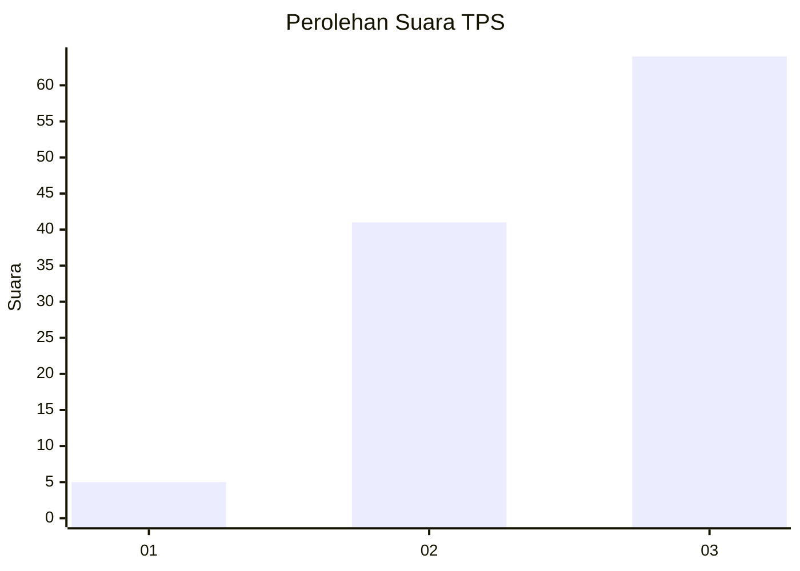
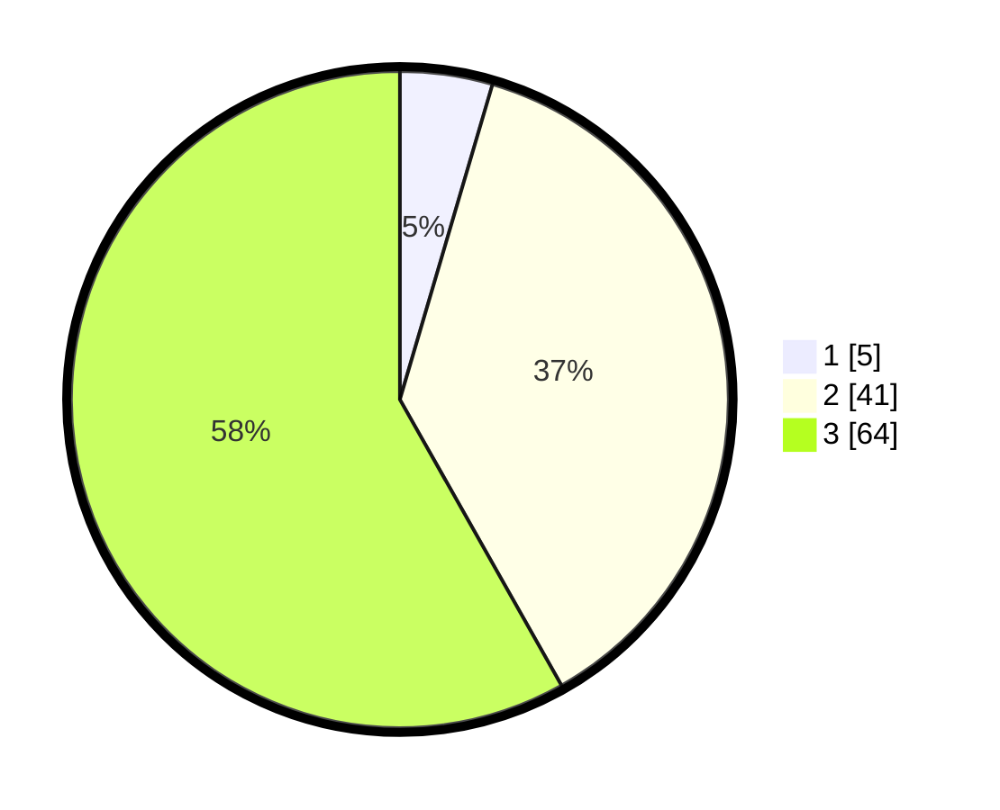

# Hasil

## Grafik

## Tabel

| No. | Nama Paslon    | Suara | Suara (raw) | Persentase |
|:--- |:-------------- | -----:| -----------:| ----------:|
| 1   | ANIES MUHAIMIN | 5     | [5][p-1]    | 4,55       |
| 2   | PRABOWO GIBRAN | 41    | [41][p-2]   | 37,27      |
| 3   | GANJAR MAHFUD  | 64    | [64][p-3]   | 58,18      |

[p-1]: https://github.com/gigit-pemilu/pemilu-2024-33-jawa-tengah/blob/main/pilpres/hitung-suara/sub/33-jawa-tengah/sub/12-wonogiri/sub/08-eromoko/sub/2006-baleharjo/sub/007-tps/sub/paslon-1.txt
[p-2]: https://github.com/gigit-pemilu/pemilu-2024-33-jawa-tengah/blob/main/pilpres/hitung-suara/sub/33-jawa-tengah/sub/12-wonogiri/sub/08-eromoko/sub/2006-baleharjo/sub/007-tps/sub/paslon-2.txt
[p-3]: https://github.com/gigit-pemilu/pemilu-2024-33-jawa-tengah/blob/main/pilpres/hitung-suara/sub/33-jawa-tengah/sub/12-wonogiri/sub/08-eromoko/sub/2006-baleharjo/sub/007-tps/sub/paslon-3.txt

## Foto C Plano

https://sirekap-obj-formc.kpu.go.id/3e9e/pemilu/ppwp/33/12/08/20/06/3312082006007-20240215-070118--0dbfa830-3cd0-4686-b18f-d51750cec7e5.jpg

https://sirekap-obj-formc.kpu.go.id/3e9e/pemilu/ppwp/33/12/08/20/06/3312082006007-20240214-214301--44bd87c2-92e1-4dc6-810b-74584dd02fc0.jpg

https://sirekap-obj-formc.kpu.go.id/3e9e/pemilu/ppwp/33/12/08/20/06/3312082006007-20240214-214504--4f694e6d-2f48-4fe4-b0e5-d7d7c26435b1.jpg

## Metadata

| Key        | Value               |
| ---------- | ------------------- |
| Time Stamp | 2024-02-15 12:00:28 |

