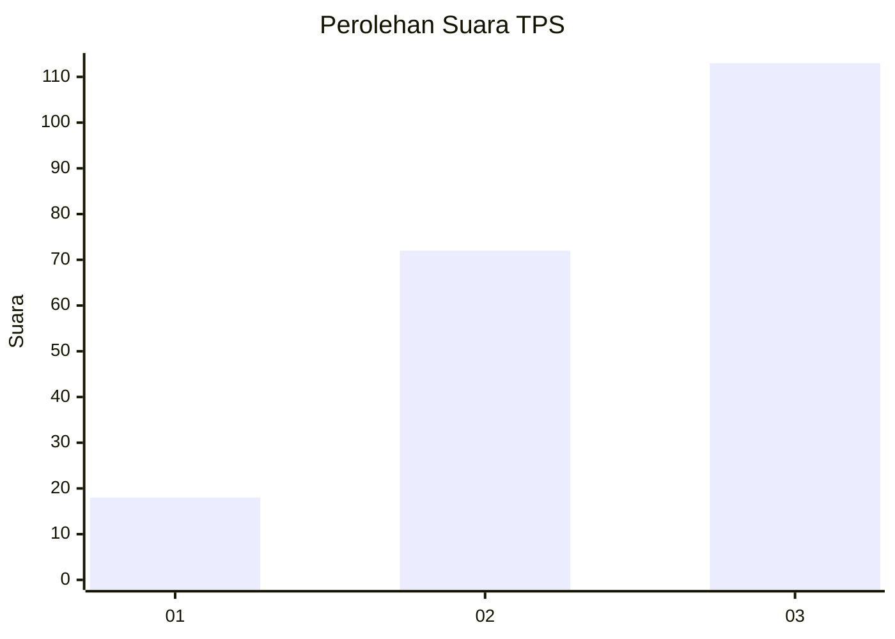
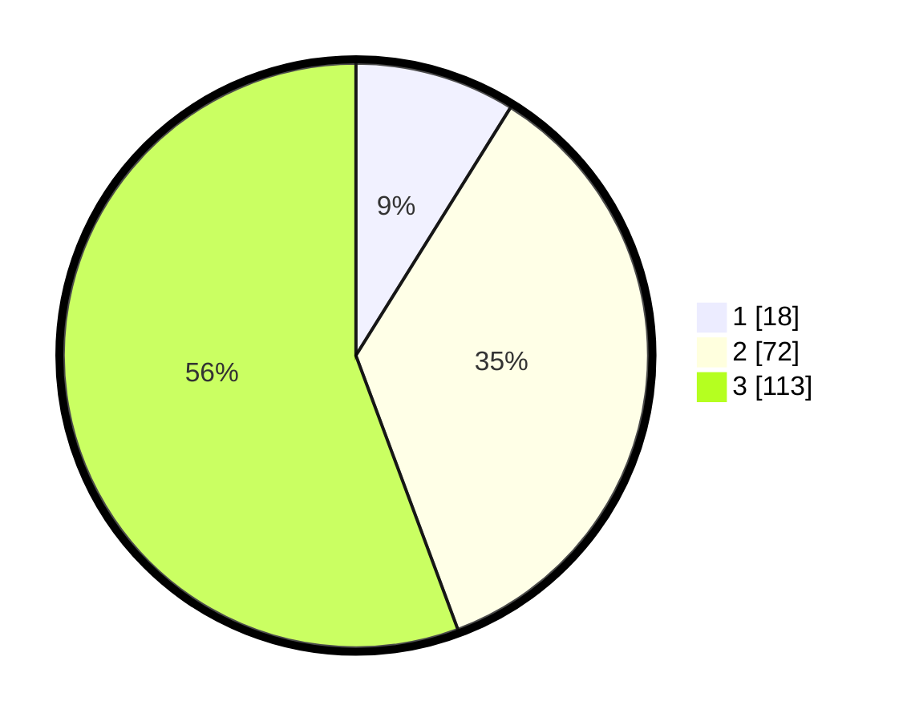

# Hasil

## Grafik

## Tabel

| No. | Nama Paslon    | Suara | Suara (raw) | Persentase |
|:--- |:-------------- | -----:| -----------:| ----------:|
| 1   | ANIES MUHAIMIN | 18    | [18][p-1]   | 8,87       |
| 2   | PRABOWO GIBRAN | 72    | [72][p-2]   | 35,47      |
| 3   | GANJAR MAHFUD  | 113   | [113][p-3]  | 55,67      |

[p-1]: https://github.com/gigit-pemilu/pemilu-2024/blob/main/pilpres/hitung-suara/sub/33-jawa-tengah/sub/12-wonogiri/sub/08-eromoko/sub/2007-sumberharjo/sub/002-tps/sub/paslon-1.txt
[p-2]: https://github.com/gigit-pemilu/pemilu-2024/blob/main/pilpres/hitung-suara/sub/33-jawa-tengah/sub/12-wonogiri/sub/08-eromoko/sub/2007-sumberharjo/sub/002-tps/sub/paslon-2.txt
[p-3]: https://github.com/gigit-pemilu/pemilu-2024/blob/main/pilpres/hitung-suara/sub/33-jawa-tengah/sub/12-wonogiri/sub/08-eromoko/sub/2007-sumberharjo/sub/002-tps/sub/paslon-3.txt

## Foto C Plano

https://sirekap-obj-formc.kpu.go.id/c2e5/pemilu/ppwp/33/12/08/20/07/3312082007002-20240216-080733--407a49cb-501c-4f9a-a435-f3637c6893fc.jpg

https://sirekap-obj-formc.kpu.go.id/c2e5/pemilu/ppwp/33/12/08/20/07/3312082007002-20240214-194032--527c3212-f291-4e75-8f85-6c52fa55b7cc.jpg

https://sirekap-obj-formc.kpu.go.id/c2e5/pemilu/ppwp/33/12/08/20/07/3312082007002-20240216-080934--71105967-ddd8-43bf-8ccd-e419b427b495.jpg

## Metadata

| Key        | Value               |
| ---------- | ------------------- |
| Time Stamp | 2024-02-24 22:31:28 |

