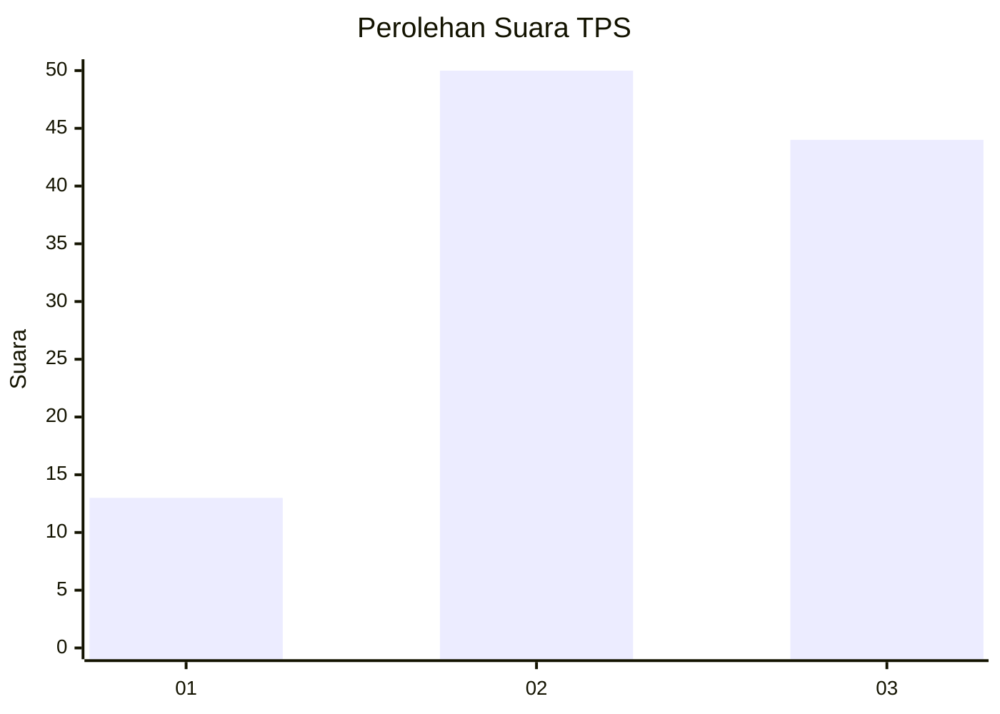
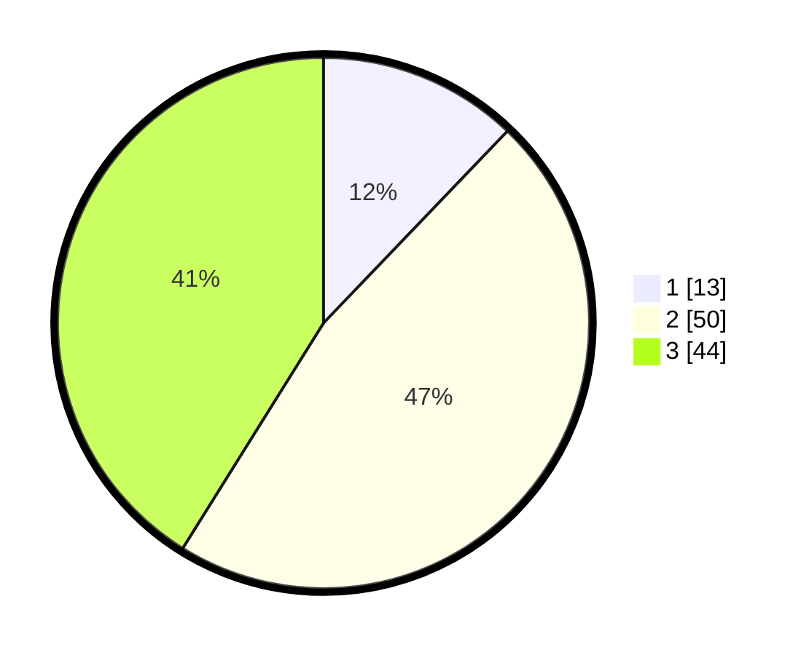

# Hasil

## Grafik

## Tabel

| No. | Nama Paslon    | Suara | Suara (raw) | Persentase |
|:--- |:-------------- | -----:| -----------:| ----------:|
| 1   | ANIES MUHAIMIN | 13    | [13][p-1]   | 12,15      |
| 2   | PRABOWO GIBRAN | 50    | [50][p-2]   | 46,73      |
| 3   | GANJAR MAHFUD  | 44    | [44][p-3]   | 41,12      |

[p-1]: https://github.com/gigit-pemilu/pemilu-2024-33-jawa-tengah/blob/main/pilpres/hitung-suara/sub/33-jawa-tengah/sub/12-wonogiri/sub/08-eromoko/sub/2011-eromoko/sub/018-tps/sub/paslon-1.txt
[p-2]: https://github.com/gigit-pemilu/pemilu-2024-33-jawa-tengah/blob/main/pilpres/hitung-suara/sub/33-jawa-tengah/sub/12-wonogiri/sub/08-eromoko/sub/2011-eromoko/sub/018-tps/sub/paslon-2.txt
[p-3]: https://github.com/gigit-pemilu/pemilu-2024-33-jawa-tengah/blob/main/pilpres/hitung-suara/sub/33-jawa-tengah/sub/12-wonogiri/sub/08-eromoko/sub/2011-eromoko/sub/018-tps/sub/paslon-3.txt

## Foto C Plano

https://sirekap-obj-formc.kpu.go.id/6827/pemilu/ppwp/33/12/08/20/11/3312082011018-20240214-155550--e8cd694e-0cbc-4a9c-a128-a3e106ae00c8.jpg

https://sirekap-obj-formc.kpu.go.id/6827/pemilu/ppwp/33/12/08/20/11/3312082011018-20240214-155451--778de2d5-0d11-42e1-b508-5a5b2d8ca3f4.jpg

https://sirekap-obj-formc.kpu.go.id/6827/pemilu/ppwp/33/12/08/20/11/3312082011018-20240214-155606--cee5686b-1a85-4b64-a19d-1957f1bff2d9.jpg

## Metadata

| Key        | Value               |
| ---------- | ------------------- |
| Time Stamp | 2024-02-14 21:46:01 |

