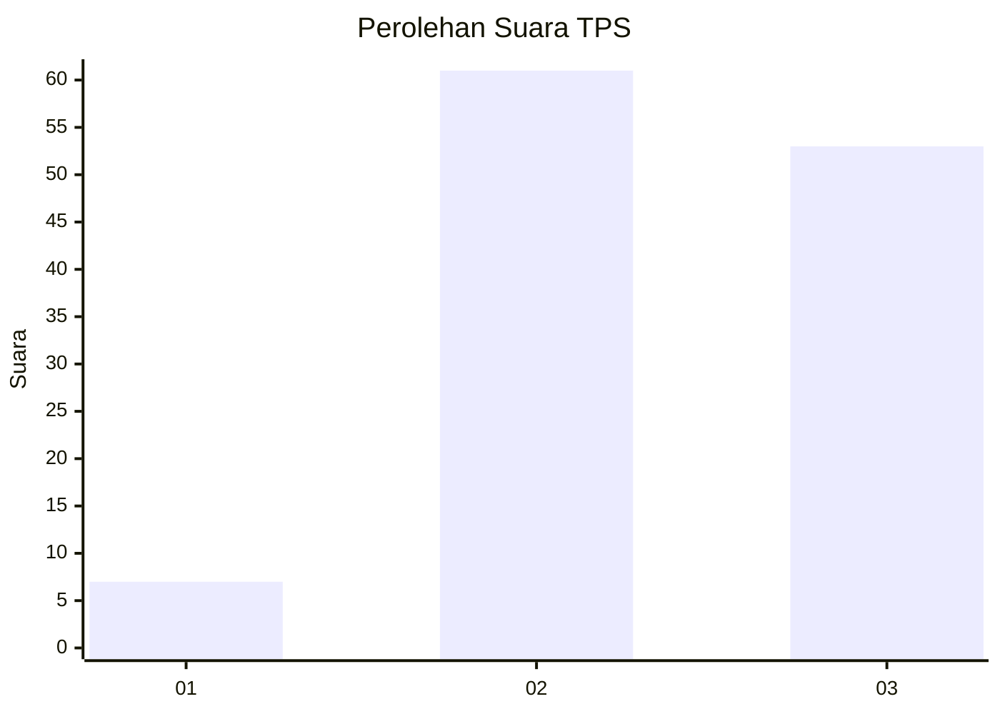
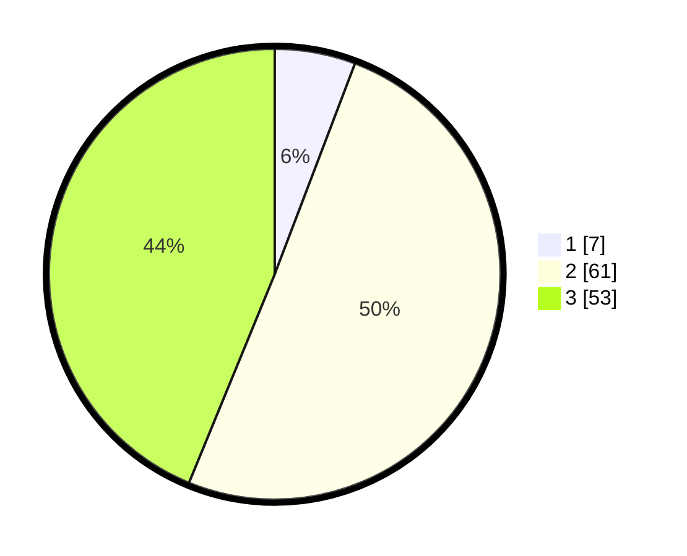

# Hasil

## Grafik

## Tabel

| No. | Nama Paslon    | Suara | Suara (raw) | Persentase |
|:--- |:-------------- | -----:| -----------:| ----------:|
| 1   | ANIES MUHAIMIN | 7     | [7][p-1]    | 5,79       |
| 2   | PRABOWO GIBRAN | 61    | [61][p-2]   | 50,41      |
| 3   | GANJAR MAHFUD  | 53    | [53][p-3]   | 43,80      |

[p-1]: https://github.com/gigit-pemilu/pemilu-2024-33-jawa-tengah/blob/main/pilpres/hitung-suara/sub/33-jawa-tengah/sub/12-wonogiri/sub/08-eromoko/sub/2012-ngunggahan/sub/009-tps/sub/paslon-1.txt
[p-2]: https://github.com/gigit-pemilu/pemilu-2024-33-jawa-tengah/blob/main/pilpres/hitung-suara/sub/33-jawa-tengah/sub/12-wonogiri/sub/08-eromoko/sub/2012-ngunggahan/sub/009-tps/sub/paslon-2.txt
[p-3]: https://github.com/gigit-pemilu/pemilu-2024-33-jawa-tengah/blob/main/pilpres/hitung-suara/sub/33-jawa-tengah/sub/12-wonogiri/sub/08-eromoko/sub/2012-ngunggahan/sub/009-tps/sub/paslon-3.txt

## Foto C Plano

https://sirekap-obj-formc.kpu.go.id/8c15/pemilu/ppwp/33/12/08/20/12/3312082012009-20240215-070314--ee557031-2a84-454a-af73-1deb6f471bc2.jpg

https://sirekap-obj-formc.kpu.go.id/8c15/pemilu/ppwp/33/12/08/20/12/3312082012009-20240215-070513--9ce4bb0d-ec87-4356-888a-3e1253f79cf5.jpg

https://sirekap-obj-formc.kpu.go.id/8c15/pemilu/ppwp/33/12/08/20/12/3312082012009-20240215-070621--b470471f-5726-454a-91da-7dde4078d6f2.jpg

## Metadata

| Key        | Value               |
| ---------- | ------------------- |
| Time Stamp | 2024-02-25 15:00:00 |

