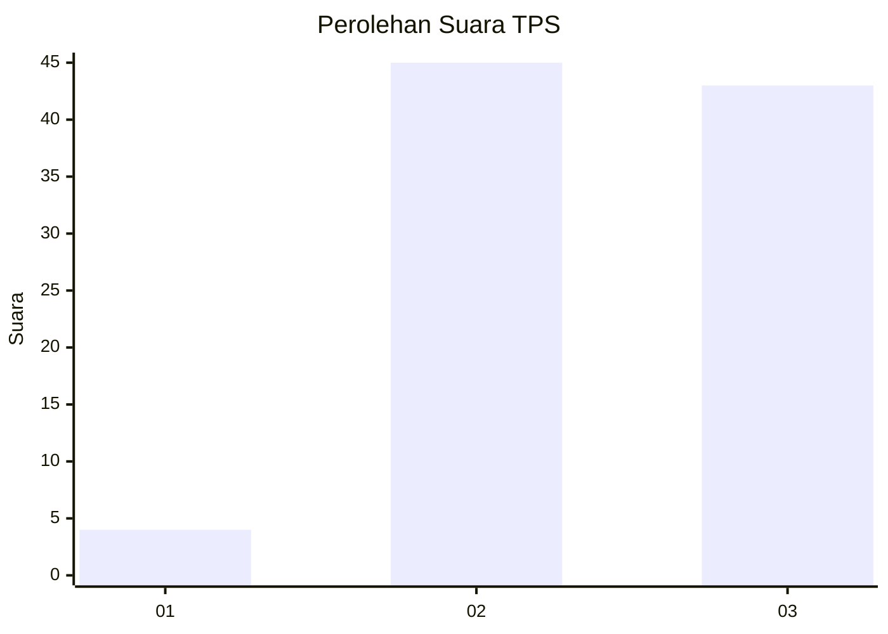
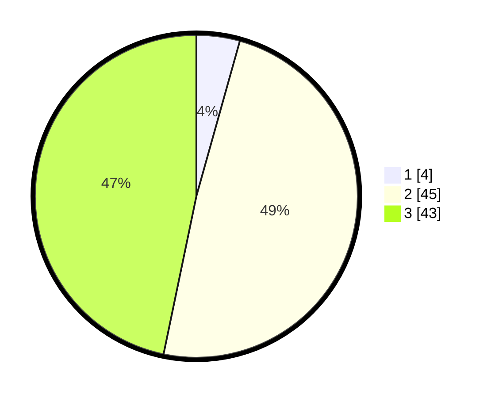

# Hasil

## Grafik

## Tabel

| No. | Nama Paslon    | Suara | Suara (raw) | Persentase |
|:--- |:-------------- | -----:| -----------:| ----------:|
| 1   | ANIES MUHAIMIN | 4     | [4][p-1]    | 4,35       |
| 2   | PRABOWO GIBRAN | 45    | [45][p-2]   | 48,91      |
| 3   | GANJAR MAHFUD  | 43    | [43][p-3]   | 46,74      |

[p-1]: https://github.com/gigit-pemilu/pemilu-2024-33-jawa-tengah/blob/main/pilpres/hitung-suara/sub/33-jawa-tengah/sub/12-wonogiri/sub/08-eromoko/sub/2012-ngunggahan/sub/010-tps/sub/paslon-1.txt
[p-2]: https://github.com/gigit-pemilu/pemilu-2024-33-jawa-tengah/blob/main/pilpres/hitung-suara/sub/33-jawa-tengah/sub/12-wonogiri/sub/08-eromoko/sub/2012-ngunggahan/sub/010-tps/sub/paslon-2.txt
[p-3]: https://github.com/gigit-pemilu/pemilu-2024-33-jawa-tengah/blob/main/pilpres/hitung-suara/sub/33-jawa-tengah/sub/12-wonogiri/sub/08-eromoko/sub/2012-ngunggahan/sub/010-tps/sub/paslon-3.txt

## Foto C Plano

https://sirekap-obj-formc.kpu.go.id/3204/pemilu/ppwp/33/12/08/20/12/3312082012010-20240215-092033--b394b231-e160-4452-8547-de3a33b6afa2.jpg

https://sirekap-obj-formc.kpu.go.id/3204/pemilu/ppwp/33/12/08/20/12/3312082012010-20240214-210943--f4cecf69-b278-43c6-b115-35c21b16aef7.jpg

https://sirekap-obj-formc.kpu.go.id/3204/pemilu/ppwp/33/12/08/20/12/3312082012010-20240214-210951--c5e1c8df-3738-4348-a2e1-aa0d247d1202.jpg

## Metadata

| Key        | Value               |
| ---------- | ------------------- |
| Time Stamp | 2024-02-15 22:00:27 |

